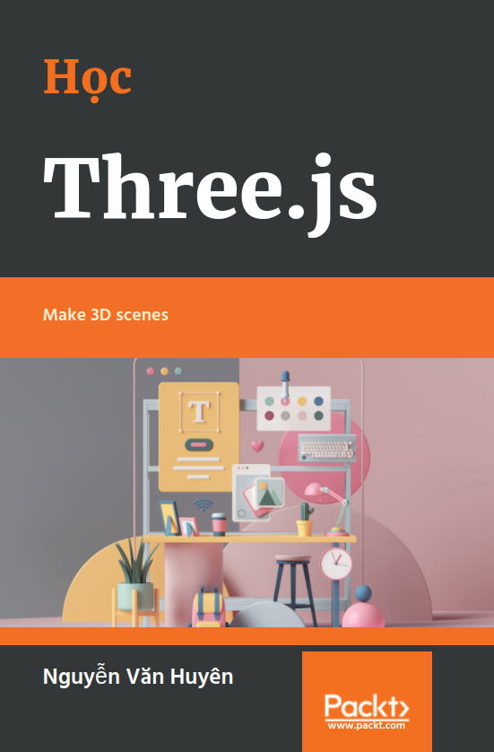

# Học Three.js



## Giới thiệu

Các trình duyệt hiện đại hỗ trợ WebGL. Với WebGL, bạn có thể trực tiếp sử dụng các tài nguyên xử lý của card đồ họa (GPU) và tạo các cảnh 3D với hiệu năng cao. Tuy nhiên, lập trình WebGL rất phức tạp, cần viết nhiều code, dễ gặp lỗi. Three.js là một thư viện JS để tạo và hiển thị đồ họa 3D trên trình duyệt sử dụng WebGL. Three.js giúp việc lập trình 3D trên trình duyệt dễ dàng hơn.

Bạn có thể tìm hiểu lịch sử phát triển của thư viện ở Wikipedia:

[Three.js - Wikipedia](https://en.m.wikipedia.org/wiki/Three.js)

Trang chủ của thư viện:

[Three.js – JavaScript 3D Library](https://threejs.org)

Manual chính thức từ trang chủ:

[Three.js Manual](https://threejs.org/manual/#en/fundamentals)

Bạn có thể tra cứu các class từ documentation. Mỗi class sẽ có các thuộc tính và phương thức, cũng như các ví dụ:

[Three.js Docs](https://threejs.org/docs/index.html)

Bạn có thể học theo sách "Learn Three.js". Sách này mô tả đầy đủ các mục, có nhiều ví dụ:

[Learn Three.js - Third Edition | Packt](https://www.packtpub.com/product/learn-three-js-third-edition/9781788833288)

Bạn có thể xem ví dụ của sách trên online ở đây:

[All (150+) learning Three.js third edition examples online - SmartJava](https://www.smartjava.org/content/all-learning-three-js-third-edition-examples-online/)

Bạn có thể download source code cho sách này ở:

[https://github.com/PacktPublishing/Learn-Three.js-Third-Edition](https://github.com/PacktPublishing/Learn-Three.js-Third-Edition)

Bạn cũng có thể học theo tutorial sau:

[Discover Three.js](https://discoverthreejs.com)

Các bài viết trên Viblo:

[Three.js - Viblo](https://viblo.asia/tags/threejs)

## Chương 1 - Tạo cảnh 3D đầu tiên với Three.js

### Các yêu cầu để sử dụng Three.js

Để chạy một trang web sử dụng Three.js, trình duyệt của bạn phải hỗ trợ WebGL. Ngoài ra, để chạy các ví dụ mà tôi sẽ viết thì trình duyệt của bạn cũng cần hỗ trợ load script dạng module, hỗ trợ lập trình hướng đối tượng trong JS. Có lẽ bạn sẽ không cần quá quan tâm vì hầu hết các trình duyệt hiện nay đều đã hỗ trợ tất cả những điều đó rồi.

Các source code đi kèm được tôi đẩy lên GitHub để bạn có thể lấy về:

[https://github.com/lockex1987/learn-threejs](https://github.com/lockex1987/learn-threejs)

Các source code đều là các file định dạng text (`html`, `js`,  `css`). Để chỉnh sửa, bạn chỉ cần bất cứ text editor nào mà bạn muốn (ví dụ VSCode).

Để chạy các file ví dụ mà tôi viết ở máy của bạn, bạn cần có web server vì một số ví dụ có tải các tài nguyên ngoài cho Texture và model. Ngoài ra các ví dụ viết kiểu JS module nên chắc chắn cần web server. Bạn không thể chạy file html dạng `file:///` được.

Bạn có thể tạo một web server đơn giản bằng PHP như sau:

```
php -S localhost:8000
```

### Tải thư viện Three.js

Bạn có thể download file zip release từ GitHub ở địa chỉ sau:

[Releases · mrdoob/three.js](https://github.com/mrdoob/three.js/releases)

File download khá là nặng, tầm hơn 300MB do chứa cả documentation, editor, code HTML của các ví dụ,... Do đó bạn không nên làm cách này. Bạn chỉ cần một file thư viện Three.js core ở thư mục `build` và tùy trường hợp cụ thể sẽ cần thêm một số file bổ sung ở thư mục `examples`.

Cấu trúc thư mục cùng các file mà bạn cần là:

```
build
├── three.cjs
├── three.js
├── three.min.js
└── three.module.js

examples
├── fonts
├── js
│   │   controls
│   │   └── OrbitControls.js
│   ├── loaders
│       └── GLTFLoader.js
│       ...
└── jsm
    ├── controls
    │   └── OrbitControls.js
    ├── loaders
        └── GLTFLoader.js
        ...

src
```

Bạn có thể sử dụng CDN ở địa chỉ sau:

[https://unpkg.com/browse/three/](https://unpkg.com/browse/three/)

Ví dụ địa chỉ của thư viện Three.js core là:

[https://unpkg.com/three@0.137.5/build/three.module.js](https://unpkg.com/three@0.137.5/build/three.module.js)

Địa chỉ của thư viện bổ sung nếu cần sử dụng OrbitControls là:

[https://unpkg.com/three@0.137.5/examples/jsm/controls/OrbitControls.js](https://unpkg.com/three@0.137.5/examples/jsm/controls/OrbitControls.js)

Các ví dụ tôi viết sẽ sử dụng CDN. Phiên bản sử dụng là r137 (release ngày 28/1/2022). Chú ý bạn cần đồng bộ phiên bản của thư viện Three.js core ở thư mục `build` với phiên bản của các thư viện bổ sung trong thư mục `examples`.

Bạn có thể sử dụng npm:

```
npm install three
```

Lệnh npm trên thực hiện khá là nhanh do chỉ download các thư mục `build`,  `examples`, `src`.

Nếu bạn có nhu cầu cần nâng cấp giữa các phiên bản (ví dụ class bạn dùng không tòn tại nữa do bị đổi tên) thì có thể làm theo hướng dẫn ở địa chỉ sau:

[Migration Guide · mrdoob/three.js Wiki · GitHub](https://github.com/mrdoob/three.js/wiki/Migration-Guide)

### Tạo khung HTML, CSS, JS cho các ví dụ

Mỗi ví dụ tôi viết thường bao gồm ba file: một file HTML, một file CSS, một file JS.

Chúng ta hãy tạo một file khung HTML (`chapter-01/01-basic-skeleton.html`):

```html
<!DOCTYPE html>
<html>
<head>
    <meta charset="UTF-8" />
    <meta name="viewport" content="width=device-width, initial-scale=1.0" />
    <title>Example 01.01 - Basic skeleton</title>
    <link rel="icon" href="../images/logo.svg" />
    <link rel="stylesheet" href="../css/style.css" />
</head>

<body>
    <canvas id="webglOutput"></canvas>

    <script src="js/01-01.js" type="module"></script>
</body>
</html>
```

Trang web chỉ chứa một thẻ `<canvas>` là nơi mà để vẽ các cảnh 3D.

Chú ý chúng ta load file JS theo kiểu module (thẻ `<script>` có thuộc tính type là module).

Khung file CSS (`css/style.css`):

```css
body {
    margin: 0;
    overflow: hidden;
}

html,
body {
    height: 100%;
}

#webglOutput {
    width: 100%;
    height: 100%;
}
```

Các style đảm bảo cảnh 3D của chúng ta sẽ chiếm toàn màn hình và không bị scroll.

Khung file JS (`chapter-01/js/01-01.js`):

```javascript
import {
    Scene,
    PerspectiveCamera,
    WebGLRenderer,
    BoxGeometry,
    MeshNormalMaterial,
    Mesh,
    REVISION
} from 'https://unpkg.com/three@0.137.5/build/three.module.js';


class ThreejsExample {
    constructor() {
        alert('Phiên bản Three.js là: ' + REVISION);
    }
}


new ThreejsExample();
```

Ở đầu file JS, chúng ta sẽ import các class của Three.js cần sử dụng. Tiếp theo chúng ta khai báo class ThreejsExample. Các nghiệp vụ của chương trình sẽ ở trong class này. Cuối cùng chúng ta sẽ khởi tạo một đối tượng ThreejsExample để thực thi các nghiệp vụ.

Các ví dụ có phần HTML và CSS gần như giống nhau hết, chỉ có phần JS là khác nhau.

[Ví dụ 01.01 - Khung cơ bản](https://static.lockex1987.com/learn-threejs/chapter-01/01-01-basic-skeleton.html)

Ví dụ trên chỉ hiển thị một trang web trắng cùng thông báo "*Phiên bản Three.js là: 137*".

### Render một đối tượng 3D cơ bản

Chúng ta hãy cùng render một hình lập phương 3D với ít code nhất gồm 6 bước.

**Bước 1**: Tạo một Scene để chứa các đối tượng 3D (Mesh), các nguồn sáng (Light).

```javascript
createScene() {
    const scene = new Scene();
    return scene;
}

constructor(canvas) {
    this.scene = this.createScene();
}
```

**Bước 2**: Tạo một Camera để chỉ định vị trí nhìn, hướng nhìn. Chúng ta sẽ tìm hiểu thêm về các tham số khi khởi tạo Camera ở các bài sau.

```javascript
createCamera() {
    const aspect = window.innerWidth / window.innerHeight;
    const camera = new PerspectiveCamera(45, aspect, 0.1, 1000);
    camera.position.set(-30, 40, 30);
    camera.lookAt(this.scene.position);
    return camera;
}

constructor(canvas) {
    this.camera = this.createCamera();
}
```

**Bước 3**: Tạo một Renderer để render. Chúng ta thường dùng WebGLRenderer. Ngoài ra còn có Renderer dựa vào CSS, SVG nhưng ít được sử dụng. Chúng ta sẽ truyền đối tượng thẻ canvas cho Renderer. Sau này, đối tượng canvas có thể lấy lại bằng thuộc tính `this.renderer.domElement`.

Chúng ta thiết lập màu nền của là màu đen (`new Color(0x000000)`) bằng phương thức `setClearColor`. Chúng ta cũng thiết lập độ lớn của cảnh bằng phương thức `setSize`. Bằng cách truyền `window.innerWidth` và `window.innerHeight`, chúng ta sẽ sử dụng toàn bộ không gian của màn hình.

```javascript
createRenderer(canvas) {
    const renderer = new WebGLRenderer({
        canvas,
        antialias: true
    });
    renderer.setClearColor(new Color(0x000000));
    renderer.setSize(window.innerWidth, window.innerHeight);
    return renderer;
}
    
constructor(canvas) {
    this.renderer = this.createRenderer(canvas);
}
```

**Bước 4**: Tạo một đối tượng Mesh hình lập phương và thêm nó vào Scene. Mesh được tạo lên từ Geometry và Material. Chúng ta sẽ dùng MeshNormalMaterial hoặc MeshBasicMaterial để chưa cần tới Light mà vẫn nhìn thấy đối tượng. Chúng ta cũng thiết lập vị trí của đối tượng.

```javascript
createCube() {
    const cubeGeometry = new BoxGeometry(6, 6, 6);
    const cubeMaterial = new MeshNormalMaterial();
    const cube = new Mesh(cubeGeometry, cubeMaterial);
    cube.position.set(-4, 3, 0);
    return cube;
}

constructor(canvas) {
    const cube = this.createCube();
    this.scene.add(cube);
}
```

**Bước 5**: Chúng ta yêu cầu Renderer hãy render Scene với Camera đi.

```javascript
render() {
    this.renderer.render(this.scene, this.camera);
}

constructor(canvas) {
    this.render();
}
```

**Bước 6**: Khởi tạo đối tượng ThreejsExample để chạy những nghiệp vụ trên.

```javascript
new ThreejsExample(document.querySelector('#webglOutput'));
```

Toàn bộ code đầy đủ là (`chapter-01/js/01-02.js`):

```javascript
import {
    Scene,
    PerspectiveCamera,
    WebGLRenderer,
    Color,
    BoxGeometry,
    MeshNormalMaterial,
    Mesh
} from 'https://unpkg.com/three@0.137.5/build/three.module.js';


class ThreejsExample {
    constructor(canvas) {
        this.scene = this.createScene();
        this.camera = this.createCamera();
        this.renderer = this.createRenderer(canvas);
        const cube = this.createCube();
        this.scene.add(cube);
        this.render();
    }

    createScene() {
        const scene = new Scene();
        return scene;
    }

    createCamera() {
        const aspect = window.innerWidth / window.innerHeight;
        const camera = new PerspectiveCamera(45, aspect, 0.1, 1000);
        camera.position.set(-30, 40, 30);
        camera.lookAt(this.scene.position);
        return camera;
    }

    createRenderer(canvas) {
        const renderer = new WebGLRenderer({
            canvas,
            antialias: true
        });
        renderer.setClearColor(new Color(0x000000));
        renderer.setSize(window.innerWidth, window.innerHeight);
        return renderer;
    }

    createCube() {
        const cubeGeometry = new BoxGeometry(6, 6, 6);
        const cubeMaterial = new MeshNormalMaterial();
        const cube = new Mesh(cubeGeometry, cubeMaterial);
        cube.position.set(-4, 3, 0);
        return cube;
    }

    render() {
        this.renderer.render(this.scene, this.camera);
    }
}


new ThreejsExample(document.querySelector('#webglOutput'));
```

[Ví dụ 01.02 - Scene đầu tiên](https://static.lockex1987.com/learn-threejs/chapter-01/01-02-first-scene.html)

Nếu bạn mở ví dụ trên trình duyệt, chúng ta sẽ thấy một hình lập phương như sau:


Ví dụ đơn giản của chúng ta chỉ sử dụng các thành phần cơ bản sau:

- Scene
- Camera (PerspectiveCamera)
- Renderer (WebGLRenderer)
- Geometry (BoxGeometry)
- Material (MeshNormalMaterial)
- Mesh

Các cảnh 3D đều được tạo từ các thành phần cơ bản trên, cùng với thành phần cơ bản khác là Light mà chúng ta chưa nhắc đến.


Chúng ta sẽ lần lượt tìm hiểu từng thành phần ở những phần sau.

### Sử dụng dat.GUI để trải nghiệm dễ dàng hơn

#### Hướng dẫn chung dat.GUI

Thư viện dat.GUI cho phép bạn tạo một giao diện đơn giản để bạn có thể thay đổi các biến trong code của bạn. Chúng ta sẽ tích hợp dat.GUI vào các ví dụ để có thể điều chỉnh vị trí, xoay các đối tượng, thay đổi các cấu hình khác, giúp bạn hiểu hơn khi tìm hiểu từng khái niệm mới. Bạn có thể thay đổi trực tiếp và nhìn các thay đổi luôn ngay trên giao diện. Việc này là tốt hơn rất nhiều so với việc bạn sửa code, refresh trình duyệt, xem kết quả, rồi lại sửa code, refresh trình duyệt, xem kết quả mới,...

Trang GitHub chủ của thư viện là:

[GitHub - dataarts/dat.gui: dat.gui is a lightweight controller library for  JavaScript](https://github.com/dataarts/dat.gui)

Các API mà thư viện cung cấp là:

[https://github.com/dataarts/dat.gui/blob/master/API.md](https://github.com/dataarts/dat.gui/blob/master/API.md)

Để sử dụng thư viện, chúng ta thêm thẻ `<script>` sau vào trang:

```html
<script src="https://unpkg.com/dat.gui@0.7.7/build/dat.gui.min.js"></script>
```

Hoặc bạn cũng có thể import như sau:

```javascript
import * as dat from 'https://unpkg.com/dat.gui@0.7.7/build/dat.gui.module.js';
```

Chúng ta khởi tạo một đối tượng dat.GUI như sau:

```javascript
const gui = new dat.GUI();
```

Ở câu lệnh trên, chúng ta không truyền thêm tham số nào khi khởi tạo. Tuy nhiên, chúng ta có thể thêm tham số là một đối tượng với các thuộc tính như `closed`, `width`,...

Để thêm một cấu hình, chúng ta sử dụng phương thức:

```javascript
gui.add(object, property, [min], [max], [step])
```

Tham số thứ nhất `object` là một đối tượng. Tham số thứ hai `property` là tên thuộc tính của đối tượng đó.

Loại của cấu hình sẽ được suy ra từ kiểu dữ liệu của giá trị của thuộc tính (giá trị của `object[property]`). Có thể có các loại sau:

- Number: giá trị kiểu số
- Range: giá trị kiểu số cùng với min, max, có thể có step hoặc không
- Text: giá trị kiểu String
- Checkbox: giá trị kiểu Boolean
- Select: giá trị là mảng các giá trị
- Button: giá trị là một hàm kiểu Function

Ngoài ra, bạn có thể thêm nhãn bằng cách sử dụng phương thức `listen()` và thêm một mục to bằng phương thức `addFolder()`.

Bạn có thể để truyền các giá trị min, max, step ở ngày trong phương thức `add()`, hoặc có thể chain các phương thức như sau:

```javascript
gui.add(object, property)
    .min(min)
    .max(max)
    .step(step)
```

Tên hiển thị ở giao diện cấu hình sẽ chính là `property`. Nhiều khi tên này sẽ bị lặp, hoặc là không thân thiện lắm. Chúng ta có thể đổi tên hiển thị bằng phương thức `name()`.

```javascript
gui.add(object, propery)
    .name(name)
```

Chúng ta có thể lắng nghe khi các giá trị cấu hình được thay đổi bằng phương thức `onChange()`.

```javascript
gui.add(object, property)
    .onChange(value => {
        // value là giá trị mới sau khi thay đổi
        // xử lý nghiệp vụ ở đây
    })
```

Để thêm cấu hình cho các giá trị màu sắc, bạn sử dụng phương thức `addColor()`. Chúng ta cần một phương thức mới, không sử dụng phương thức `add()` cũ vì cần phân biệt với các trường hợp kiểu dữ liệu là Number hoặc String.

Chúng ta có thể truyền giá trị màu sắc ban đầu theo các định dạng sau:

- Xâu CSS ('#FF0000')
- Mảng RGB ([0, 128, 255])
- Mảng RGB cùng giá trị alpha ([0, 128, 255, 0.3])
- Giá trị hue, saturation, value ({ h: 350, s: 0.9, v: 0.3 })
- Số nguyên (0xFF0000)

Tips:

- Bạn có thể nhấn phím H để ẩn / hiện giao diện cấu hình hoặc sử dụng các phương thức như `gui.hide()`, `gui.show()`.
- Bạn có thể truyền `width` khi khởi tạo để chỉ định kích thước của giao diện

#### Cấu hình góc xoay hình lập phương

Chúng ta sẽ khai báo một đối tượng JS mà sẽ có các thuộc tính mà chúng ta muốn thay đổi sử dụng dat.GUI. Ví dụ chúng ta muốn thay đổi góc quay theo 3 trục của hình lập phương mà chúng ta đã tạo ở ví dụ trước:

```javascript
this.controls = {
    rotationX: 0,
    rotationY: 0,
    rotationZ: 0
};
```

Tiếp theo, chúng ta sẽ truyền đối tượng này cho đối tượng dat.GUI mới và định nghĩa khoảng giá trị của các thuộc tính (từ 0 đến 360 độ). Chúng ta cũng định nghĩa nghiệp vụ khi giá trị các thuộc tính được thay đổi ở phương thức `onChange`: cập nhật lại các góc quay của hình lập phương và render lại. Các góc trong Three.js sử dụng đơn vị là radian nên chúng ta cũng có thêm phương thức `convertDegToRad` để chuyển từ độ sang radian.

```javascript
createControlsGui() {
    const gui = new dat.GUI();
    gui.add(this.controls, 'rotationX', 0, 360).onChange(value => {
        this.cube.rotation.x = this.convertDegToRad(value);
        this.render();
    });
    gui.add(this.controls, 'rotationY', 0, 360).onChange(value => {
        this.cube.rotation.y = this.convertDegToRad(value);
        this.render();
    });
    gui.add(this.controls, 'rotationZ', 0, 360).onChange(value => {
        this.cube.rotation.z = this.convertDegToRad(value);
        this.render();
    });
}

convertDegToRad(deg) {
    return deg * Math.PI / 180;
}
```

Toàn bộ code đầy đủ là (`chapter-01/js/01-03.js`):

```javascript
import {
    Scene,
    PerspectiveCamera,
    WebGLRenderer,
    Color,
    BoxGeometry,
    MeshNormalMaterial,
    Mesh
} from 'https://unpkg.com/three@0.137.5/build/three.module.js';

import * as dat from 'https://unpkg.com/dat.gui@0.7.7/build/dat.gui.module.js';


class ThreejsExample {
    constructor(canvas) {
        this.scene = this.createScene();
        this.camera = this.createCamera();
        this.renderer = this.createRenderer(canvas);

        this.cube = this.createCube();
        this.scene.add(this.cube);

        this.render();

        this.controls = {
            rotationX: 0,
            rotationY: 0,
            rotationZ: 0
        };
        this.createControlsGui();
    }

    createScene() {
        const scene = new Scene();
        return scene;
    }

    createCamera() {
        const aspect = window.innerWidth / window.innerHeight;
        const camera = new PerspectiveCamera(45, aspect, 0.1, 1000);
        camera.position.set(-30, 40, 30);
        camera.lookAt(this.scene.position);
        return camera;
    }

    createRenderer(canvas) {
        const renderer = new WebGLRenderer({
            canvas,
            antialias: true
        });
        renderer.setClearColor(new Color(0x000000));
        renderer.setSize(window.innerWidth, window.innerHeight);
        return renderer;
    }

    createCube() {
        const cubeGeometry = new BoxGeometry(6, 6, 6);
        const cubeMaterial = new MeshNormalMaterial();
        const cube = new Mesh(cubeGeometry, cubeMaterial);
        cube.position.set(-4, 3, 0);
        return cube;
    }

    createControlsGui() {
        const gui = new dat.GUI();
        gui.add(this.controls, 'rotationX', 0, 360).onChange(value => {
            this.cube.rotation.x = this.convertDegToRad(value);
            this.render();
        });
        gui.add(this.controls, 'rotationY', 0, 360).onChange(value => {
            this.cube.rotation.y = this.convertDegToRad(value);
            this.render();
        });
        gui.add(this.controls, 'rotationZ', 0, 360).onChange(value => {
            this.cube.rotation.z = this.convertDegToRad(value);
            this.render();
        });
    }

    convertDegToRad(deg) {
        return deg * Math.PI / 180;
    }

    render() {
        this.renderer.render(this.scene, this.camera);
    }
}


new ThreejsExample(document.querySelector('#webglOutput'));
```

[Ví dụ 01.03 - Control GUI](https://static.lockex1987.com/learn-threejs/chapter-01/01-03-control-gui.html)

Khi bạn chạy ví dụ trên, bạn sẽ thấy một giao diện đơn giản ở góc trên phải của màn hình mà bạn có thể điều khiển góc quay theo các trục X, Y, Z. Hãy tự mình xoay hình lập phương theo các góc khác nhau để cảm nhận tính 3D của cảnh.


### Responsive

#### Cảnh chiếm toàn bộ viewport, responsive theo viewport

Trong các ví dụ trước, chúng ta đã tạo được một cảnh 3D đơn giản. Tuy nhiên, khi bạn thay đổi kích thước viewport của trình duyệt, bạn có thể thấy là kích thước của cảnh vẫn giữ nguyên. Do đó, nếu bạn mở rộng viewport thì sẽ có các khoảng trắng ở bên phải hoặc bên dưới, còn nếu bạn thu nhỏ viewport thì một số phần của cảnh sẽ bị che mất.

Mở rộng:


Thu nhỏ:


Để có thể thay đổi kích thước của cảnh theo kích thước của viewport, chúng ta cần lắng nghe sự kiện `resize` của window. Đây là JS bình thường, chưa phải là Three.js:

```javascript
handleResize() {
    window.addEventListener('resize', () => {
        this.onResize();
    });
}
```

Trong sự kiện `resize`, chúng ta sẽ cần update lại `aspect` của Camera theo tỷ lệ chiều ngang / chiều dọc của viewport, thông báo cập nhật lại ma trận chiếu của Camera, đồng thời cập nhật lại kích thước của Renderer:

```javascript
onResize() {
    const width = window.innerWidth;
    const height = window.innerHeight;
    const aspect = width / height;
    this.camera.aspect = aspect;
    this.camera.updateProjectionMatrix();
    this.renderer.setSize(width, height);
}
```

Chúng ta cũng cần lại render lại cảnh:

```javascript
this.render();
```

Chú ý: Không xử lý nặng ở hàm `resize`. Có thể sử dụng kỹ thuật throttle để tránh hàm bị gọi với tần suất cao.

Toàn bộ code đầy đủ là (`chapter-01/js/01-04.js`):

```javascript
import {
    Scene,
    PerspectiveCamera,
    WebGLRenderer,
    Color,
    BoxGeometry,
    MeshNormalMaterial,
    Mesh
} from 'https://unpkg.com/three@0.137.5/build/three.module.js';


class ThreejsExample {
    constructor(canvas) {
        this.scene = this.createScene();
        this.camera = this.createCamera();
        this.renderer = this.createRenderer(canvas);
        const cube = this.createCube();
        this.scene.add(cube);
        this.render();
        this.handleResize();
    }

    createScene() {
        const scene = new Scene();
        return scene;
    }

    createCamera() {
        const aspect = window.innerWidth / window.innerHeight;
        const camera = new PerspectiveCamera(45, aspect, 0.1, 1000);
        camera.position.set(-30, 40, 30);
        camera.lookAt(this.scene.position);
        return camera;
    }

    createRenderer(canvas) {
        const renderer = new WebGLRenderer({
            canvas,
            antialias: true
        });
        renderer.setClearColor(new Color(0x000000));
        const width = window.innerWidth;
        const height = window.innerHeight;
        renderer.setSize(width, height);
        return renderer;
    }

    createCube() {
        const cubeGeometry = new BoxGeometry(6, 6, 6);
        const cubeMaterial = new MeshNormalMaterial();
        const cube = new Mesh(cubeGeometry, cubeMaterial);
        cube.position.set(-4, 3, 0);
        return cube;
    }

    render() {
        this.renderer.render(this.scene, this.camera);
    }

    handleResize() {
        window.addEventListener('resize', () => {
            this.onResize();
            this.render();
        });
    }

    onResize() {
        const width = window.innerWidth;
        const height = window.innerHeight;
        const aspect = width / height;
        this.camera.aspect = aspect;
        this.camera.updateProjectionMatrix();
        this.renderer.setSize(width, height);
    }
}


new ThreejsExample(document.querySelector('#webglOutput'));
```

[Ví dụ 01.04 - Responsive](https://static.lockex1987.com/learn-threejs/chapter-01/01-04-responsive.html)

Bạn có thể test responsive trên các thiết bị mobile bằng cách xoay qua lại giữa chế độ `portrait` và `landscape`. Sự kiện `resize` cũng xảy ra trên máy tính nếu như chúng ta sử dụng nhiều màn hình và di chuyển trình duyệt giữa các màn hình.

Sử dụng kiểm tra check sau trong trường hợp không phải resize cả trình duyệt, mà resize thành phần của trang: ví dụ chúng ta có side panel ở bên trái có thể thay đổi kích thước:

```javascript
needResize(canvas) {
    return canvas.width !== canvas.clientWidth
        || canvas.height !== canvas.clientHeight;
}
```


#### Cảnh không chiếm toàn bộ viewport, responsive theo canvas

Ở ví dụ trên, chúng ta đã xử lý trong trường hợp cảnh 3D chiếm toàn bộ viewport. Chúng ta tính toán với các kích thước của viewport (`window.innerWidth`, `window.innerHeight`). Vậy trong trường hợp cảnh không chiếm toàn bộ viewport thì sao? Ví dụ khi mà cảnh 3D chỉ là một phần trang trí của trang web, có thể có kích thước cố định nào đó theo pixel hoặc là kích thước tương đối theo phần trăm với viewport. Lúc đó chúng ta sẽ cần dựa vào phần tử canvas của trang, nơi mà cảnh 3D được render.

Để minh họa cho việc cảnh không chiếm toàn bộ viewport, chúng ta có thể để kích thước canvas chiếm 70% của chiều width và height:

```html
<style>
    #webglOutput {
        width: 70%;
        height: 70%;
    }
</style>
```

Chúng ta sẽ cần chờ cho trang web được tải xong hoàn toàn rồi mới thực thi. Khi đó việc tính toán kích thước canvas mới chính xác. Chúng ta lấy kích thước canvas bằng các thuộc tính là `canvas.clientWidth` và `canvas.clientHeight`.

```javascript
window.addEventListener('load', () => {
    new ThreejsExample(document.querySelector('#webglOutput'));
});
```

Lúc khởi tạo đối tượng Renderer (phương thức `createRenderer`), chúng ta sẽ thiết lập kích thước của Renderer bằng kích thước của canvas. Chú ý chúng ta thêm tham số thứ ba bằng `false` vào phương thức `setSize`. Khi truyền giá trị `false`, canvas sẽ không được thiết lập kích thước hiển thị bằng CSS với thuộc tính `style`. Three.js chỉ thiết lập thuộc tính `width` và `height` của canvas.

```javascript
const width = canvas.clientWidth;
const height = canvas.clientHeight;
renderer.setSize(width, height, false);
```

Nếu không truyền `false`:


Nếu truyền `false`:


Nếu chúng ta không truyền `false` thì những lần sau gọi `canvas.clientWidth` hoặc `canvas.clientHeight` sẽ luôn trả về một giá trị không thay đổi.

Ở phương thức `onResize`, chúng ta lấy lại đối tượng canvas thông qua thuộc tính `domElement` của đối tượng Renderer và xử lý theo kích thước của canvas. Khi gọi lại phương thức `setSize` của đối tượng Renderer, chúng ta cũng truyền tham số thứ ba là `false`.

```javascript
const canvas = this.renderer.domElement;
const width = canvas.clientWidth;
const height = canvas.clientHeight;
const aspect = width / height;
this.camera.aspect = aspect;
this.camera.updateProjectionMatrix();
this.renderer.setSize(width, height, false);
```

Toàn bộ code đầy đủ là (`chapter-01/js/01-05.js`):

```javascript
import {
    Scene,
    PerspectiveCamera,
    WebGLRenderer,
    Color,
    BoxGeometry,
    MeshNormalMaterial,
    Mesh
} from 'https://unpkg.com/three@0.137.5/build/three.module.js';


class ThreejsExample {
    constructor(canvas) {
        this.scene = this.createScene();
        this.camera = this.createCamera();
        this.renderer = this.createRenderer(canvas);
        const cube = this.createCube();
        this.scene.add(cube);
        this.render();
        this.handleResize();
    }

    createScene() {
        const scene = new Scene();
        return scene;
    }

    createCamera() {
        const aspect = window.innerWidth / window.innerHeight;
        const camera = new PerspectiveCamera(45, aspect, 0.1, 1000);
        camera.position.set(-30, 40, 30);
        camera.lookAt(this.scene.position);
        return camera;
    }

    createRenderer(canvas) {
        const renderer = new WebGLRenderer({
            canvas,
            antialias: true
        });
        renderer.setClearColor(new Color(0x000000));
        const width = canvas.clientWidth;
        const height = canvas.clientHeight;
        renderer.setSize(width, height, false);
        return renderer;
    }

    createCube() {
        const cubeGeometry = new BoxGeometry(6, 6, 6);
        const cubeMaterial = new MeshNormalMaterial();
        const cube = new Mesh(cubeGeometry, cubeMaterial);
        cube.position.set(-4, 3, 0);
        return cube;
    }

    render() {
        this.renderer.render(this.scene, this.camera);
    }

    handleResize() {
        window.addEventListener('resize', () => {
            this.onResize();
            this.render();
        });
    }

    onResize() {
        const canvas = this.renderer.domElement;
        const width = canvas.clientWidth;
        const height = canvas.clientHeight;
        const aspect = width / height;
        this.camera.aspect = aspect;
        this.camera.updateProjectionMatrix();
        this.renderer.setSize(width, height, false);
    }
}


window.addEventListener('load', () => {
    new ThreejsExample(document.querySelector('#webglOutput'));
});
```

[Ví dụ 01.05 - Responsive theo canvas](https://static.lockex1987.com/learn-threejs/chapter-01/01-05-responsive-by-canvas.html)

#### Pixel ratio

Trên màn hình máy tính bình thường thì pixel ratio thường bằng 1. Tuy nhiên, trên máy Mac hay thiết bị mobile, pixel ratio thường lớn hơn 1. Chúng ta có thể lấy pixel ratio của thiết bị hiển thị trong JS bằng thuộc tính `window.devicePixelRatio`.

Điện thoại của tôi có giá trị pixel ratio là 3. Cảnh 3D của ví dụ trước khi hiển thị trên điện thoại của tôi như sau:


Chúng ta có thể thấy rằng hình ảnh không được sắc nét lắm.

Để xử lý trên các thiết bị hiển thị mà có pixel ratio lớn hơn 1, khi thiết lập kích thước của Renderer, chúng ta hãy nhân với pixel ratio:

```javascript
const pixelRatio = window.devicePixelRatio;
const width = canvas.clientWidth * pixelRatio;
const height = canvas.clientHeight * pixelRatio;
this.renderer.setSize(width, height, false);
```

Tất nhiên, việc tăng kích thước của Renderer sẽ tăng khối lượng tính toán, có thể ảnh hưởng đến hiệu năng. Chúng ta có thể xử lý chỉ để tối đa là 2 như sau:

```javascript
const pixelRatio = Math.min(window.devicePixelRatio, 2);
```

Một số ví dụ trên mạng có thể hướng dẫn cách sau:

```javascript
this.renderer.setPixelRatio(window.devicePixelRatio);
```

Tuy nhiên, documentation trên trang chủ của Three.js khuyên không nên sử dụng cách này.

[Ví dụ 01.06 - Pixel ratio](https://static.lockex1987.com/learn-threejs/chapter-01/01-06-pixel-ratio.html)

Cảnh đã trông sắc nét hơn trên mobile:


### Animation

Nếu chúng ta muốn animate cảnh, chúng ta cần render cảnh nhiều lần theo một tần suất nào đó. Các trình duyệt hiện đại có một giải pháp cho vấn đề, đó là hàm `requestAnimationFrame`. Tần suất gọi hàm sẽ phụ thuộc vào trình duyệt, thường là 60 lần trong một giây. Ở trong phương thức `render` của chúng ta, chúng ta cần gọi hàm `requestAnimationFrame` với tham số chính là phương thức `render`. Ngoài ra, chúng ta sẽ định nghĩa thêm phương thức `update` để cập nhật lại các đối tượng trong cảnh. Vòng lặp của chúng ta như sau:

```javascript
update() {
    // Cập nhật lại các đối tượng ở đây
}

render() {
    this.update();
    this.renderer.render(this.scene, this.camera);
    requestAnimationFrame(this.render.bind(this));
}
```

Chúng ta cũng có thể sử dụng các thư viện như [gsap](https://github.com/greensock/GSAP), [tween.js](https://github.com/tweenjs/tween.js/),... Khi đó chúng ta không gọi `this.update()` trong phương thức `render()` nữa. Các thư viện trên sẽ có tiến trình riêng để cập nhật lại các đối tượng. Sử dụng các thư viện đó thì animation của chúng ta sẽ không bị đều đều mà sẽ có ease.

Chúng ta cũng không cần render luôn lại cảnh khi resize trình duyệt nữa, vì đằng nào cảnh sẽ sớm được render lại. Hãy bỏ câu lệnh gọi `this.render()` trong phương thức `handleResize`.

Chúng ta hãy định nghĩa thêm phương thức `tick` khi tạo hình lập phương. Trong phương thức này, chúng ta sẽ tăng các góc xoay của hình lập phương. Việc định nghĩa luôn lúc này sẽ giúp cho việc quản lý code của chúng ta tốt hơn khi cảnh có nhiều đối tượng. Trong phương thức `update`, chúng ta chỉ cần gọi `this.cube.tick()`.

```javascript
createCube() {
    // ...
    cube.tick = () => {
        cube.rotation.x += 0.02;
        cube.rotation.y += 0.02;
        cube.rotation.z += 0.02;
    };
    // ...
}

update() {
    this.cube.tick();
}
```

Toàn bộ code đầy đủ là (`chapter-01/js/01-07.js`):

```javascript
import {
    Scene,
    PerspectiveCamera,
    WebGLRenderer,
    Color,
    BoxGeometry,
    MeshNormalMaterial,
    Mesh
} from 'https://unpkg.com/three@0.137.5/build/three.module.js';


class ThreejsExample {
    constructor(canvas) {
        this.scene = this.createScene();
        this.camera = this.createCamera();
        this.renderer = this.createRenderer(canvas);
        this.cube = this.createCube();
        this.scene.add(this.cube);
        this.render();
        this.handleResize();
    }

    createScene() {
        const scene = new Scene();
        return scene;
    }

    createCamera() {
        const aspect = window.innerWidth / window.innerHeight;
        const camera = new PerspectiveCamera(45, aspect, 0.1, 1000);
        camera.position.set(-30, 40, 30);
        camera.lookAt(this.scene.position);
        return camera;
    }

    createRenderer(canvas) {
        const renderer = new WebGLRenderer({
            canvas,
            antialias: true
        });
        renderer.setClearColor(new Color(0x000000));
        const pixelRatio = window.devicePixelRatio;
        const width = canvas.clientWidth * pixelRatio;
        const height = canvas.clientHeight * pixelRatio;
        renderer.setSize(width, height, false);
        return renderer;
    }

    createCube() {
        const cubeGeometry = new BoxGeometry(6, 6, 6);
        const cubeMaterial = new MeshNormalMaterial();
        const cube = new Mesh(cubeGeometry, cubeMaterial);
        cube.position.set(-4, 3, 0);
        cube.tick = () => {
            cube.rotation.x += 0.02;
            cube.rotation.y += 0.02;
            cube.rotation.z += 0.02;
        };
        return cube;
    }

    update() {
        this.cube.tick();
    }

    render() {
        this.update();
        this.renderer.render(this.scene, this.camera);
        requestAnimationFrame(this.render.bind(this));
    }

    handleResize() {
        window.addEventListener('resize', () => {
            this.onResize();
        });
    }

    onResize() {
        const canvas = this.renderer.domElement;
        const pixelRatio = window.devicePixelRatio;
        const width = canvas.clientWidth * pixelRatio;
        const height = canvas.clientHeight * pixelRatio;
        const aspect = width / height;
        this.camera.aspect = aspect;
        this.camera.updateProjectionMatrix();
        this.renderer.setSize(width, height, false);
    }
}


window.addEventListener('load', () => {
    new ThreejsExample(document.querySelector('#webglOutput'));
});
```

[Ví dụ 01.07 - Animation](https://static.lockex1987.com/learn-threejs/chapter-01/01-07-animation.html)

Hình lập phương của chúng ta đã xoay. Trong nhiều trường hợp, việc tạo animation như vậy là đã thỏa mãn yêu cầu: chúng ta cập nhật lại đối tượng một chút ở mỗi lần render. Tuy nhiên, giả sử chúng ta có yêu cầu là xoay hình lập phương một vòng mỗi 2 giây thì sao? Với code như trên thì chúng ta không thể đảm bảo việc đó. Chúng ta không thể đảm bảo được tần suất phương thức `render` được gọi, việc này phụ thuộc trình duyệt. Ở các thiết bị mà có framerate lớn, phương thức render sẽ được gọi nhiều lần hơn, hình lập phương sẽ quay nhanh hơn.

Để xử lý yêu cầu trên, chúng ta có thể tính góc quay của hình lập phương theo khoảng thời gian từ khi trang web được tải chứ không tăng ở mỗi lần gọi. Hàm `requestAnimationFrame` có một tham số chính là số milli giây từ khi trang web được tải. Chúng ta sẽ sử dụng luôn tham số này. Giả sử tham số có tên là `ms`. Khi đó công thức góc quay của hình lập phương sẽ là:

```
ms * Math.PI / 1000
```

Giải thích công thức:

- Chúng ta chia 1000 để chuyển về giây
- Math.PI chính là một nửa vòng tròn. Mỗi giây chúng ta xoay được nửa vòng, vậy 2 giây sẽ quay được một vòng.

Chúng ta sẽ sửa lại code như sau:

```javascript
createCube() {
    // ...
    cube.tick = (ms) => {
        cube.rotation.y = ms * Math.PI / 1000;
    };
    // ...
}

update(ms) {
    this.cube.tick(ms);
}

render(ms = 0) {
    this.update(ms);
    // ...
}
```

[Ví dụ 01.08 - Animation theo khoảng thời gian đã trôi qua](https://static.lockex1987.com/learn-threejs/chapter-01/01-08-animation-by-elapsed-time.html)

## Chương 2 - Các thành phần cơ bản tạo nên một cảnh 3D trong Three.js

Trong chương này, chúng ta sẽ cùng tìm hiểu về các thành phần như Scene, Camera, Renderer, Mesh, Geometry. Trước đó, chúng ta cũng tìm hiểu về hệ tọa độ trong Three.js.

### Hệ tọa độ


Các đối tượng trong cảnh của Three.js nằm trong một không gian 3D gồm có ba trục:

- Trục X: từ trái sang phải
- Trục Y: từ dưới lên trên

- Trục Z: từ xa về gần màn hình


Chúng ta có thể sử dụng AxesHelper để hiện thị 3 trục tọa độ trên cảnh. Trục X có màu đỏ, trục Y có màu xanh lá cây, trục Z có màu xanh da trời. Ví dụ:

```javascript
const axesHelper = new AxesHelper(5);
scene.add(axesHelper);
```

### Scene

Ở các ví dụ trước, chúng ta đã biết để tạo một cảnh 3D trong Three.js cần các thành phần cơ bản sau:

- Scene
- Camera
- Renderer
- Mesh (là kết hợp của Geometry và Material)

Scene là một không gian 3D mà trong đó bạn có thể đặt các đối tượng như Mesh và Light.

Scene là một cấu trúc mà đôi khi còn được gọi là scene graph. Một scene graph là một cấu trúc mà giữ tất cả các thông tin cần thiết của cảnh. Trong Three.js, điều đó có nghĩa là Scene chứa tất cả các đối tượng, nguồn sáng, và các đối tượng khác cần thiết để render. Như cái tên ám chỉ, scene graph không chỉ là một mảng các đối tượng; nó bao gồm một tập các node dạng cây.


Mỗi đối tượng bạn có thể thêm vào Scene, và chính cả Scene, extend từ một base class là Object3D. Một đối tượng Object3D có thể có các đối tượng con riêng của nó.

Phân hệ các class là:

```
Object3D
├── Scene
├── Camera
│    └── PerspectiveCamera
├── Mesh
├── Group
└── Light
    ├── AmbientLight
    ├── DirectionalLight
    ├── SpotLight
    ├── PointLight
    └── HemisphereLight
```

Chúng ta tạo một đối tượng Scene mới như sau:

```javascript
const scene = new Scene();
```

Scene chính nó thì không có nhiều các thuộc tính và phương thức. Tuy nhiên, chúng ta có thể sử dụng một số các phương thức của base class Object3D sau:

- `castShadow` (Boolean): có đổ bóng không. Mặc định là `false`.
- `children` (Array): mảng các đối tượng con.
- `position` (Vector3): Vị trí của đối tượng. Mặc định là (0, 0, 0).
- `rotation` (Euler): các góc quay local của đối tượng, bằng đơn vị radian.
- `add`(Object3D,...): Thêm đối tượng nào đó thành con của đối tượng hiện tại.
- `remove`(Object3D,...): Loại bỏ đối tượng con nào đó khỏi đối tượng hiện tại.
- `lookAt`(Vector3): Xoay đối tượng để đối mặt với một điểm trong không gian.
- `traverse`(Function): Thực hiện hàm callback trên đối tượng hiện tại và tất cả con cháu.

Chúng ta hãy khám phá các tính năng của một Scene bằng cách nhìn vào một ví dụ. Trong thư mục source code cho chương này (`chapter-02`), bạn có thể tìm thấy file ví dụ `02-01-scene.html`. Khi bạn mở ví dụ này trên trình duyệt, cảnh sẽ trông tương tự như sau:


Nhìn vào code JS của ví dụ này (`02-01.js`), bạn có thể thấy chúng ta sử dụng các phương thức `this.scene.add` để thêm mặt phẳng, thêm các hình lập phương. Chúng ta cũng sử dụng phương thức `this.scene.remove` để loại bỏ các hình lập phương. Ngoài ra, chúng ta cũng sử dụng thuộc tính `this.scene.children` để lấy ra danh sách các hình lập phương và phương thức `this.scene.traverse` để duyệt qua các hình lập phương.

Ở bảng điều khiển bên gốc trên phải, bạn có thể nhấn nút addCube để thêm một hình lập phương vào cảnh. Kích thước, vị trí của hình lập phương mới sẽ được thiết lập ngẫu nhiên. Bạn cũng có thể nhấn nút removeCube để loại bỏ hình lập phương cuối cùng thêm vào. Mục numberOfObjects hiển thị số đối tượng hiện tại trong cảnh. Bạn có thể thấy khi mới mở ví dụ, chúng ta đã có sẵn 4 đối tượng. Đó là: mặt phẳng, một hình lập phương.

[Ví dụ 02.01 - Scene](https://static.lockex1987.com/learn-threejs/chapter-02/02-01-scene.html)

Scene có thuộc tính `fog` để thêm hiệu ứng sương mù vào cảnh. Tuy nhiên, để có thể xem được hiệu ứng, chúng ta không được sử dụng MeshNormalMaterial hoặc MeshBasicMaterial. Có thể sử dụng MeshLambertMaterial. Vậy hãy để hiệu ứng này ở các bài sau. (có cần ánh sáng không?)

### Camera

Trong Three.js, chúng ta có hai loại Camera là OrthographicCamera và PerspectiveCamera. Tuy nhiên, chúng ta sẽ chỉ tập trung vào PerspectiveCamera vì nó giống thế giới thực nhất. Một PerspectiveCamera sẽ mô phỏng hành động của một camera quay phim trong đời thực. Đối tượng càng xa Camera thì trông càng bé. Vị trí của camera và hướng của nó sẽ quyết định phần nào của khung cảnh được render trên màn hình. Khi khởi tạo một camera mới, bạn cần truyền vào:

- `fov`: field of view (FOV) - góc nhìn theo chiều dọc. Góc càng rộng thì chúng ta càng nhìn được nhiều hơn, các đối tượng càng nhỏ đi. Con người thường có FOV bằng 180 độ, trong khi một số loài chim có thể có FOV bằng 360 độ. Tuy nhiên, màn hình máy tính không chiếm toàn bộ tầm nhìn của chúng ta, do đó chúng ta nên chọn một giá trị nhỏ hơn, nên để từ 45 đến 90. Giá trị tốt là 45.
- `aspect`: tỷ lệ chiều ngang / chiều dọc của vùng mà chúng ta render đầu ra của cảnh. Tỷ lệ này quyết định sự khác nhau giữa FOV theo chiều ngang và FOV theo chiều dọc. Để hình ảnh không bị biến dạng, hãy để giá trị này bằng tỷ lệ chiều ngang / chiều dọc của canvas.
- `near`: mặt phẳng gần. Nếu đối tượng cách Camera nhỏ hơn `near` thì sẽ không nhìn thấy. Nên để 0.1.
- `far`: mặt phẳng xa. Nếu đối tượng cách Camera lớn hơn `far` thì sẽ không nhìn thấy. Nên để 1000. Nếu để quá cao, trong một số trường hợp có thể ảnh hưởng đến hiệu năng.

Bốn giá trị trên chỉ định không gian 3D mà có thể được chụp lại bởi camera của bạn. Các đối tượng ở giữa `near` và `far`, trong khoảng `fov` (ngang và dọc) sẽ được hiển thị.


Bạn có thể sử dụng phương thức `Vector3.distanceTo(v: Vector3)` để tính khoảng cách giữa hai điểm, ví dụ `postion` của Camera và `position` của một đối tượng nào đó.

Bình thường, Camera sẽ hướng về trung tâm, điểm (0, 0, 0). Bạn có thể thay đổi Camera nhìn cái gì, ví dụ:

```javascript
camera.lookAt(new Vector3(x, y, z));
```

Nếu chúng ta mở ví dụ và tick chọn rotateCamera, bạn có thể thấy cảnh của chúng ta được xoay vòng tròn. Bản thân cảnh không thực sự đang di chuyển. Chính là Camera của chúng ta xoay vòng tròn và luôn luôn nhìn vào điểm trung tâm (0, 0, 0).

### Renderer

Trong Three.js, chúng ta có các Renderer sau: WebGLRenderer, WebGL1Renderer, CSS2DRenderer, CSS3DRenderer, SVGRenderer. Chúng ta sử dụng WebGLRenderer để tận dụng sức mạnh của WebGL 2.

Chúng ta khởi tạo một đối tượng Renderer mới như sau:

```javascript
const renderer = new WebGLRenderer(parameters);
```

Tham số `parameters` là một đối tượng với các thuộc tính định nghĩa các hành vi của Renderer. Trong đó có hai thuộc tính cấu hình quan trọng là `canvas` và `antialias`.

Thuộc tính cấu hình `canvas` chỉ định phần tử DOM canvas trong trang để vẽ đầu ra. Nó tương ứng với thuộc tính domElement của đối tượng Renderer. Nếu bạn không truyền ở đây, một phần tử canvas mới sẽ được tạo.

Thuộc tính cấu hình `antialias` chỉ định có thực hiện xử lý antialiasing hay không. Mặc định là `false`. Nếu để `antialias` bằng true thì hình ảnh sẽ sắc nét hơn.


Trong các ví dụ trước, chúng ta hay sử dụng các phương thức sau của đối tượng Renderer: `setClearColor()`, `setSize()`, `render()`.

Phương thức `setClearColor(color: Color, alpha: Float)` chỉ định màu để xóa (cũng là màu nền) và độ trong suốt. Chúng ta cần truyền vào tham số là một đối tượng Color của Three.js. Ví dụ:

```javascript
renderer.setClearColor(new Color(0x000000));
```

Phương thức `setSize(width: Integer, height: Integer, updateStyle: Boolean)` chỉ định độ phân giải của phần tử canvas. Chúng ta nên để độ phân giải này bằng kích thước hiển thị của canvas nhân với pixel ratio của thiết bị. Thiết lập `updateStyle` bằng `false` sẽ ngăn việc thiết lập style cho phần tử canvas.

```javascript
const pixelRatio = window.devicePixelRatio;
const width = canvas.clientWidth * pixelRatio;
const height = canvas.clientHeight * pixelRatio;
renderer.setSize(width, height, false);
```

Phương thức `render(scene: Object3D, camera: Camera)` sẽ render cảnh hoặc đối tượng có kiểu dữ liệu khác sử dụng Camera.

```javascript
this.renderer.render(this.scene, this.camera);
```

### Mesh và các Geometry cơ bản

#### Mesh

Đối tượng Mesh là kết hợp của Geometry và Material.

Ví dụ để thêm một hình lập phương vào cảnh, chúng ta làm như sau:

```javascript
const geometry = new BoxGeometry(1, 1, 1);
const material = new MeshBasicMaterial({
    color: 0xffff00
});
const mesh = new Mesh(geometry, material);
scene.add(mesh);
```

Class Mesh extend từ class Object3D nên kế thừa tất cả các thuộc tính, phương thức của Object3D như position, rotation,...

#### Geometry

Geometry là một tập các điểm, cũng được gọi là các đỉnh, và các mặt kết nối các điểm đó với nhau. Lấy hình lập phương làm ví dụ:

- Một hình lập phương có 8 góc. Mỗi góc có thể định nghĩa bằng tọa độ x, y, z. Do đó hình lập phương có 8 đỉnh.
- Một hình lập phương có 6 cạnh. Trong Three.js, một mặt luôn bao gồm 3 đỉnh để tạo thành một hình tam giác. Mỗi cạnh của hình lập phương sẽ bao gồm hai tam giác (hai mặt).

Three.js có một tập nhiều các Geometry sẵn có mà bạn có thể sử dụng. Bạn chỉ việc thêm Material và tạo Mesh nữa là xong. Bạn không cần tự mình định nghĩa tất cả các đỉnh cũng như các mặt. Để tạo một hình lập phương, bạn chỉ cần định nghĩa chiều rộng, chiều cao, và chiều sâu.

Danh sách các Geometry mà Three.js cung cấp là:

- BoxGeometry: hình hộp, ví dụ tòa nhà, bức tường
- SphereGeometry: hình cầu, ví dụ quả bóng, trái đất
- PlaneGeometry: mặt phẳng
- CylinderGeometry: hình trụ
- TorusGeometry: hình vòng, ví dụ bánh xe, bánh donut
- TorusKnotGeometry: hình vòng có nút thắt
- LatheGeometry: hình khuôn tiện tạo bởi xoay các điểm theo một trục nào đó, ví dụ lọ hoa, ly rượu, cái cốc
- OctahedronGeometry: hình 8 mặt
- DodecahedronGeometry: hình 12 mặt
- IcosahedronGeometry: hình 20 mặt
- ExtrudeGeometry: hình nổi lên từ một hình 2D
- TextGeometry: chữ 3D được sinh từ một typeface
- TubeGeometry: hình vòng tròn dọc theo một đường, ví dụ ống nước
- ...


Có nhiều cái bạn sẽ ít khi sử dụng.

Các Geometry trên đều có phiên bản Buffer tương ứng, ví dụ với BoxGeometry chúng ta sẽ có BoxBufferGeometry. Các phiên bản Buffer mới hơn và nhan hơn so với phiên bản không Buffer. Dữ liệu của chúng được lưu trong các mảng một chiều.   Bạn nên luôn luôn sử dụng phiên bản Buffer của từng Geometry. Phiên bản không Buffer được giữ lại chỉ để tương thích ngược với các phiên bản Three.js cũ.

Bạn có thể xem trực quan các Geometry qua ví dụ sau:

[Ví dụ 02.02 - Geometry Browser](https://static.lockex1987.com/learn-threejs/chapter-02/02-02-geometry-browser.html)

[Ví dụ 02.03 - Primitives](https://static.lockex1987.com/learn-threejs/chapter-02/02-03-primitives.html)

Chúng ta sẽ không đi sâu vào từng Geometry ở đây. Bạn có thể tham khảo từng cái qua ví dụ và ở Documentation của Three.js.

## Chương 3 - Material

Material: Lambert, Phong, smooth shading, texture

### Một số Material cần Light

It's a little better but it's still hard to see the 3d. What would help is to add some lighting so let's add a light. There are many kinds of lights in three.js which we'll go over in a future article. For now let's create a directional light.

{
  const color = 0xFFFFFF;
  const intensity = 1;
  const light = new THREE.DirectionalLight(color, intensity);
  light.position.set(-1, 2, 4);
  scene.add(light);
}

Directional lights have a position and a target. Both default to 0, 0, 0. In our case we're setting the light's position to -1, 2, 4 so it's slightly on the left, above, and behind our camera. The target is still 0, 0, 0 so it will shine toward the origin.

We also need to change the material. The MeshBasicMaterial is not affected by lights. Let's change it to a MeshPhongMaterial which is affected by lights.


#### Hiệu ứng sương mù (Để sau Light và Material)

Scene có thuộc tính `fog` để thêm hiệu ứng sương mù vào cảnh. Nếu đối tượng ở xa Camera thì sẽ bị mờ, nếu đối tượng ở gần Camera thì sẽ rõ hơn. Mặc định thuộc tính `fog` có giá trị `null`.

Chúng ta định nghĩa một đối tượng Fog mới như sau:

```javascript
new Fog(color: Integer, near: Float, far: Float)
```

Các tham số:

- `color` (Integer): màu của sương mù.

- `near` (Float): khoảng cách tối thiểu để áp dụng sương mù. Mặc định là 1.

- `far` (Float): khoảng cách tối đa để áp dụng sương mù. Mặc định là 1000.


Các đối tượng mà có khoảng cách nhỏ hơn `near` hoặc lớn hơn `far` thì sẽ không bị ảnh hưởng bởi sương mù. Mật độ sương mù sẽ tăng tuyến tính từ `near` đến `far`.

[Example 02.02 - Foggy Scene](https://static.lockex1987.com/learn-threejs/chapter-02/02-foggy-scene.html)

Để có thể xem được hiệu ứng, chúng ta cần có ánh sáng và không sử dụng MeshNormalMaterial hoặc MeshBasicMaterial. Có thể sử dụng MeshLambertMaterial.

this.scene.fog = new Fog(0xffffff, 1, 100);

## Chương 4 - Light

Light: ambient, direction, point, spot; bóng: cast và receive


## Chương 5 - Texture


## Chương 6 - Camera Controls

Ở phiên bản 127, CDN vẫn load kiểu tương đối:

https://unpkg.com/three@0.127.0/examples/jsm/controls/OrbitControls.js

```javascript
import {
	EventDispatcher,
	MOUSE,
	Quaternion,
	Spherical,
	TOUCH,
	Vector2,
	Vector3
} from '../../../build/three.module.js';
```

Từ phiên bản 128, CDN bắt đầu sửa lại kiểu `import { ... } from 'three'` thôi.


## Chương 7 - Load model

Data loader: binary, image, JSON, scene

Định dạng glTF (GL Transmission Format), có đuôi là glb hoặc gltf.

glTF files come in standard and binary form. These have different extensions:

- Standard .glt files are uncompressed and may come with an extra .bin data file.
- Binary .glb files include all data in one single file.

Định dạng OBJ cũng rất phổ biến.


## Chương 8 - Các ví dụ lẻ

Tự tạo hình lập phương bằng các điểm và các mặt (tạo hình tam giác cho đơn giản).

3D text

[Example 02.05 - Custom geometry](https://static.lockex1987.com/learn-threejs/old/02-05-custom-geometry.html)

[Solar system](https://static.lockex1987.com/learn-threejs/old/solar-system.html)

[Tank](https://static.lockex1987.com/learn-threejs/old/tank.html)

