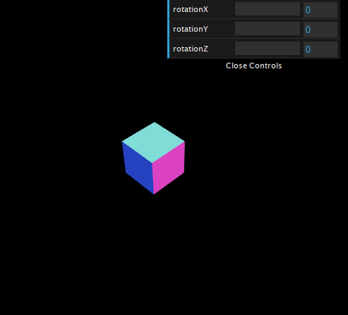

# Học Three.js

## Giới thiệu

Các trình duyệt hiện đại hỗ trợ WebGL. Với WebGL, bạn có thể trực tiếp sử dụng các tài nguyên xử lý của card đồ họa (GPU) và tạo các cảnh 3D với hiệu năng cao. Tuy nhiên, lập trình WebGL rất phức tạp, cần viết nhiều code, dễ gặp lỗi. Three.js là một thư viện JS để tạo và hiển thị đồ họa 3D trên trình duyệt sử dụng WebGL. Three.js giúp việc lập trình 3D trên trình duyệt dễ dàng hơn.

Bạn có thể tìm hiểu lịch sử phát triển của thư viện ở Wikipedia:

[Three.js - Wikipedia](https://en.m.wikipedia.org/wiki/Three.js)

Trang chủ của thư viện:

[Three.js – JavaScript 3D Library](https://threejs.org)

Manual chính thức từ trang chủ:

[Three.js Manual](https://threejs.org/manual/#en/fundamentals)

Bạn có thể học theo sách "Learn Three.js". Sách này mô tả đầy đủ các mục, có nhiều ví dụ:

[Learn Three.js - Third Edition | Packt](https://www.packtpub.com/product/learn-three-js-third-edition/9781788833288)

Bạn có thể xem ví dụ của sách trên online ở đây:

[All (150+) learning Three.js third edition examples online - SmartJava](https://www.smartjava.org/content/all-learning-three-js-third-edition-examples-online/)

Bạn có thể download source code cho sách này ở:

[https://github.com/PacktPublishing/Learn-Three.js-Third-Edition](https://github.com/PacktPublishing/Learn-Three.js-Third-Edition)

Bạn cũng có thể học theo tutorial sau:

[Discover Three.js](https://discoverthreejs.com)

Các bài viết trên Viblo:

[Three.js - Viblo](https://viblo.asia/tags/threejs)

## Chương 1 - Tạo cảnh 3D đầu tiên với Three.js

### Các yêu cầu để sử dụng Three.js

Để chạy một trang web sử dụng Three.js, trình duyệt của bạn phải hỗ trợ WebGL. Ngoài ra, để chạy các ví dụ mà tôi sẽ viết thì trình duyệt của bạn cũng cần hỗ trợ load script dạng module, hỗ trợ lập trình hướng đối tượng trong JS. Có lẽ bạn sẽ không cần quá quan tâm vì hầu hết các trình duyệt hiện nay đều đã hỗ trợ tất cả những điều đó rồi.

Các source code đi kèm được tôi đẩy lên GitHub để bạn có thể lấy về:

[https://github.com/lockex1987/learn-threejs](https://github.com/lockex1987/learn-threejs)

Các source code đều là các file định dạng text (`html`, `js`,  `css`). Để chỉnh sửa, bạn chỉ cần bất cứ text editor nào mà bạn muốn (ví dụ VSCode).

Để chạy các file ví dụ mà tôi viết ở máy của bạn, bạn cần có web server vì một số ví dụ có tải các tài nguyên ngoài cho Texture và model. Ngoài ra các ví dụ viết kiểu JS module nên chắc chắn cần web server. Bạn không thể chạy file html dạng `file:///` được.

Bạn có thể tạo một web server đơn giản bằng PHP như sau:

```
php -S localhost:8000
```

### Tải thư viện Three.js

Bạn có thể download file zip release từ GitHub ở địa chỉ sau:

[Releases · mrdoob/three.js](https://github.com/mrdoob/three.js/releases)

File download khá là nặng, tầm hơn 300MB do chứa cả documentation, editor, code HTML của các ví dụ,... Do đó bạn không nên làm cách này. Bạn chỉ cần một file thư viện Three.js core ở thư mục `build` và tùy trường hợp cụ thể sẽ cần thêm một số file bổ sung ở thư mục `examples`.

Cấu trúc thư mục cùng các file mà bạn cần là:

```
build
    three.cjs
    three.js
    three.min.js
    three.module.js
examples
    fonts
    js
        controls
            OrbitControls.js
        loaders
        ...
    jsm
        controls
            OrbitControls.js
        loaders
src
```

Bạn có thể sử dụng CDN ở địa chỉ sau:

[https://unpkg.com/browse/three/](https://unpkg.com/browse/three/)

Ví dụ địa chỉ của thư viện Three.js core là:

[https://unpkg.com/three@0.137.5/build/three.module.js](https://unpkg.com/three@0.137.5/build/three.module.js)

Địa chỉ của thư viện bổ sung nếu cần sử dụng OrbitControls là:

[https://unpkg.com/three@0.137.5/examples/jsm/controls/OrbitControls.js](https://unpkg.com/three@0.137.5/examples/jsm/controls/OrbitControls.js)

Các ví dụ tôi viết sẽ sử dụng CDN. Phiên bản sử dụng là r137 (release ngày 28/1/2022). Chú ý bạn cần đồng bộ phiên bản của thư viện Three.js core ở thư mục `build` với phiên bản của các thư viện bổ sung trong thư mục `examples`.

Bạn có thể sử dụng npm:

```
npm install three
```

Lệnh npm trên thực hiện khá là nhanh do chỉ download các thư mục `build`,  `examples`, `src`.

Nếu bạn có nhu cầu cần nâng cấp giữa các phiên bản thì có thể làm theo hướng dẫn ở địa chỉ sau:

[Migration Guide · mrdoob/three.js Wiki · GitHub](https://github.com/mrdoob/three.js/wiki/Migration-Guide)

### Tạo khung HTML, CSS, JS cho các ví dụ

Mỗi ví dụ tôi viết thường bao gồm ba file: một file HTML, một file CSS, một file JS.

Chúng ta hãy tạo một file khung HTML (`chapter-01/01-basic-skeleton.html`):

```html
<!DOCTYPE html>
<html>
<head>
    <meta charset="UTF-8" />
    <title>Example 01.01 - Basic skeleton</title>
    <link rel="icon" href="../images/logo.svg" />
    <link rel="stylesheet" href="../css/style.css" />
</head>

<body>
    <canvas id="webglOutput"></canvas>

    <script src="js/01-01.js" type="module"></script>
</body>
</html>
```

Trang web chỉ chứa một thẻ `<canvas>` là nơi mà để vẽ các cảnh 3D.

Chú ý chúng ta load file JS theo kiểu module (thẻ `<script>` có thuộc tính type là module).

Khung file CSS (`css/style.css`):

```css
body {
    margin: 0;
    overflow: hidden;
}

html,
body {
    height: 100%;
}

#webglOutput {
    width: 100%;
    height: 100%;
}
```

Các style đảm bảo cảnh 3D của chúng ta sẽ chiếm toàn màn hình và không bị scroll.

Khung file JS (`chapter-01/js/01-01.js`):

```javascript
import {
    Scene,
    PerspectiveCamera,
    WebGLRenderer,
    BoxGeometry,
    MeshNormalMaterial,
    Mesh,
    REVISION
} from 'https://unpkg.com/three@0.137.5/build/three.module.js';


class ThreejsExample {
    constructor() {
        alert('Phiên bản Three.js là: ' + REVISION);
    }
}


new ThreejsExample();
```

Ở đầu file JS, chúng ta sẽ import các class của Three.js cần sử dụng. Tiếp theo chúng ta khai báo class ThreejsExample. Các nghiệp vụ của chương trình sẽ ở trong class này. Cuối cùng chúng ta sẽ khởi tạo một đối tượng ThreejsExample để thực thi các nghiệp vụ.

Các ví dụ có phần HTML và CSS gần như giống nhau hết, chỉ có phần JS là khác nhau.

[Ví dụ 01.01 - Khung cơ bản](https://static.lockex1987.com/learn-threejs/chapter-01/01-basic-skeleton.html)

Ví dụ trên chỉ hiển thị một trang web trắng cùng thông báo "*Phiên bản Three.js là: 137*".

### Render một đối tượng 3D cơ bản

Chúng ta hãy cùng render một hình lập phương 3D với ít code nhất gồm 6 bước.

**Bước 1**: Tạo một Scene để chứa các đối tượng 3D (Mesh), các nguồn sáng (Light).

```javascript
createScene() {
    const scene = new Scene();
    return scene;
}

constructor(canvas) {
    this.scene = this.createScene();
}
```

**Bước 2**: Tạo một Camera để chỉ định vị trí nhìn, hướng nhìn. Chúng ta sẽ tìm hiểu thêm về các tham số khi khởi tạo Camera ở các bài sau.

```javascript
createCamera() {
    const aspect = window.innerWidth / window.innerHeight;
    const camera = new PerspectiveCamera(45, aspect, 0.1, 1000);
    camera.position.set(-30, 40, 30);
    camera.lookAt(this.scene.position);
    return camera;
}

constructor(canvas) {
    this.camera = this.createCamera();
}
```

**Bước 3**: Tạo một Renderer để render. Chúng ta thường dùng WebGLRenderer. Ngoài ra còn có Renderer dựa vào CSS, SVG nhưng ít được sử dụng. Chúng ta sẽ truyền đối tượng thẻ canvas cho Renderer. Sau này, đối tượng canvas có thể lấy lại bằng thuộc tính `this.renderer.domElement`.

Chúng ta thiết lập màu nền của là màu đen (`new Color(0x000000)`) bằng phương thức `setClearColor`. Chúng ta cũng thiết lập độ lớn của cảnh bằng phương thức `setSize`. Bằng cách truyền `window.innerWidth` và `window.innerHeight`, chúng ta sẽ sử dụng toàn bộ không gian của màn hình.

```javascript
createRenderer(canvas) {
    const renderer = new WebGLRenderer({
        canvas,
        antialias: true
    });
    renderer.setClearColor(new Color(0x000000));
    renderer.setSize(window.innerWidth, window.innerHeight);
    return renderer;
}
    
constructor(canvas) {
    this.renderer = this.createRenderer(canvas);
}
```

**Bước 4**: Tạo một đối tượng Mesh hình lập phương và thêm nó vào Scene. Mesh được tạo lên từ Geometry và Material. Chúng ta sẽ dùng MeshNormalMaterial hoặc MeshBasicMaterial để chưa cần tới Light mà vẫn nhìn thấy đối tượng. Chúng ta cũng thiết lập vị trí của đối tượng.

```javascript
createCube() {
    const cubeGeometry = new BoxGeometry(6, 6, 6);
    const cubeMaterial = new MeshNormalMaterial();
    const cube = new Mesh(cubeGeometry, cubeMaterial);
    cube.position.set(-4, 3, 0);
    return cube;
}

constructor(canvas) {
    const cube = this.createCube();
    this.scene.add(cube);
}
```

**Bước 5**: Chúng ta yêu cầu Renderer hãy render Scene với Camera đi.

```javascript
render() {
    this.renderer.render(this.scene, this.camera);
}

constructor(canvas) {
    this.render();
}
```

**Bước 6**: Khởi tạo đối tượng ThreejsExample để chạy những nghiệp vụ trên.

```javascript
new ThreejsExample(document.querySelector('#webglOutput'));
```

Toàn bộ code đầy đủ là (`chapter-01/js/01-02.js`):

```javascript
import {
    Scene,
    PerspectiveCamera,
    WebGLRenderer,
    Color,
    BoxGeometry,
    MeshNormalMaterial,
    Mesh
} from 'https://unpkg.com/three@0.137.5/build/three.module.js';


class ThreejsExample {
    constructor(canvas) {
        this.scene = this.createScene();
        this.camera = this.createCamera();
        this.renderer = this.createRenderer(canvas);
        const cube = this.createCube();
        this.scene.add(cube);
        this.render();
    }

    createScene() {
        const scene = new Scene();
        return scene;
    }

    createCamera() {
        const aspect = window.innerWidth / window.innerHeight;
        const camera = new PerspectiveCamera(45, aspect, 0.1, 1000);
        camera.position.set(-30, 40, 30);
        camera.lookAt(this.scene.position);
        return camera;
    }

    createRenderer(canvas) {
        const renderer = new WebGLRenderer({
            canvas,
            antialias: true
        });
        renderer.setClearColor(new Color(0x000000));
        renderer.setSize(window.innerWidth, window.innerHeight);
        return renderer;
    }

    createCube() {
        const cubeGeometry = new BoxGeometry(6, 6, 6);
        const cubeMaterial = new MeshNormalMaterial();
        const cube = new Mesh(cubeGeometry, cubeMaterial);
        cube.position.set(-4, 3, 0);
        return cube;
    }

    render() {
        this.renderer.render(this.scene, this.camera);
    }
}


new ThreejsExample(document.querySelector('#webglOutput'));
```

[Ví dụ 01.02 - Scene đầu tiên](https://static.lockex1987.com/learn-threejs/chapter-01/02-first-scene.html)

Nếu bạn mở ví dụ trên trình duyệt, chúng ta sẽ thấy một hình lập phương như sau:


Ví dụ đơn giản của chúng ta chỉ sử dụng các đối tượng cơ bản sau:

- Scene
- Camera (PerspectiveCamera)
- Renderer (WebGLRenderer)
- Geometry (BoxGeometry)
- Material (MeshNormalMaterial)
- Mesh

Các cảnh 3D đều được tạo từ các đối tượng cơ bản trên, cùng với đối tượng cơ bản khác là Light mà chúng ta chưa nhắc đến.

### Sử dụng dat.GUI để trải nghiệm dễ dàng hơn

Thư viện dat.GUI cho phép bạn tạo một giao diện đơn giản để bạn có thể thay đổi các biến trong code của bạn. Chúng ta sẽ tích hợp dat.GUI vào các ví dụ để có thể điều chỉnh vị trí, xoay các đối tượng, thay đổi các cấu hình khác, giúp bạn hiểu hơn khi tìm hiểu từng khái niệm mới.

Trang GitHub chủ của thư viện là:

[GitHub - dataarts/dat.gui: dat.gui is a lightweight controller library for  JavaScript](https://github.com/dataarts/dat.gui)

Để sử dụng thư viện, chúng ta thêm thẻ `script` sau vào trang:

```html
<script src="https://cdnjs.cloudflare.com/ajax/libs/dat-gui/0.7.7/dat.gui.min.js"></script>
```

Chúng ta sẽ khai báo một đối tượng JS mà sẽ có các thuộc tính mà chúng ta muốn thay đổi sử dụng dat.GUI. Ví dụ chúng ta muốn thay đổi góc quay theo 3 trục của hình lập phương mà chúng ta đã tạo ở ví dụ trước:

```javascript
this.controls = {
    rotationX: 0,
    rotationY: 0,
    rotationZ: 0
};
```

Tiếp theo, chúng ta sẽ truyền đối tượng này cho đối tượng dat.GUI mới và định nghĩa khoảng giá trị của các thuộc tính (từ 0 đến 360 độ). Chúng ta cũng định nghĩa nghiệp vụ khi giá trị các thuộc tính được thay đổi ở phương thức `onChange`. Các góc trong Three.js sử dụng đơn vị là radian nên chúng ta cũng có thêm phương thức `convertDegToRad` để chuyển từ độ sang radian.

```javascript
createGui() {
    const gui = new dat.GUI();
    gui.add(this.controls, 'rotationX', 0, 360).onChange(value => {
        this.cube.rotation.x = this.convertDegToRad(value);
        this.render();
    });
    gui.add(this.controls, 'rotationY', 0, 360).onChange(value => {
        this.cube.rotation.y = this.convertDegToRad(value);
        this.render();
    });
    gui.add(this.controls, 'rotationZ', 0, 360).onChange(value => {
        this.cube.rotation.z = this.convertDegToRad(value);
        this.render();
    });
}

convertDegToRad(deg) {
    return deg * Math.PI / 180;
}
```

[Ví dụ 01.03 - Control GUI](https://static.lockex1987.com/learn-threejs/chapter-01/03-control-gui.html)

Khi bạn chạy ví dụ trên, bạn sẽ thấy một giao diện đơn giản ở góc trên phải của màn hình mà bạn có thể điều khiển góc quay theo các trục X, Y, Z. Hãy tự mình xoay hình lập phương theo các góc khác nhau để cảm nhận tính 3D của cảnh.




