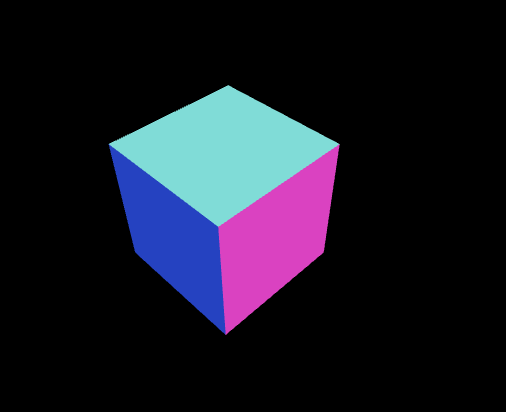
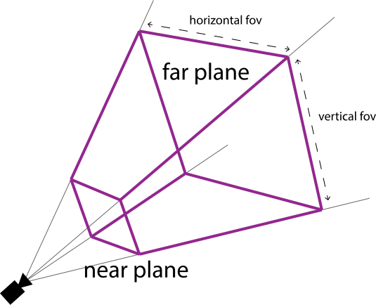
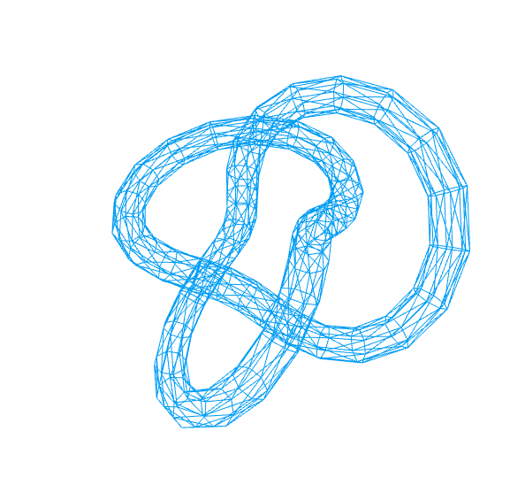
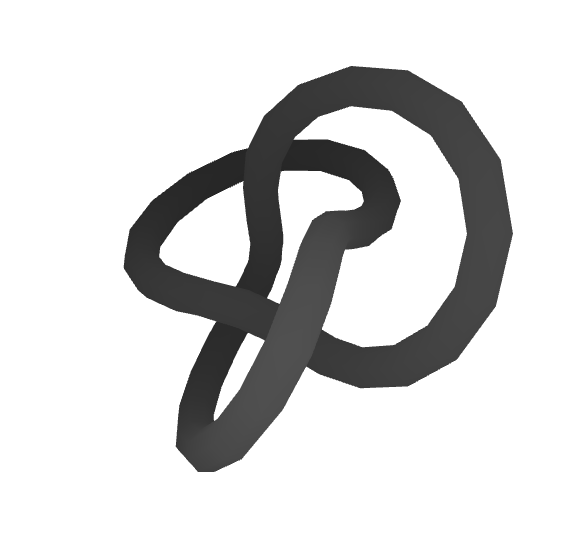
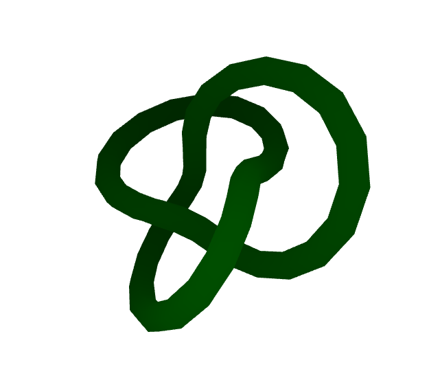
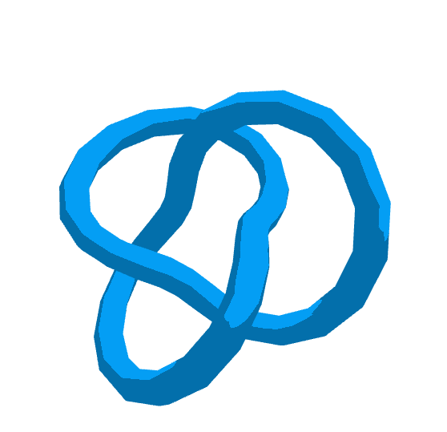
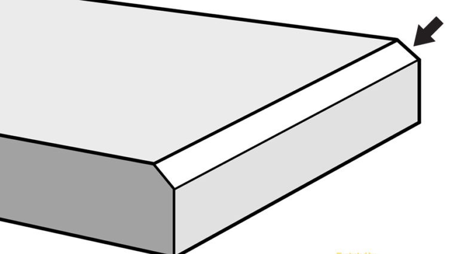
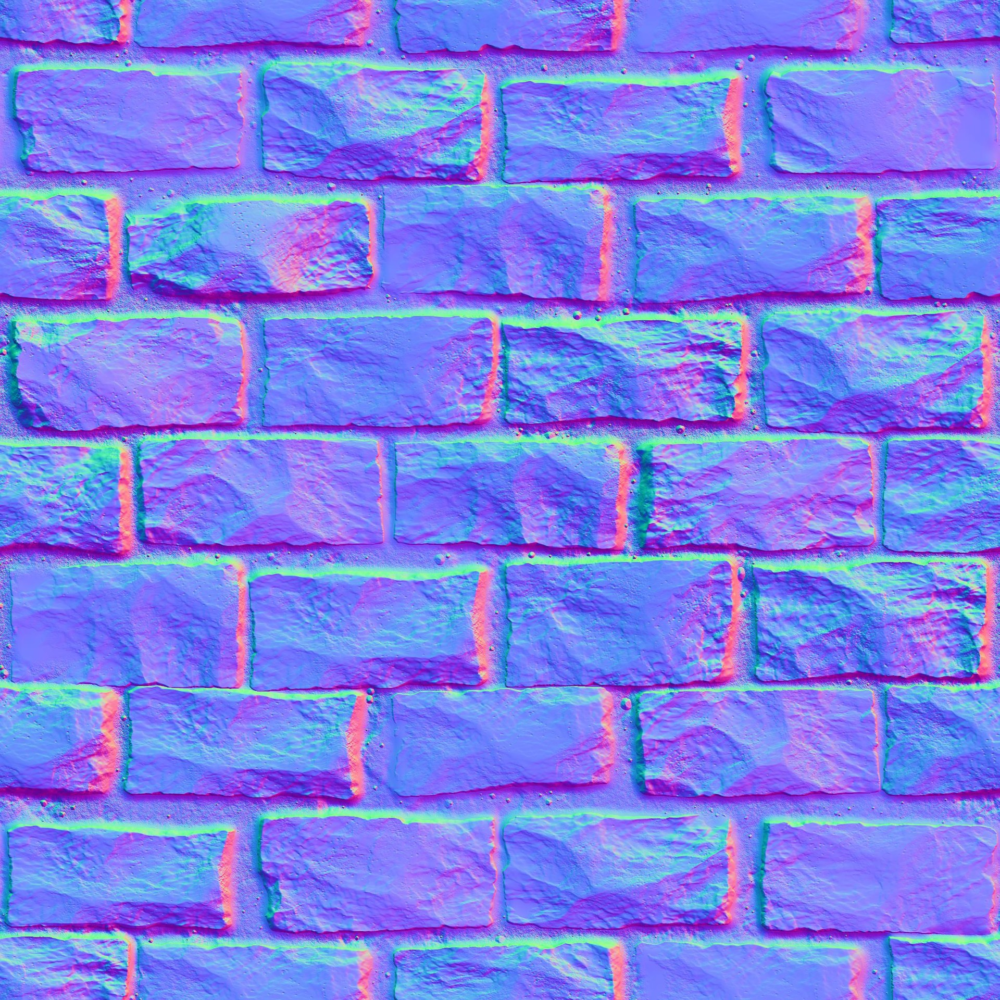
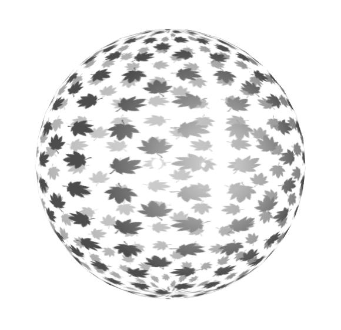

## Giới thiệu

Các trình duyệt hiện đại hỗ trợ WebGL. Với WebGL, bạn có thể trực tiếp sử dụng các tài nguyên xử lý của card đồ họa (GPU) và tạo các cảnh 3D với hiệu năng cao. Tuy nhiên, lập trình WebGL rất phức tạp, cần viết nhiều code, dễ gặp lỗi. Three.js là một thư viện JS để tạo và hiển thị đồ họa 3D trên trình duyệt sử dụng WebGL. Three.js giúp việc lập trình 3D trên trình duyệt dễ dàng hơn.

Bạn có thể tìm hiểu lịch sử phát triển của thư viện ở Wikipedia:

[Three.js - Wikipedia](https://en.m.wikipedia.org/wiki/Three.js)

Trang chủ của thư viện:

[Three.js – JavaScript 3D Library](https://threejs.org)

Manual chính thức từ trang chủ:

[Three.js Manual](https://threejs.org/manual/#en/fundamentals)

Bạn có thể tra cứu các class từ documentation. Mỗi class sẽ có các thuộc tính và phương thức, cũng như các ví dụ:

[Three.js Docs](https://threejs.org/docs/index.html)

Bạn có thể học theo sách "Learn Three.js". Sách này mô tả đầy đủ các mục, có nhiều ví dụ:

[Learn Three.js - Third Edition | Packt](https://www.packtpub.com/product/learn-three-js-third-edition/9781788833288)

Bạn có thể xem ví dụ của sách trên online ở đây:

[All (150+) learning Three.js third edition examples online - SmartJava](https://www.smartjava.org/content/all-learning-three-js-third-edition-examples-online/)

Bạn có thể download source code cho sách này ở:

[https://github.com/PacktPublishing/Learn-Three.js-Third-Edition](https://github.com/PacktPublishing/Learn-Three.js-Third-Edition)

Bạn cũng có thể học theo tutorial sau:

[Discover Three.js](https://discoverthreejs.com)

Các bài viết trên Viblo:

[Three.js - Viblo](https://viblo.asia/tags/threejs)

Khóa học có phí chất lượng:

[Three.js Journey](https://threejs-journey.com)

## Chương 1 - Tạo cảnh 3D đầu tiên

### Các yêu cầu để sử dụng Three.js

Để chạy một trang web sử dụng Three.js, trình duyệt của bạn phải hỗ trợ WebGL. Ngoài ra, để chạy các ví dụ mà tôi sẽ viết thì trình duyệt của bạn cũng cần hỗ trợ load script dạng module, hỗ trợ lập trình hướng đối tượng trong JS. Có lẽ bạn sẽ không cần quá quan tâm vì hầu hết các trình duyệt hiện nay đều đã hỗ trợ tất cả những điều đó rồi.

Các source code đi kèm được tôi đẩy lên GitHub để bạn có thể lấy về:

[https://github.com/lockex1987/learn-threejs](https://github.com/lockex1987/learn-threejs)

Các source code đều là các file định dạng text (`html`, `js`,  `css`). Để chỉnh sửa, bạn chỉ cần bất cứ text editor nào mà bạn muốn (ví dụ VSCode).

Để chạy các file ví dụ mà tôi viết ở máy của bạn, bạn cần có web server vì một số ví dụ có tải các tài nguyên ngoài cho Texture và model. Ngoài ra các ví dụ viết kiểu JS module nên chắc chắn cần web server. Bạn không thể chạy file html dạng `file:///` được.

Bạn có thể tạo một web server đơn giản bằng PHP như sau:

```
php -S localhost:8000
```

### Tải thư viện Three.js

Bạn có thể download file zip release từ GitHub ở địa chỉ sau:

[Releases · mrdoob/three.js](https://github.com/mrdoob/three.js/releases)

File download khá là nặng, tầm hơn 300MB do chứa cả documentation, editor, code HTML của các ví dụ,... Do đó bạn không nên làm cách này. Bạn chỉ cần một file thư viện Three.js core ở thư mục `build` và tùy trường hợp cụ thể sẽ cần thêm một số file bổ sung ở thư mục `examples`.

Cấu trúc thư mục cùng các file mà bạn cần là:

```
build
├── three.cjs
├── three.js
├── three.min.js
└── three.module.js

examples
├── fonts
├── js
│   │   controls
│   │   └── OrbitControls.js
│   ├── loaders
│       └── GLTFLoader.js
│       ...
└── jsm
    ├── controls
    │   └── OrbitControls.js
    ├── loaders
        └── GLTFLoader.js
        ...

src
```

Bạn có thể sử dụng CDN ở địa chỉ sau:

[https://unpkg.com/browse/three/](https://unpkg.com/browse/three/)

Ví dụ địa chỉ của thư viện Three.js core là:

[https://unpkg.com/three@0.137.5/build/three.module.js](https://unpkg.com/three@0.137.5/build/three.module.js)

Địa chỉ của thư viện bổ sung nếu cần sử dụng OrbitControls là:

[https://unpkg.com/three@0.137.5/examples/jsm/controls/OrbitControls.js](https://unpkg.com/three@0.137.5/examples/jsm/controls/OrbitControls.js)

Các ví dụ tôi viết sẽ sử dụng CDN. Phiên bản sử dụng là r137 (release ngày 28/1/2022). Chú ý bạn cần đồng bộ phiên bản của thư viện Three.js core ở thư mục `build` với phiên bản của các thư viện bổ sung trong thư mục `examples`.

Bạn có thể sử dụng npm:

```
npm install three
```

Lệnh npm trên thực hiện khá là nhanh do chỉ download các thư mục `build`,  `examples`, `src`.

Nếu bạn có nhu cầu cần nâng cấp giữa các phiên bản (ví dụ class bạn dùng không tòn tại nữa do bị đổi tên) thì có thể làm theo hướng dẫn ở địa chỉ sau:

[Migration Guide · mrdoob/three.js Wiki · GitHub](https://github.com/mrdoob/three.js/wiki/Migration-Guide)

### Tạo khung HTML, CSS, JS cho các ví dụ

Mỗi ví dụ tôi viết thường bao gồm ba file: một file HTML, một file CSS, một file JS.

Chúng ta hãy tạo một file khung HTML (`chapter-01/01-basic-skeleton.html`):

```html
<!DOCTYPE html>
<html>
<head>
    <meta charset="UTF-8" />
    <meta name="viewport" content="width=device-width, initial-scale=1.0" />
    <title>Example 01.01 - Basic skeleton</title>
    <link rel="icon" href="../images/logo.svg" />
    <link rel="stylesheet" href="../css/style.css" />
</head>

<body>
    <canvas id="webglOutput"></canvas>

    <script src="js/01-01.js" type="module"></script>
</body>
</html>
```

Trang web chỉ chứa một thẻ `<canvas>` là nơi mà để vẽ các cảnh 3D.

Chú ý chúng ta load file JS theo kiểu module (thẻ `<script>` có thuộc tính type là module).

Khung file CSS (`css/style.css`):

```css
body {
    margin: 0;
    overflow: hidden;
}

html,
body {
    height: 100%;
}

#webglOutput {
    width: 100%;
    height: 100%;
}
```

Các style đảm bảo cảnh 3D của chúng ta sẽ chiếm toàn màn hình và không bị scroll.

Khung file JS (`chapter-01/js/01-01.js`):

```javascript
import {
    Scene,
    PerspectiveCamera,
    WebGLRenderer,
    BoxGeometry,
    MeshNormalMaterial,
    Mesh,
    REVISION
} from 'https://unpkg.com/three@0.137.5/build/three.module.js';


class ThreejsExample {
    constructor() {
        alert('Phiên bản Three.js là: ' + REVISION);
    }
}


new ThreejsExample();
```

Ở đầu file JS, chúng ta sẽ import các class của Three.js cần sử dụng. Tiếp theo chúng ta khai báo class ThreejsExample. Các nghiệp vụ của chương trình sẽ ở trong class này. Cuối cùng chúng ta sẽ khởi tạo một đối tượng ThreejsExample để thực thi các nghiệp vụ.

Các ví dụ có phần HTML và CSS gần như giống nhau hết, chỉ có phần JS là khác nhau.

[Ví dụ 01.01 - Khung cơ bản](https://static.lockex1987.com/learn-threejs/chapter-01/01-01-basic-skeleton.html)

Ví dụ trên chỉ hiển thị một trang web trắng cùng thông báo "*Phiên bản Three.js là: 137*".

### Render một đối tượng 3D cơ bản

Chúng ta hãy cùng render một hình lập phương 3D với ít code nhất gồm 6 bước.

**Bước 1**: Tạo một Scene để chứa các đối tượng 3D (Mesh), các nguồn sáng (Light).

```javascript
createScene() {
    const scene = new Scene();
    return scene;
}

constructor(canvas) {
    this.scene = this.createScene();
}
```

**Bước 2**: Tạo một Camera để chỉ định vị trí nhìn, hướng nhìn. Chúng ta sẽ tìm hiểu thêm về các tham số khi khởi tạo Camera ở các bài sau.

```javascript
createCamera() {
    const aspect = window.innerWidth / window.innerHeight;
    const camera = new PerspectiveCamera(45, aspect, 0.1, 1000);
    camera.position.set(-30, 40, 30);
    camera.lookAt(this.scene.position);
    return camera;
}

constructor(canvas) {
    this.camera = this.createCamera();
}
```

**Bước 3**: Tạo một Renderer để render. Chúng ta thường dùng WebGLRenderer. Ngoài ra còn có Renderer dựa vào CSS, SVG nhưng ít được sử dụng. Chúng ta sẽ truyền đối tượng thẻ canvas cho Renderer. Sau này, đối tượng canvas có thể lấy lại bằng thuộc tính `this.renderer.domElement`.

Chúng ta thiết lập màu nền của là màu trắng (`new Color(0xFFFFFF)`) bằng phương thức `setClearColor`. Chúng ta cũng thiết lập độ lớn của cảnh bằng phương thức `setSize`. Bằng cách truyền `window.innerWidth` và `window.innerHeight`, chúng ta sẽ sử dụng toàn bộ không gian của màn hình.

```javascript
createRenderer(canvas) {
    const renderer = new WebGLRenderer({
        canvas,
        antialias: true
    });
    renderer.setClearColor(new Color(0xFFFFFF));
    renderer.setSize(window.innerWidth, window.innerHeight);
    return renderer;
}
    
constructor(canvas) {
    this.renderer = this.createRenderer(canvas);
}
```

**Bước 4**: Tạo một đối tượng Mesh hình lập phương và thêm nó vào Scene. Mesh được tạo lên từ Geometry và Material. Chúng ta sẽ dùng MeshNormalMaterial hoặc MeshBasicMaterial để chưa cần tới Light mà vẫn nhìn thấy đối tượng. Chúng ta cũng thiết lập vị trí của đối tượng.

```javascript
createCube() {
    const cubeGeometry = new BoxGeometry(6, 6, 6);
    const cubeMaterial = new MeshNormalMaterial();
    const cube = new Mesh(cubeGeometry, cubeMaterial);
    cube.position.set(-4, 3, 0);
    return cube;
}

constructor(canvas) {
    const cube = this.createCube();
    this.scene.add(cube);
}
```

**Bước 5**: Chúng ta yêu cầu Renderer hãy render Scene với Camera đi.

```javascript
render() {
    this.renderer.render(this.scene, this.camera);
}

constructor(canvas) {
    this.render();
}
```

**Bước 6**: Khởi tạo đối tượng ThreejsExample để chạy những nghiệp vụ trên.

```javascript
new ThreejsExample(document.querySelector('#webglOutput'));
```

Toàn bộ code đầy đủ là (`chapter-01/js/01-02.js`):

```javascript
import {
    Scene,
    PerspectiveCamera,
    WebGLRenderer,
    Color,
    BoxGeometry,
    MeshNormalMaterial,
    Mesh
} from 'https://unpkg.com/three@0.137.5/build/three.module.js';


class ThreejsExample {
    constructor(canvas) {
        this.scene = this.createScene();
        this.camera = this.createCamera();
        this.renderer = this.createRenderer(canvas);
        const cube = this.createCube();
        this.scene.add(cube);
        this.render();
    }

    createScene() {
        const scene = new Scene();
        return scene;
    }

    createCamera() {
        const aspect = window.innerWidth / window.innerHeight;
        const camera = new PerspectiveCamera(45, aspect, 0.1, 1000);
        camera.position.set(-30, 40, 30);
        camera.lookAt(this.scene.position);
        return camera;
    }

    createRenderer(canvas) {
        const renderer = new WebGLRenderer({
            canvas,
            antialias: true
        });
        renderer.setClearColor(new Color(0xFFFFFF));
        renderer.setSize(window.innerWidth, window.innerHeight);
        return renderer;
    }

    createCube() {
        const cubeGeometry = new BoxGeometry(6, 6, 6);
        const cubeMaterial = new MeshNormalMaterial();
        const cube = new Mesh(cubeGeometry, cubeMaterial);
        cube.position.set(-4, 3, 0);
        return cube;
    }

    render() {
        this.renderer.render(this.scene, this.camera);
    }
}


new ThreejsExample(document.querySelector('#webglOutput'));
```

[Ví dụ 01.02 - Scene đầu tiên](https://static.lockex1987.com/learn-threejs/chapter-01/01-02-first-scene.html)

Nếu bạn mở ví dụ trên trình duyệt, chúng ta sẽ thấy một hình lập phương như sau:



Ví dụ đơn giản của chúng ta chỉ sử dụng các thành phần cơ bản sau:

- Scene
- Camera (PerspectiveCamera)
- Renderer (WebGLRenderer)
- Geometry (BoxGeometry)
- Material (MeshNormalMaterial)
- Mesh

Các cảnh 3D đều được tạo từ các thành phần cơ bản trên, cùng với thành phần cơ bản khác là Light mà chúng ta chưa nhắc đến.


Chúng ta sẽ lần lượt tìm hiểu từng thành phần ở những phần sau.

### Sử dụng dat.GUI để trải nghiệm dễ dàng hơn

#### Hướng dẫn chung dat.GUI

Thư viện dat.GUI cho phép bạn tạo một giao diện đơn giản để bạn có thể thay đổi các biến trong code của bạn. Chúng ta sẽ tích hợp dat.GUI vào các ví dụ để có thể điều chỉnh vị trí, xoay các đối tượng, thay đổi các cấu hình khác, giúp bạn hiểu hơn khi tìm hiểu từng khái niệm mới. Bạn có thể thay đổi trực tiếp và nhìn các thay đổi luôn ngay trên giao diện. Việc này là tốt hơn rất nhiều so với việc bạn sửa code, refresh trình duyệt, xem kết quả, rồi lại sửa code, refresh trình duyệt, xem kết quả mới,...

Trang GitHub chủ của thư viện là:

[GitHub - dataarts/dat.gui: dat.gui is a lightweight controller library for  JavaScript](https://github.com/dataarts/dat.gui)

Các API mà thư viện cung cấp là:

[https://github.com/dataarts/dat.gui/blob/master/API.md](https://github.com/dataarts/dat.gui/blob/master/API.md)

Để sử dụng thư viện, chúng ta thêm thẻ `<script>` sau vào trang:

```html
<script src="https://unpkg.com/dat.gui@0.7.7/build/dat.gui.min.js"></script>
```

Hoặc bạn cũng có thể import như sau:

```javascript
import * as dat from 'https://unpkg.com/dat.gui@0.7.7/build/dat.gui.module.js';
```

Ở các hướng dẫn trên trang chủ của Three.js thường sử dụng lil-gui thay cho dat.GUI. Tuy nhiên cách sử dụng cũng khá giống nhau:

```javascript
import GUI from 'https://cdn.jsdelivr.net/npm/lil-gui@0.16/+esm';
```

Chúng ta khởi tạo một đối tượng dat.GUI như sau:

```javascript
const gui = new dat.GUI();
```

Ở câu lệnh trên, chúng ta không truyền thêm tham số nào khi khởi tạo. Tuy nhiên, chúng ta có thể thêm tham số là một đối tượng với các thuộc tính như `closed`, `width`,...

Để thêm một cấu hình, chúng ta sử dụng phương thức:

```javascript
gui.add(object, property, [min], [max], [step])
```

Tham số thứ nhất `object` là một đối tượng. Tham số thứ hai `property` là tên thuộc tính của đối tượng đó.

Loại của cấu hình sẽ được suy ra từ kiểu dữ liệu của giá trị của thuộc tính (giá trị của `object[property]`). Có thể có các loại sau:

- Number: giá trị kiểu số
- Range: giá trị kiểu số cùng với min, max, có thể có step hoặc không
- Text: giá trị kiểu String
- Checkbox: giá trị kiểu Boolean
- Select: giá trị là mảng các giá trị
- Button: giá trị là một hàm kiểu Function

Ngoài ra, bạn có thể thêm nhãn bằng cách sử dụng phương thức `listen()` và thêm một mục to bằng phương thức `addFolder()`.

Bạn có thể để truyền các giá trị min, max, step ở ngày trong phương thức `add()`, hoặc có thể chain các phương thức như sau:

```javascript
gui.add(object, property)
    .min(min)
    .max(max)
    .step(step)
```

Tên hiển thị ở giao diện cấu hình sẽ chính là `property`. Nhiều khi tên này sẽ bị lặp, hoặc là không thân thiện lắm. Chúng ta có thể đổi tên hiển thị bằng phương thức `name()`.

```javascript
gui.add(object, propery)
    .name(name)
```

Chúng ta có thể lắng nghe khi các giá trị cấu hình được thay đổi bằng phương thức `onChange()`.

```javascript
gui.add(object, property)
    .onChange(value => {
        // value là giá trị mới sau khi thay đổi
        // xử lý nghiệp vụ ở đây
    })
```

Để thêm cấu hình cho các giá trị màu sắc, bạn sử dụng phương thức `addColor()`. Chúng ta cần một phương thức mới, không sử dụng phương thức `add()` cũ vì cần phân biệt với các trường hợp kiểu dữ liệu là Number hoặc String.

Chúng ta có thể truyền giá trị màu sắc ban đầu theo các định dạng sau:

- Xâu CSS ('#FF0000')
- Mảng RGB ([0, 128, 255])
- Mảng RGB cùng giá trị alpha ([0, 128, 255, 0.3])
- Giá trị hue, saturation, value ({ h: 350, s: 0.9, v: 0.3 })
- Số nguyên (0xFF0000)

Tips:

- Bạn có thể nhấn phím H để ẩn / hiện giao diện cấu hình hoặc sử dụng các phương thức như `gui.hide()`, `gui.show()`.
- Bạn có thể truyền `width` khi khởi tạo để chỉ định kích thước của giao diện

#### Cấu hình góc xoay hình lập phương

Chúng ta sẽ khai báo một đối tượng JS mà sẽ có các thuộc tính mà chúng ta muốn thay đổi sử dụng dat.GUI. Ví dụ chúng ta muốn thay đổi góc quay theo 3 trục của hình lập phương mà chúng ta đã tạo ở ví dụ trước:

```javascript
this.controls = {
    rotationX: 0,
    rotationY: 0,
    rotationZ: 0
};
```

Tiếp theo, chúng ta sẽ truyền đối tượng này cho đối tượng dat.GUI mới và định nghĩa khoảng giá trị của các thuộc tính (từ 0 đến 360 độ). Chúng ta cũng định nghĩa nghiệp vụ khi giá trị các thuộc tính được thay đổi ở phương thức `onChange`: cập nhật lại các góc quay của hình lập phương và render lại. Các góc trong Three.js sử dụng đơn vị là radian nên chúng ta cũng có thêm phương thức `convertDegToRad` để chuyển từ độ sang radian.

```javascript
createControlsGui() {
    const gui = new dat.GUI();
    gui.add(this.controls, 'rotationX', 0, 360).onChange(value => {
        this.cube.rotation.x = this.convertDegToRad(value);
        this.render();
    });
    gui.add(this.controls, 'rotationY', 0, 360).onChange(value => {
        this.cube.rotation.y = this.convertDegToRad(value);
        this.render();
    });
    gui.add(this.controls, 'rotationZ', 0, 360).onChange(value => {
        this.cube.rotation.z = this.convertDegToRad(value);
        this.render();
    });
}

convertDegToRad(deg) {
    return deg * Math.PI / 180;
}
```

Toàn bộ code đầy đủ là (`chapter-01/js/01-03.js`):

```javascript
import {
    Scene,
    PerspectiveCamera,
    WebGLRenderer,
    Color,
    BoxGeometry,
    MeshNormalMaterial,
    Mesh
} from 'https://unpkg.com/three@0.137.5/build/three.module.js';

import * as dat from 'https://unpkg.com/dat.gui@0.7.7/build/dat.gui.module.js';


class ThreejsExample {
    constructor(canvas) {
        this.scene = this.createScene();
        this.camera = this.createCamera();
        this.renderer = this.createRenderer(canvas);

        this.cube = this.createCube();
        this.scene.add(this.cube);

        this.render();

        this.controls = {
            rotationX: 0,
            rotationY: 0,
            rotationZ: 0
        };
        this.createControlsGui();
    }

    createScene() {
        const scene = new Scene();
        return scene;
    }

    createCamera() {
        const aspect = window.innerWidth / window.innerHeight;
        const camera = new PerspectiveCamera(45, aspect, 0.1, 1000);
        camera.position.set(-30, 40, 30);
        camera.lookAt(this.scene.position);
        return camera;
    }

    createRenderer(canvas) {
        const renderer = new WebGLRenderer({
            canvas,
            antialias: true
        });
        renderer.setClearColor(new Color(0xFFFFFF));
        renderer.setSize(window.innerWidth, window.innerHeight);
        return renderer;
    }

    createCube() {
        const cubeGeometry = new BoxGeometry(6, 6, 6);
        const cubeMaterial = new MeshNormalMaterial();
        const cube = new Mesh(cubeGeometry, cubeMaterial);
        cube.position.set(-4, 3, 0);
        return cube;
    }

    createControlsGui() {
        const gui = new dat.GUI();
        gui.add(this.controls, 'rotationX', 0, 360).onChange(value => {
            this.cube.rotation.x = this.convertDegToRad(value);
            this.render();
        });
        gui.add(this.controls, 'rotationY', 0, 360).onChange(value => {
            this.cube.rotation.y = this.convertDegToRad(value);
            this.render();
        });
        gui.add(this.controls, 'rotationZ', 0, 360).onChange(value => {
            this.cube.rotation.z = this.convertDegToRad(value);
            this.render();
        });
    }

    convertDegToRad(deg) {
        return deg * Math.PI / 180;
    }

    render() {
        this.renderer.render(this.scene, this.camera);
    }
}


new ThreejsExample(document.querySelector('#webglOutput'));
```

[Ví dụ 01.03 - Control GUI](https://static.lockex1987.com/learn-threejs/chapter-01/01-03-control-gui.html)

Khi bạn chạy ví dụ trên, bạn sẽ thấy một giao diện đơn giản ở góc trên phải của màn hình mà bạn có thể điều khiển góc quay theo các trục X, Y, Z. Hãy tự mình xoay hình lập phương theo các góc khác nhau để cảm nhận tính 3D của cảnh.


### Responsive

#### Cảnh chiếm toàn bộ viewport, responsive theo viewport

Trong các ví dụ trước, chúng ta đã tạo được một cảnh 3D đơn giản. Tuy nhiên, khi bạn thay đổi kích thước viewport của trình duyệt, bạn có thể thấy là kích thước của cảnh vẫn giữ nguyên. Do đó, nếu bạn mở rộng viewport thì sẽ có các khoảng trắng ở bên phải hoặc bên dưới, còn nếu bạn thu nhỏ viewport thì một số phần của cảnh sẽ bị che mất.

Mở rộng:


Thu nhỏ:


Để có thể thay đổi kích thước của cảnh theo kích thước của viewport, chúng ta cần lắng nghe sự kiện `resize` của window. Đây là JS bình thường, chưa phải là Three.js:

```javascript
handleResize() {
    window.addEventListener('resize', () => {
        this.onResize();
    });
}
```

Trong sự kiện `resize`, chúng ta sẽ cần update lại `aspect` của Camera theo tỷ lệ chiều ngang / chiều dọc của viewport, thông báo cập nhật lại ma trận chiếu của Camera, đồng thời cập nhật lại kích thước của Renderer:

```javascript
onResize() {
    const width = window.innerWidth;
    const height = window.innerHeight;
    const aspect = width / height;
    this.camera.aspect = aspect;
    this.camera.updateProjectionMatrix();
    this.renderer.setSize(width, height);
}
```

Chúng ta cũng cần lại render lại cảnh:

```javascript
this.render();
```

Chú ý: Không xử lý nặng ở hàm `resize`. Có thể sử dụng kỹ thuật throttle để tránh hàm bị gọi với tần suất cao.

Toàn bộ code đầy đủ là (`chapter-01/js/01-04.js`):

```javascript
import {
    Scene,
    PerspectiveCamera,
    WebGLRenderer,
    Color,
    BoxGeometry,
    MeshNormalMaterial,
    Mesh
} from 'https://unpkg.com/three@0.137.5/build/three.module.js';


class ThreejsExample {
    constructor(canvas) {
        this.scene = this.createScene();
        this.camera = this.createCamera();
        this.renderer = this.createRenderer(canvas);
        const cube = this.createCube();
        this.scene.add(cube);
        this.render();
        this.handleResize();
    }

    createScene() {
        const scene = new Scene();
        return scene;
    }

    createCamera() {
        const aspect = window.innerWidth / window.innerHeight;
        const camera = new PerspectiveCamera(45, aspect, 0.1, 1000);
        camera.position.set(-30, 40, 30);
        camera.lookAt(this.scene.position);
        return camera;
    }

    createRenderer(canvas) {
        const renderer = new WebGLRenderer({
            canvas,
            antialias: true
        });
        renderer.setClearColor(new Color(0xFFFFFF));
        const width = window.innerWidth;
        const height = window.innerHeight;
        renderer.setSize(width, height);
        return renderer;
    }

    createCube() {
        const cubeGeometry = new BoxGeometry(6, 6, 6);
        const cubeMaterial = new MeshNormalMaterial();
        const cube = new Mesh(cubeGeometry, cubeMaterial);
        cube.position.set(-4, 3, 0);
        return cube;
    }

    render() {
        this.renderer.render(this.scene, this.camera);
    }

    handleResize() {
        window.addEventListener('resize', () => {
            this.onResize();
            this.render();
        });
    }

    onResize() {
        const width = window.innerWidth;
        const height = window.innerHeight;
        const aspect = width / height;
        this.camera.aspect = aspect;
        this.camera.updateProjectionMatrix();
        this.renderer.setSize(width, height);
    }
}


new ThreejsExample(document.querySelector('#webglOutput'));
```

[Ví dụ 01.04 - Responsive](https://static.lockex1987.com/learn-threejs/chapter-01/01-04-responsive.html)

Bạn có thể test responsive trên các thiết bị mobile bằng cách xoay qua lại giữa chế độ `portrait` và `landscape`. Sự kiện `resize` cũng xảy ra trên máy tính nếu như chúng ta sử dụng nhiều màn hình và di chuyển trình duyệt giữa các màn hình.

Sử dụng kiểm tra check sau trong trường hợp không phải resize cả trình duyệt, mà resize thành phần của trang: ví dụ chúng ta có side panel ở bên trái có thể thay đổi kích thước:

```javascript
needResize(canvas) {
    return canvas.width !== canvas.clientWidth
        || canvas.height !== canvas.clientHeight;
}
```


#### Cảnh không chiếm toàn bộ viewport, responsive theo canvas

Ở ví dụ trên, chúng ta đã xử lý trong trường hợp cảnh 3D chiếm toàn bộ viewport. Chúng ta tính toán với các kích thước của viewport (`window.innerWidth`, `window.innerHeight`). Vậy trong trường hợp cảnh không chiếm toàn bộ viewport thì sao? Ví dụ khi mà cảnh 3D chỉ là một phần trang trí của trang web, có thể có kích thước cố định nào đó theo pixel hoặc là kích thước tương đối theo phần trăm với viewport. Lúc đó chúng ta sẽ cần dựa vào phần tử canvas của trang, nơi mà cảnh 3D được render.

Để minh họa cho việc cảnh không chiếm toàn bộ viewport, chúng ta có thể để kích thước canvas chiếm 70% của chiều width và height:

```html
<style>
    #webglOutput {
        width: 70%;
        height: 70%;
    }
</style>
```

Chúng ta sẽ cần chờ cho trang web được tải xong hoàn toàn rồi mới thực thi. Khi đó việc tính toán kích thước canvas mới chính xác. Chúng ta lấy kích thước canvas bằng các thuộc tính là `canvas.clientWidth` và `canvas.clientHeight`.

```javascript
window.addEventListener('load', () => {
    new ThreejsExample(document.querySelector('#webglOutput'));
});
```

Lúc khởi tạo đối tượng Renderer (phương thức `createRenderer`), chúng ta sẽ thiết lập kích thước của Renderer bằng kích thước của canvas. Chú ý chúng ta thêm tham số thứ ba bằng `false` vào phương thức `setSize`. Khi truyền giá trị `false`, canvas sẽ không được thiết lập kích thước hiển thị bằng CSS với thuộc tính `style`. Three.js chỉ thiết lập thuộc tính `width` và `height` của canvas.

```javascript
const width = canvas.clientWidth;
const height = canvas.clientHeight;
renderer.setSize(width, height, false);
```

Nếu không truyền `false`:


Nếu truyền `false`:


Nếu chúng ta không truyền `false` thì những lần sau gọi `canvas.clientWidth` hoặc `canvas.clientHeight` sẽ luôn trả về một giá trị không thay đổi.

Ở phương thức `onResize`, chúng ta lấy lại đối tượng canvas thông qua thuộc tính `domElement` của đối tượng Renderer và xử lý theo kích thước của canvas. Khi gọi lại phương thức `setSize` của đối tượng Renderer, chúng ta cũng truyền tham số thứ ba là `false`.

```javascript
const canvas = this.renderer.domElement;
const width = canvas.clientWidth;
const height = canvas.clientHeight;
const aspect = width / height;
this.camera.aspect = aspect;
this.camera.updateProjectionMatrix();
this.renderer.setSize(width, height, false);
```

Toàn bộ code đầy đủ là (`chapter-01/js/01-05.js`):

```javascript
import {
    Scene,
    PerspectiveCamera,
    WebGLRenderer,
    Color,
    BoxGeometry,
    MeshNormalMaterial,
    Mesh
} from 'https://unpkg.com/three@0.137.5/build/three.module.js';


class ThreejsExample {
    constructor(canvas) {
        this.scene = this.createScene();
        this.camera = this.createCamera();
        this.renderer = this.createRenderer(canvas);
        const cube = this.createCube();
        this.scene.add(cube);
        this.render();
        this.handleResize();
    }

    createScene() {
        const scene = new Scene();
        return scene;
    }

    createCamera() {
        const aspect = window.innerWidth / window.innerHeight;
        const camera = new PerspectiveCamera(45, aspect, 0.1, 1000);
        camera.position.set(-30, 40, 30);
        camera.lookAt(this.scene.position);
        return camera;
    }

    createRenderer(canvas) {
        const renderer = new WebGLRenderer({
            canvas,
            antialias: true
        });
        renderer.setClearColor(new Color(0xFFFFFF));
        const width = canvas.clientWidth;
        const height = canvas.clientHeight;
        renderer.setSize(width, height, false);
        return renderer;
    }

    createCube() {
        const cubeGeometry = new BoxGeometry(6, 6, 6);
        const cubeMaterial = new MeshNormalMaterial();
        const cube = new Mesh(cubeGeometry, cubeMaterial);
        cube.position.set(-4, 3, 0);
        return cube;
    }

    render() {
        this.renderer.render(this.scene, this.camera);
    }

    handleResize() {
        window.addEventListener('resize', () => {
            this.onResize();
            this.render();
        });
    }

    onResize() {
        const canvas = this.renderer.domElement;
        const width = canvas.clientWidth;
        const height = canvas.clientHeight;
        const aspect = width / height;
        this.camera.aspect = aspect;
        this.camera.updateProjectionMatrix();
        this.renderer.setSize(width, height, false);
    }
}


window.addEventListener('load', () => {
    new ThreejsExample(document.querySelector('#webglOutput'));
});
```

[Ví dụ 01.05 - Responsive theo canvas](https://static.lockex1987.com/learn-threejs/chapter-01/01-05-responsive-by-canvas.html)

#### Pixel ratio

Trên màn hình máy tính bình thường thì pixel ratio thường bằng 1. Tuy nhiên, trên máy Mac hay thiết bị mobile, pixel ratio thường lớn hơn 1. Chúng ta có thể lấy pixel ratio của thiết bị hiển thị trong JS bằng thuộc tính `window.devicePixelRatio`.

Điện thoại của tôi có giá trị pixel ratio là 3. Cảnh 3D của ví dụ trước khi hiển thị trên điện thoại của tôi như sau:


Chúng ta có thể thấy rằng hình ảnh không được sắc nét lắm.

Để xử lý trên các thiết bị hiển thị mà có pixel ratio lớn hơn 1, khi thiết lập kích thước của Renderer, chúng ta hãy nhân với pixel ratio:

```javascript
const pixelRatio = window.devicePixelRatio;
const width = canvas.clientWidth * pixelRatio;
const height = canvas.clientHeight * pixelRatio;
this.renderer.setSize(width, height, false);
```

Tất nhiên, việc tăng kích thước của Renderer sẽ tăng khối lượng tính toán, có thể ảnh hưởng đến hiệu năng. Chúng ta có thể xử lý chỉ để tối đa là 2 như sau:

```javascript
const pixelRatio = Math.min(window.devicePixelRatio, 2);
```

Một số ví dụ trên mạng có thể hướng dẫn cách sau:

```javascript
this.renderer.setPixelRatio(window.devicePixelRatio);
```

Tuy nhiên, documentation trên trang chủ của Three.js khuyên không nên sử dụng cách này.

[Ví dụ 01.06 - Pixel ratio](https://static.lockex1987.com/learn-threejs/chapter-01/01-06-pixel-ratio.html)

Cảnh đã trông sắc nét hơn trên mobile:


### Animation

Nếu chúng ta muốn animate cảnh, chúng ta cần render cảnh nhiều lần theo một tần suất nào đó. Các trình duyệt hiện đại có một giải pháp cho vấn đề, đó là hàm `requestAnimationFrame`. Tần suất gọi hàm sẽ phụ thuộc vào trình duyệt, thường là 60 lần trong một giây. Ở trong phương thức `render` của chúng ta, chúng ta cần gọi hàm `requestAnimationFrame` với tham số chính là phương thức `render`. Ngoài ra, chúng ta sẽ định nghĩa thêm phương thức `update` để cập nhật lại các đối tượng trong cảnh. Vòng lặp của chúng ta như sau:

```javascript
update() {
    // Cập nhật lại các đối tượng ở đây
}

render() {
    this.update();
    this.renderer.render(this.scene, this.camera);
    requestAnimationFrame(this.render.bind(this));
}
```

Chúng ta cũng có thể sử dụng các thư viện như [gsap](https://github.com/greensock/GSAP), [tween.js](https://github.com/tweenjs/tween.js/),... Khi đó chúng ta không gọi `this.update()` trong phương thức `render()` nữa. Các thư viện trên sẽ có tiến trình riêng để cập nhật lại các đối tượng. Sử dụng các thư viện đó thì animation của chúng ta sẽ không bị đều đều mà sẽ có ease.

Chúng ta cũng không cần render luôn lại cảnh khi resize trình duyệt nữa, vì đằng nào cảnh sẽ sớm được render lại. Hãy bỏ câu lệnh gọi `this.render()` trong phương thức `handleResize`.

Chúng ta hãy định nghĩa thêm phương thức `tick` khi tạo hình lập phương. Trong phương thức này, chúng ta sẽ tăng các góc xoay của hình lập phương. Việc định nghĩa luôn lúc này sẽ giúp cho việc quản lý code của chúng ta tốt hơn khi cảnh có nhiều đối tượng. Trong phương thức `update`, chúng ta chỉ cần gọi `this.cube.tick()`.

```javascript
createCube() {
    // ...
    cube.tick = () => {
        cube.rotation.x += 0.02;
        cube.rotation.y += 0.02;
        cube.rotation.z += 0.02;
    };
    // ...
}

update() {
    this.cube.tick();
}
```

Toàn bộ code đầy đủ là (`chapter-01/js/01-07.js`):

```javascript
import {
    Scene,
    PerspectiveCamera,
    WebGLRenderer,
    Color,
    BoxGeometry,
    MeshNormalMaterial,
    Mesh
} from 'https://unpkg.com/three@0.137.5/build/three.module.js';


class ThreejsExample {
    constructor(canvas) {
        this.scene = this.createScene();
        this.camera = this.createCamera();
        this.renderer = this.createRenderer(canvas);
        this.cube = this.createCube();
        this.scene.add(this.cube);
        this.render();
        this.handleResize();
    }

    createScene() {
        const scene = new Scene();
        return scene;
    }

    createCamera() {
        const aspect = window.innerWidth / window.innerHeight;
        const camera = new PerspectiveCamera(45, aspect, 0.1, 1000);
        camera.position.set(-30, 40, 30);
        camera.lookAt(this.scene.position);
        return camera;
    }

    createRenderer(canvas) {
        const renderer = new WebGLRenderer({
            canvas,
            antialias: true
        });
        renderer.setClearColor(new Color(0xFFFFFF));
        const pixelRatio = window.devicePixelRatio;
        const width = canvas.clientWidth * pixelRatio;
        const height = canvas.clientHeight * pixelRatio;
        renderer.setSize(width, height, false);
        return renderer;
    }

    createCube() {
        const cubeGeometry = new BoxGeometry(6, 6, 6);
        const cubeMaterial = new MeshNormalMaterial();
        const cube = new Mesh(cubeGeometry, cubeMaterial);
        cube.position.set(-4, 3, 0);
        cube.tick = () => {
            cube.rotation.x += 0.02;
            cube.rotation.y += 0.02;
            cube.rotation.z += 0.02;
        };
        return cube;
    }

    update() {
        this.cube.tick();
    }

    render() {
        this.update();
        this.renderer.render(this.scene, this.camera);
        requestAnimationFrame(this.render.bind(this));
    }

    handleResize() {
        window.addEventListener('resize', () => {
            this.onResize();
        });
    }

    onResize() {
        const canvas = this.renderer.domElement;
        const pixelRatio = window.devicePixelRatio;
        const width = canvas.clientWidth * pixelRatio;
        const height = canvas.clientHeight * pixelRatio;
        const aspect = width / height;
        this.camera.aspect = aspect;
        this.camera.updateProjectionMatrix();
        this.renderer.setSize(width, height, false);
    }
}


window.addEventListener('load', () => {
    new ThreejsExample(document.querySelector('#webglOutput'));
});
```

[Ví dụ 01.07 - Animation](https://static.lockex1987.com/learn-threejs/chapter-01/01-07-animation.html)

Hình lập phương của chúng ta đã xoay. Trong nhiều trường hợp, việc tạo animation như vậy là đã thỏa mãn yêu cầu: chúng ta cập nhật lại đối tượng một chút ở mỗi lần render. Tuy nhiên, giả sử chúng ta có yêu cầu là xoay hình lập phương một vòng mỗi 2 giây thì sao? Với code như trên thì chúng ta không thể đảm bảo việc đó. Chúng ta không thể đảm bảo được tần suất phương thức `render` được gọi, việc này phụ thuộc trình duyệt. Ở các thiết bị mà có framerate lớn, phương thức render sẽ được gọi nhiều lần hơn, hình lập phương sẽ quay nhanh hơn.

Để xử lý yêu cầu trên, chúng ta có thể tính góc quay của hình lập phương theo khoảng thời gian từ khi trang web được tải chứ không tăng ở mỗi lần gọi. Hàm `requestAnimationFrame` có một tham số chính là số milli giây từ khi trang web được tải. Chúng ta sẽ sử dụng luôn tham số này. Giả sử tham số có tên là `ms`. Khi đó công thức góc quay của hình lập phương sẽ là:

```
ms * Math.PI / 1000
```

Giải thích công thức:

- Chúng ta chia 1000 để chuyển về giây
- Math.PI chính là một nửa vòng tròn. Mỗi giây chúng ta xoay được nửa vòng, vậy 2 giây sẽ quay được một vòng.

Chúng ta sẽ sửa lại code như sau:

```javascript
createCube() {
    // ...
    cube.tick = (ms) => {
        cube.rotation.y = ms * Math.PI / 1000;
    };
    // ...
}

update(ms) {
    this.cube.tick(ms);
}

render(ms = 0) {
    this.update(ms);
    // ...
}
```

[Ví dụ 01.08 - Animation theo khoảng thời gian đã trôi qua](https://static.lockex1987.com/learn-threejs/chapter-01/01-08-animation-by-elapsed-time.html)

## Chương 2 - Các thành phần cơ bản

Trong chương này, chúng ta sẽ cùng tìm hiểu về các thành phần như Scene, Camera, Renderer, Mesh, Geometry. Trước đó, chúng ta cũng tìm hiểu về hệ tọa độ trong Three.js.

### Hệ tọa độ


Các đối tượng trong cảnh của Three.js nằm trong một không gian 3D gồm có ba trục:

- Trục X: từ trái sang phải
- Trục Y: từ dưới lên trên
- Trục Z: từ xa về gần màn hình

Chúng ta có thể sử dụng AxesHelper để hiện thị ba trục tọa độ trên cảnh của mình. Code như sau:

```javascript
const axesHelper = new AxesHelper(5);
scene.add(axesHelper);
```

Cảnh của chúng ta sẽ xuất hiện ba đường kẻ thể hiện các trục. Trục X có màu đỏ, trục Y có màu xanh lá cây, trục Z có màu xanh da trời. Tham số khởi tạo là kích thước (độ dài) của các đường kẻ.

### Scene

Ở các ví dụ trước, chúng ta đã biết để tạo một cảnh 3D trong Three.js cần các thành phần cơ bản sau:

- Scene
- Camera
- Renderer
- Mesh (là kết hợp của Geometry và Material)

Scene giống như một không gian 3D mà trong đó bạn có thể đặt các đối tượng như Mesh và Light. Scene là một cấu trúc mà đôi khi còn được gọi là scene graph. Một scene graph là một cấu trúc mà giữ tất cả các thông tin cần thiết của cảnh. Trong Three.js, điều đó có nghĩa là Scene chứa tất cả các đối tượng, nguồn sáng, và các đối tượng khác cần thiết để render. Như cái tên ám chỉ, scene graph không chỉ là một mảng các đối tượng; nó bao gồm một tập các node dạng cây. Ví dụ chúng ta có cây sau:


Các node của cây có thể là Group:


Mỗi đối tượng bạn có thể thêm vào Scene, và chính cả Scene, extend từ một base class là Object3D. Một đối tượng Object3D có thể có các đối tượng con riêng của nó.

Phân hệ các class là:

```
Object3D
├── Scene
├── Camera
│    └── PerspectiveCamera
├── Mesh
├── Group
└── Light
    ├── AmbientLight
    ├── DirectionalLight
    ├── SpotLight
    ├── PointLight
    └── HemisphereLight
```

Chúng ta tạo một đối tượng Scene mới như sau:

```javascript
const scene = new Scene();
```

Scene chính nó thì không có nhiều các thuộc tính và phương thức. Tuy nhiên, chúng ta có thể sử dụng một số các thuộc tính và phương thức của base class Object3D sau:

- `castShadow` (Boolean): có đổ bóng không. Mặc định là `false`.
- `children` (Array): mảng các đối tượng con.
- `position` (Vector3): vị trí của đối tượng. Mặc định là (0, 0, 0).
- `rotation` (Euler): các góc quay local của đối tượng, bằng đơn vị radian.
- `add`(Object3D,...): thêm đối tượng nào đó thành con của đối tượng hiện tại.
- `remove`(Object3D,...): loại bỏ đối tượng con nào đó khỏi đối tượng hiện tại.
- `lookAt`(Vector3): xoay đối tượng để đối mặt với một điểm trong không gian.
- `traverse`(Function): thực hiện hàm callback trên đối tượng hiện tại và tất cả con cháu.

Chúng ta hãy khám phá các tính năng của một Scene bằng cách nhìn vào một ví dụ. Trong thư mục source code cho chương này (`chapter-02`), bạn có thể tìm thấy file ví dụ `02-01-scene.html`. Khi bạn mở ví dụ này trên trình duyệt, cảnh sẽ trông tương tự như sau:


Nhìn vào code JS của ví dụ này (`02-01.js`), bạn có thể thấy chúng ta sử dụng các phương thức `this.scene.add()` để thêm mặt phẳng, thêm AxesHelper, thêm các hình lập phương. Chúng ta cũng sử dụng phương thức `this.scene.remove()` để loại bỏ các hình lập phương. Ngoài ra, chúng ta cũng sử dụng thuộc tính `this.scene.children` để lấy ra danh sách các hình lập phương và phương thức `this.scene.traverse()` để duyệt qua các hình lập phương.

Ở bảng điều khiển bên gốc trên phải, bạn có thể nhấn nút "addCube" để thêm một hình lập phương vào cảnh. Kích thước, vị trí của hình lập phương mới sẽ được thiết lập ngẫu nhiên. Bạn cũng có thể nhấn nút "removeCube" để loại bỏ hình lập phương cuối cùng thêm vào. Mục "Số đối tượng" (numberOfObjects) hiển thị số đối tượng hiện tại trong cảnh (bao gồm cả mặt phẳng, AxesHelper, các hình lập phương). Bạn có thể thấy khi mới mở ví dụ, chúng ta đã có sẵn 3 đối tượng. Đó là: một mặt phẳng, một AxesHelper, một hình lập phương.

[Ví dụ 02.01 - Scene](https://static.lockex1987.com/learn-threejs/chapter-02/02-01-scene.html)

Đối tượng Scene có thuộc tính `fog` để thêm hiệu ứng sương mù vào cảnh. Nếu đối tượng ở xa Camera thì sẽ bị mờ, nếu đối tượng ở gần Camera thì sẽ rõ hơn. Mặc định thuộc tính `fog` có giá trị `null`.

Chúng ta định nghĩa một đối tượng Fog mới như sau:

```javascript
new Fog(color: Integer, near: Float, far: Float)
```

Các tham số:

- `color` (Integer): màu của sương mù.

- `near` (Float): khoảng cách tối thiểu để áp dụng sương mù. Mặc định là 1.

- `far` (Float): khoảng cách tối đa để áp dụng sương mù. Mặc định là 1000.

Các đối tượng mà có khoảng cách nhỏ hơn `near` hoặc lớn hơn `far` thì sẽ không bị ảnh hưởng bởi sương mù. Mật độ sương mù sẽ tăng tuyến tính từ `near` đến `far`.

Tạo sương mà và gán vào cảnh như sau:

```javascript
const fog = new Fog(0xffffff, 1, 100);
this.scene.fog = fog;
```

[Ví dụ 02.04 - Fog](https://static.lockex1987.com/learn-threejs/chapter-02/02-04-fog.html)

### Camera

Trong Three.js, chúng ta có hai loại Camera là OrthographicCamera và PerspectiveCamera. Tuy nhiên, chúng ta sẽ chỉ tập trung vào PerspectiveCamera vì nó giống thế giới thực nhất. Một PerspectiveCamera sẽ mô phỏng hành động của một camera quay phim trong đời thực. Đối tượng càng xa Camera thì trông càng bé. Vị trí của camera và hướng của nó sẽ quyết định phần nào của khung cảnh được render trên màn hình. Khi khởi tạo một camera mới, bạn cần truyền vào:

- `fov`: field of view (FOV) - góc nhìn theo chiều dọc. Góc càng rộng thì chúng ta càng nhìn được nhiều hơn, các đối tượng càng nhỏ đi. Con người thường có FOV bằng 180 độ, trong khi một số loài chim có thể có FOV bằng 360 độ. Tuy nhiên, màn hình máy tính không chiếm toàn bộ tầm nhìn của chúng ta, do đó chúng ta nên chọn một giá trị nhỏ hơn, nên để từ 45 đến 90. Giá trị tốt là 45.
- `aspect`: tỷ lệ chiều ngang / chiều dọc của vùng mà chúng ta render đầu ra của cảnh. Tỷ lệ này quyết định sự khác nhau giữa FOV theo chiều ngang và FOV theo chiều dọc. Để hình ảnh không bị biến dạng, hãy để giá trị này bằng tỷ lệ chiều ngang / chiều dọc của canvas.
- `near`: mặt phẳng gần. Nếu đối tượng cách Camera nhỏ hơn `near` thì sẽ không nhìn thấy. Nên để 0.1.
- `far`: mặt phẳng xa. Nếu đối tượng cách Camera lớn hơn `far` thì sẽ không nhìn thấy. Nên để 1000. Nếu để quá cao, trong một số trường hợp có thể ảnh hưởng đến hiệu năng, hoặc xảy ra hiện tượng z-fighting.

Bốn giá trị trên chỉ định không gian 3D giống như hình kim tự tháp cụt mà có thể được chụp lại bởi camera của bạn. Các đối tượng ở giữa `near` và `far`, trong khoảng `fov` (ngang và dọc) sẽ được hiển thị.



Bạn có thể sử dụng phương thức `Vector3.distanceTo(v: Vector3)` để tính khoảng cách giữa hai điểm, ví dụ `postion` của Camera và `position` của một đối tượng nào đó.

Bình thường, Camera sẽ nhìn hướng về trung tâm, điểm gốc tọa độ (0, 0, 0). Bạn có thể thay đổi vị trí Camera nhìn về, ví dụ:

```javascript
camera.lookAt(new Vector3(x, y, z));
```

Nếu chúng ta mở ví dụ và tick chọn mục "rotateCamera", bạn có thể thấy cảnh của chúng ta được xoay vòng tròn. Bản thân cảnh không thực sự đang di chuyển. Chính là Camera của chúng ta xoay vòng tròn và luôn luôn nhìn vào điểm trung tâm (0, 0, 0). Code để chúng ta di chuyển Camera như sau:

```javascript
camera.tick = ms => {
    // Tính góc xoay theo thời gian
    // Xoay một vòng hết 16 giây
    const seconds = ms / 1000;
    const angle = seconds * Math.PI / 8;

    // Sử dụng các hàm sin và cos để di chuyển vòng tròn
    camera.position.x = 30 * Math.sin(angle);
    camera.position.z = 30 * Math.cos(angle);

    // Luôn nhìn vào điểm trung tâm
    camera.lookAt(this.scene.position);
};
```

Trên giao diện của [Ví dụ 02.01 - Scene](https://static.lockex1987.com/learn-threejs/chapter-02/02-01-scene.html), bạn có thể điều chỉnh vị trí của Camera và tham số FOV của Camera.

### Renderer

Trong Three.js, chúng ta có các Renderer sau: WebGLRenderer, WebGL1Renderer, CSS2DRenderer, CSS3DRenderer, SVGRenderer. Tuy nhiên, chúng ta gần như chỉ sử dụng WebGLRenderer để tận dụng sức mạnh của WebGL.

Chúng ta khởi tạo một đối tượng Renderer mới như sau:

```javascript
const renderer = new WebGLRenderer(parameters);
```

Tham số `parameters` là một đối tượng với các thuộc tính định nghĩa các hành vi của Renderer. Trong đó có hai thuộc tính cấu hình quan trọng là `canvas` và `antialias`.

Thuộc tính cấu hình `canvas` chỉ định phần tử DOM canvas trong trang để vẽ đầu ra. Nó tương ứng với thuộc tính `domElement` của đối tượng Renderer. Nếu bạn không truyền ở đây, một phần tử canvas mới sẽ được tạo.

Thuộc tính cấu hình `antialias` chỉ định có thực hiện xử lý antialiasing hay không. Mặc định là `false`. Nếu để `antialias` bằng `true` thì các đường thẳng sẽ sắc nét hơn, không bị trông giống bậc thang hoặc răng cưa.


Trong các ví dụ trước, chúng ta hay sử dụng các phương thức sau của đối tượng Renderer: `setClearColor()`, `setSize()`, `render()`.

Phương thức `setClearColor(color: Color, alpha: Float)` chỉ định màu để xóa (cũng là màu nền) và độ trong suốt. Chúng ta cần truyền vào tham số là một đối tượng Color của Three.js. Ví dụ:

```javascript
renderer.setClearColor(new Color(0xFFFFFF));
```

Phương thức `setSize(width: Integer, height: Integer, updateStyle: Boolean)` chỉ định độ phân giải của phần tử canvas. Chúng ta nên để độ phân giải này bằng kích thước hiển thị của canvas nhân với pixel ratio của thiết bị. Thiết lập `updateStyle` bằng `false` sẽ ngăn việc thiết lập style cho phần tử canvas.

```javascript
const pixelRatio = window.devicePixelRatio;
const width = canvas.clientWidth * pixelRatio;
const height = canvas.clientHeight * pixelRatio;
renderer.setSize(width, height, false);
```

Phương thức `render(scene: Object3D, camera: Camera)` sẽ render đối tượng Scene hoặc đối tượng có kiểu dữ liệu khác sử dụng Camera.

```javascript
this.renderer.render(this.scene, this.camera);
```

### Mesh

Đối tượng Mesh là kết hợp của Geometry và Material. Geometry thì tương tự như khung xương, còn Material thì tương tự như lớp da.

Ví dụ để thêm một hình lập phương vào cảnh, chúng ta làm như sau:

```javascript
const geometry = new BoxGeometry(1, 1, 1);
const material = new MeshBasicMaterial({
    color: 0xffff00
});
const mesh = new Mesh(geometry, material);
scene.add(mesh);
```

Class Mesh extend từ class Object3D nên kế thừa tất cả các thuộc tính, phương thức của Object3D như `position`, `rotation`,...

### Geometry

Geometry là một tập các điểm, cũng được gọi là các đỉnh, và các mặt kết nối các điểm đó với nhau. Lấy hình lập phương làm ví dụ:

- Một hình lập phương có 8 góc. Mỗi góc có thể định nghĩa bằng tọa độ x, y, z. Do đó hình lập phương có 8 đỉnh.
- Một hình lập phương có 6 cạnh. Trong Three.js, một mặt luôn bao gồm 3 đỉnh để tạo thành một hình tam giác. Mỗi cạnh của hình lập phương sẽ bao gồm hai tam giác (hai mặt).

Three.js có một tập nhiều các Geometry sẵn có mà bạn có thể sử dụng. Bạn chỉ việc thêm Material và tạo Mesh nữa là xong. Bạn không cần tự mình định nghĩa tất cả các đỉnh cũng như các mặt. Ví dụ để tạo một hình lập phương, bạn chỉ cần định nghĩa chiều rộng, chiều cao, và chiều sâu.

Danh sách các Geometry mà Three.js cung cấp là (có thể bạn chỉ cần sử dụng một số Geometry trong danh sách này thôi):

- BoxGeometry: hình hộp, ví dụ tòa nhà, bức tường
- SphereGeometry: hình cầu, ví dụ quả bóng, trái đất
- PlaneGeometry: mặt phẳng
- CylinderGeometry: hình trụ
- TorusGeometry: hình vòng, ví dụ bánh xe, bánh donut
- TorusKnotGeometry: hình vòng có nút thắt
- LatheGeometry: hình khuôn tiện tạo bởi xoay các điểm theo một trục nào đó, ví dụ lọ hoa, ly rượu, cái cốc
- OctahedronGeometry: hình 8 mặt
- DodecahedronGeometry: hình 12 mặt
- IcosahedronGeometry: hình 20 mặt
- ExtrudeGeometry: hình nổi lên từ một hình 2D
- TextGeometry: chữ 3D được sinh từ một typeface
- TubeGeometry: hình vòng tròn dọc theo một đường, ví dụ ống nước
- ...


Các Geometry trên đều có phiên bản Buffer tương ứng, ví dụ với BoxGeometry chúng ta sẽ có BoxBufferGeometry. Các phiên bản Buffer mới hơn và được xử lý nhanh hơn so với phiên bản không Buffer. Dữ liệu của chúng được lưu trong các mảng một chiều. Bạn nên luôn luôn sử dụng phiên bản Buffer của từng Geometry. Phiên bản không Buffer được giữ lại chỉ để tương thích ngược với các phiên bản Three.js cũ. Từ phiên bản r125, Geometry (không Buffer) đã bị loại bỏ khỏi core của thư viện. Nó giờ lưu ở `examples/jsm/deprecated/Geometry.js`. Các khởi tạo Geometry như BoxGeometry giờ sẽ tạo ra BufferGeometry luôn.

Bạn có thể xem trực quan các Geometry qua hai ví dụ sau:

[Ví dụ 02.02 - Geometry Browser](https://static.lockex1987.com/learn-threejs/chapter-02/02-02-geometry-browser.html)


[Ví dụ 02.03 - Primitives](https://static.lockex1987.com/learn-threejs/chapter-02/02-03-primitives.html)


Chúng ta sẽ không đi sâu vào từng Geometry ở đây. Bạn có thể tham khảo từng cái qua ví dụ và ở Documentation của Three.js.

## Chương 3 - Material

### Giới thiệu chung

Trong Three.js, Material xác định màu của một điểm trên đối tượng (Mesh). Material quyết định đối tượng trông như thế nào: trong suốt, wireframe, sáng bóng, thô ráp, giống kim loại,... Chúng ta sẽ lần lượt tìm hiểu từng loại Material từ đơn giản đến phức tạp.

| Tên                  | Mô tả                                                        |
| -------------------- | ------------------------------------------------------------ |
| MeshBasicMaterial    | Đây là Material cơ bản để tạo cho đối tượng một màu sắc đơn giản hoặc hiển thị wireframe. Material này không bị ảnh hưởng bởi ánh sáng. |
| MeshDeptMaterial     | Sử dụng khoảng cách từ Camera đến đối tượng để quyết định màu sắc. Càng gần thì màu trắng, càng xa thì màu đen. Sự thay đổi giữa màu trắng và màu đen dựa vào các giá trị khoảng cách near và far của Camera. |
| MeshNormalMaterial   | Material đơn giản quyết định màu sắc của một mặt dựa vào normal vector (vector pháp tuyến) của nó. Không bị ảnh hưởng bởi ánh sáng. |
| MeshLambertMaterial  | Material này có sử dụng ánh sáng và tạo ra đối tượng trông mờ, không sáng bóng. Chỉ tính toán ánh sáng ở các đỉnh. |
| MeshPhongMaterial    | Material này cũng sử dụng ánh sáng và có thể tạo các đối tượng sáng bóng. Tính toán ánh sáng ở tất cả pixel. Hỗ trợ specular highlight. |
| MeshToonMaterial     | Một mở rộng của MeshPhongMaterial để làm các đối tượng trông giống như cartoon (hoạt hình). |
| MeshStandardMaterial | Material này sử dụng physically based rendering. Một model vật ký được sử dụng để quyết định cách ánh sáng tương tác với các bề mặt. Điều này cho phép bạn tạo các đối tượng chính xác và chân thật hơn. |
| MeshPhysicalMaterial | Một mở rộng của MeshStandardMaterial cho phép nhiều điểu chỉnh hơn về reflection. |

Chúng ta sẽ không tìm hiểu các Material sau:

- MeshMatcapMaterial
- PointsMaterial
- SpriteMaterial
- LineBasicMaterial
- LineDashMaterial
- ShadowMaterial
- ShaderMaterial
- RawShaderMaterial

Chúng ta cũng chưa tìm hiểu Texture (thuộc tính `map`, `bumpMap`, `envMaps`, `alphaMap`, `matcap`, `displacementMap`, `aoMap`,...). Chúng ta sẽ có chương về Texture riêng.

Có hai cách để thiết lập các thuộc tính cho Material. Cách đầu tiên ở thời điểm khởi tạo, ví dụ:

```javascript
const material = new MeshPhongMaterial({
    color: 0xFF0000, // màu đỏ (cũng có thể sử dụng xâu màu CSS ở đây)
    flatShading: true
});
```

Cách khác là sau khi khởi tạo:

```javascript
const material = new MeshPhongMaterial();
material.color.setHSL(0, 1, 0.5); // màu đỏ
material.flatShading = true;
```

Chú ý rằng kiểu `Color` trong Three.js có nhiều cách để thiết lập:

```javascript
material.color.set(0x00FFFF); // giống như kiểu CSS #RRGGBB
material.color.set(cssString); // bất kỳ xâu màu CSS nào, ví dụ 'purple',
                               // '#F32',
                               // 'rgb(255, 127, 64)'
                               // 'hsl(180, 50%, 25%)'
material.color.set(someColor); // tham số là đối tượng Color khác
material.color.setHSL(h, s, l); // trong đó h, s, l từ 0 đến 1
material.color.setRGB(r, b, b); // trong đó r, g, b từ 0 đến 1
```

Các Material cùng chia sẻ các thuộc tính được định nghĩa ở base class THREE.Material. Các thuộc tính chung hay dùng nhất là `side`, `needsUpdate`, `transparent`, `opacity`,... Ngoài ra, một số Material cũng có các thuộc tính giống nhau như `color`, `flatShading`, `wireframe`,...

Thuộc tính `color` chỉ định màu sắc của Material.

Thuộc tính `flatShading` chỉ định đối tượng trông giống các khối hay trông mượt. Giá trị mặc định là `false`.


Nếu thiết lập thuộc tính `wireframe` bằng true thì đối tượng chỉ được render dưới dạng khung với các đường thẳng nối các đỉnh.

Thuộc tính `side` chỉ định các mặt của tam giác được hiển thị. Mặc định là THREE.FrontSide. Các giá trị khác là THREE.BackSide và THREE.DoubleSide. Hầu hết các đối tượng 3D được vẽ thường là các vật đặc nên back side - các mặt ở bên trong vật thường không cần phải vẽ. Lý do thông thưởng để thiết lập thuộc tính side là cho các mặt phẳng mà có thể nhìn thấy cả back side.


Bạn cần thiết lập thuộc tính `needsUpdate` bằng `true` khi bạn thay đổi cấu hình `flatShading`, thay đổi cấu hình `transparent`, hoặc thêm / loại bỏ Texture.

Để tạo các đối tượng không phải phải đục mà có độ trong suốt nào đó, chúng ta cần thiết lập thuộc tính `opacity` từ 0 đến 1 và đồng thời thiết lập thuộc tính `transparent` bằng `true`.

### MeshBasicMaterial

MeshBasicMaterial là một Material rất đơn giản, không phụ thuộc vào ánh sáng. Các đối tượng với Material này sẽ trông đơn sắc, các vị trí đều có màu giống nhau.


MeshBasicMaterial (cùng các Material khác như Normal, Phong, Toon, Standard, Physical,...) có đều có thuộc tính `color` và `wireframe`. Bạn có thể chỉ định `color` bằng màu sắc bằng muốn, chỉ định `wireframe` bằng `true` để nhìn thấy khung của đối tượng (rất tốt để debug). Ví dụ:

```javascript
const material = new MeshBasicMaterial({
    color: 0x7777ff,
    wireframe: false
});
```

[Ví dụ MeshBasicMaterial](https://static.lockex1987.com/learn-threejs/chapter-03/03-01-material-browser.html#MeshBasicMaterial)



### MeshDeptMaterial

Với Material này, cách các đối tượng trông không được định nghĩa bởi ánh sáng hay một thuộc tính nào đó của Material; nó được định nghĩa bằng khoảng cách của đối tượng tới Camera. Điểm ở gần Camera sẽ có màu trắng, còn điểm ở xa Camera sẽ có màu đen. Trông cảnh sẽ như có hiệu ứng fading.

MeshDeptMaterial không có nhiều các thuộc tính để chúng ta điều chỉnh cách một đối tượng được render. Tuy nhiên, chúng ta có thể điều chỉnh hiệu ứng fading nhanh hay chậm bằng các khoảng cách `near` và `far` của Camera. Khi tìm hiểu về Camera ở chương trước, chúng ta đã biết hai khoảng cách này thiết lập không gian nhìn thấy của Camera.

Khoảng cách giữa `near` và `far` định nghĩa độ sáng và tần suất các đối tượng fade out. Nếu khoảng cách là rất lớn, các đối tượng chỉ fade out một chút khi di chuyển ra xa Camera. Khi khoảng cách là nhỏ, việc fade out sẽ rõ ràng hơn.

Tạo MeshDeptMaterial rất dễ và không yêu cầu tham số nào:

```javascript
const material = new MeshDeptMaterial();
```

[Ví dụ MeshDepthMaterial](https://static.lockex1987.com/learn-threejs/chapter-03/03-01-material-browser.html#MeshDepthMaterial)



MeshDepthMaterial không có thuộc tính để thiết lập màu sắc của đối tượng. Tuy nhiên, bạn có thể kết hợp các Material để tạo hiệu ứng mới (blend). Đoạn code sau chỉ cách chúng ta kết hợp các Material:

```javascript
const depthMaterial = new THREE.MeshDepthMaterial();
const basicMaterial = new THREE.MeshBasicMaterial({
    color: 0x00ff00,
    transparent: true,
    blending: THREE.MultiplyBlending
});
const materials = [
    basicMaterial,
    depthMaterial
];

// Tham khảo THREE.SceneUtils.createMultiMaterialObject
const mesh = new THREE.Group();
materials.forEach(material => {
    mesh.add(new THREE.Mesh(geometry, material));
});
```

[Ví dụ Combine](https://static.lockex1987.com/learn-threejs/chapter-03/03-01-material-browser.html#Combine)



### MeshNormalMaterial

Chúng ta hãy thiết lập thuộc tính `flatShading` bằng `true` để dễ hình dung:

Với MeshNormalMaterial, mỗi mặt (pixel) của đối tượng được render với màu sắc hơi khác nhau. Mặc dù đối tượng có xoay, các màu sắc có vẻ vẫn gần như giữ nguyên vị trí. Điều này là do màu của mỗi mặt (pixel) dựa vào vector pháp tuyến của mặt đó. Vector pháp tuyến là vector vuông góc với mặt và hướng ra ngoài. Chúng ta có trục x là màu đỏ, trục y là màu lục, trục z là màu lam. Do đó các mặt hướng về phải sẽ có màu hồng, hướng về trái sẽ có màu aqua, hướng lên trên sẽ có màu lục nhẹ, hướng xuống dưới sẽ có màu tím, hướng về màn hình sẽ có màu lavender.

Sử dụng MeshNormalMaterial rất đơn giản:

```javascript
const material = new MeshNormalMaterial();
```

[Ví dụ MeshNormalMaterial](https://static.lockex1987.com/learn-threejs/chapter-03/03-01-material-browser.html#MeshNormalMaterial)


### MeshLambertMaterial

MeshLambertMaterial có thể được sử dụng để tạo các bề mặt mờ, không sáng bóng như gỗ, đá.

Với MeshLambertMaterial, chúng ta sẽ cần thêm ánh sáng vào trong cảnh. Nếu không, đối tượng sẽ chỉ có màu đen. Chúng ta sẽ tìm hiểu kỹ về ánh sáng (Light) ở chương sau. Còn hiện tại, chúng ta hãy sử dụng đoạn code sau để thêm ánh sáng:

```javascript
function addLights(scene) {
    const ambientLight = new THREE.AmbientLight(0x000000);
    scene.add(ambientLight);

    const pointLight1 = new THREE.PointLight(0xffffff, 1, 0);
    pointLight1.position.set(0, 200, 0);
    scene.add(pointLight1);

    const pointLight2 = new THREE.PointLight(0xffffff, 1, 0);
    pointLight2.position.set(100, 200, 100);
    scene.add(pointLight2);

    const pointLight3 = new THREE.PointLight(0xffffff, 1, 0);
    pointLight3.position.set(-100, -200, -100);
    scene.add(pointLight3);
    
    /*
    const directionalLight = new THREE.DirectionalLight(0xFFFFFF, 1);
    directionalLight.position.set(-1, 2, 4);
    scene.add(directionalLight);
    */

    return [
        ambientLight,
        pointLight1,
        pointLight2,
        pointLight3
    ];
}
```

MeshLambertMaterial cũng có các thuộc tính như `flatShading`, `wireframe` mà chúng ta đã tìm hiểu trước đó, do đó chúng ta sẽ không đi vào chi tiết các thuộc tính này nữa. Chúng ta sẽ tập trung vào hai thuộc tính quan trọng của MeshLambertMaterial là:

- `color`: Màu sắc của Material.
- `emissive`: Màu mà Material phát ra. Nó không thực sự đóng vai trò như một nguồn sáng mà là màu không bị ảnh hưởng bởi ánh sáng khác. Giá trị mặc định là màu đen.

Tạo một MeshLambertMaterial cùng một màu như sau:

```javascript
const material = new MeshLambertMaterial({
    color: '#7833aa'
});
```

[Ví dụ MeshLambertMaterial](https://static.lockex1987.com/learn-threejs/chapter-03/03-01-material-browser.html#MeshLambertMaterial)


### MeshPhongMaterial

Với MeshPhongMaterial, chúng ta có thể tạo các bề mặt sáng bóng như nhựa hoặc kim loại. MeshPhongMaterial cũng có các thuộc tính `color`, `emissive` như MeshLambertMaterial; ngoài ra còn có các thuộc tính `specular` và `shininess`.

Thuộc tính `specular` chỉ định màu sắc của specular highlight. Nếu bạn thiết lập `specular` cùng màu với `color`, bạn sẽ được kết quả trông giống như kim loại. Nếu bạn thiết lập `specular` màu xám, kết quả sẽ trông giống nhựa.

Thuộc tính `shininess` của MeshPhongMaterial quyết định độ sáng bóng của specular highlight (thanh kiếm, đồ nhựa, đồ sứ,...). Giá trị mặc định là 30.


Thiết lập thuộc tính `emissive` bằng một màu nào đó trên MeshLambertMaterial hoặc MeshPhongMaterial và thiết lập thuộc tính `color` bằng màu đen (và thiết lập thuộc tính `shininess` của MeshPhongMaterial bằng 0) sẽ cho ra kết quả giống như MeshBasicMaterial.


Tại sao chúng ta có cả MeshBasicMaterial và MeshLambertMaterial trong khi MeshPhongMaterial có thể làm cùng một việc cho cả ba? Lý do là các Material phức tạp cần nhiều sức mạnh GPU để vẽ. Trên các thiết bị có GPU chậm như điện thoại bạn có thể muốn giảm tải cho GPU bằng cách sử dụng Material ít phức tạp hơn. Nếu bạn không cần các tính năng thêm thì hãy sử dụng Material đơn giản nhất. Nếu bạn không cần Light và specular highlight thì hãy sử dụng MeshBasicMaterial.

[Ví dụ MeshPhongMaterial](https://static.lockex1987.com/learn-threejs/chapter-03/03-01-material-browser.html#MeshPhongMaterial)


### MeshToonMaterial

MeshToonMaterial tương tự như MeshPhongMaterial với một khác biệt lớn. Thay vì shading mượt sử dụng gradient map, MeshToonMaterial mặc định sử dụng gradient map mà 70% độ sáng cho 70% đầu tiên và 100% sau đó. Kết quả là hai tông màu khác nhau giống như cartoon.

[Ví dụ MeshToonMaterial](https://static.lockex1987.com/learn-threejs/chapter-03/03-01-material-browser.html#MeshToonMaterial)



### MeshStandardMaterial

MeshStandardMaterial và MeshPhysicalMaterial sử dụng Physically Based Rendering (PBR). Các Material trước sử dụng toán học đơn giản để làm các Material trông giống 3D nhưng chúng không thực sự xảy ra như vậy trong thế giới thực. PBR sử dụng toán học phức tạp hơn nhiều để gần với cái thực sự xảy ra trong thế giới thực.

Sự khác nhau lớn nhất giữa MeshPhongMaterial và MeshStandardMaterial là các tham số khác nhau. MeshPhongMaterial sử dụng thuộc tính `shininess` (sáng bóng) còn MeshStandardMaterial sử dụng hai thuộc tính `roughness` (thô ráp) và `metalness` (tính kim loại).

Ở mức cơ bản, `roughness` là đối nghịch với `shininess`. Cái gì đó mà có `roughness` cao, như một quả bóng chày thì không có relection. Cái gì đó mà có `roughness` thấp, không sần sùi thô ráp, như một quả bóng bi da, thì rất sáng bóng. Thuộc tính này quyết định cách ánh sáng chạm vào bề mặt được khuyếch tán như thế nào. Giá trị của `roughness` từ 0 đến 1. Giá trị mặc định là 0.5, giá trị 0 thì relection như gương, và giá trị 1 thì khuyếch tán toàn bộ ánh sáng.

Thuộc tính còn lại, `metalness`, chỉ định Material giống kim loại bao nhiêu. Kim loại cư xử khác với không phải kim loại. Giá trị của `metalness` từ 0 cho không kim loại và 1 cho kim loại. Giá trị mặc định là 0.5.

Hình sau thể hiện `roughness` từ 0 đến 1 (từ trái sang phải) và `metalness` từ 0 đến 1 (từ trên xuống dưới).


[Ví dụ MeshStandardMaterial](https://static.lockex1987.com/learn-threejs/chapter-03/03-01-material-browser.html#MeshStandardMaterial)


### MeshPhysicalMaterial

MeshPhysicalMaterial giống như MeshStandardMaterial nhưng nó thêm thuộc tính `clearcoat` có giá trị từ 0 đến 1 để chỉ định clearcoat gloss layer và thuộc tính `clearCoatRoughness` chỉ định độ thô ráp của gloss layer. Với Material này, chúng ta có nhiều điều khiển hơn về reflection.

Hình sau thể hiện cùng `roughness` và `metalness` như hình trước cùng với cấu hình `clearcoat` và `clearCoatRoughness`.


[Ví dụ MeshPhysicalMaterial](https://static.lockex1987.com/learn-threejs/chapter-03/03-01-material-browser.html#MeshPhysicalMaterial)


### Nhiều Material cho một Mesh

Cho đến lúc này, chúng ta chỉ sử dụng một Material cho một Mesh. Chúng ta có thể định nghĩa một Material nào đó cho từng mặt của một Geometry. Ví dụ, nếu chúng ta có một hình lập phương gồm 12 mặt, chúng ta có thể thiết lập các Material khác nhau (màu khác nhau) với từng side. Bạn có thể làm như sau:

```javascript
// Danh sách màu sắc
const colors = [
    0x009e60,
    0x0051ba,
    0xffd500,
    0xff5800,
    0xC41E3A,
    0xffffff
];

// Danh sách các Material
const cubeMaterials = colors.map(color => (new THREE.MeshBasicMaterial({ color: color })));

const cubeGeometry = new THREE.BoxGeometry(10, 10, 10);
const cubeMesh = new THREE.Mesh(cubeGeometry, cubeMaterials);
```

Khi khởi tạo Mesh, thay vì truyền vào một đối tượng Material, chúng ta sẽ truyền vào một mảng các Material.

Bạn có thể chú ý là chúng ta chỉ tạo 6 Material, trong khi hình lập phương có 12 mặt. Đó là do Three.js tự động phân bổ các Material với các mặt tương ứng.

[Ví dụ 03.02 - Multiple Materials](https://static.lockex1987.com/learn-threejs/chapter-03/03-02-multiple-materials.html)


### Kết luận

Các Material xử lý nhanh và chậm khác nhau: MeshBasicMaterial < MeshLambertMaterial < MeshPhongMaterial < MeshStandardMaterial < MeshPhysicalMaterial. Các Material xử lý chậm có thể tạo các cảnh trông giống thật, chân thực hơn nhưng bạn có thể cần thiết kế code của bạn sử dụng các Material nhanh hơn trên các thiết bị yếu.

Quyết định giá trị cho các thuộc tính của Material rất khó. Giải pháp tốt đó là sử dụng dat.GUI để điều chỉnh các thuộc tính và quan sát luôn kết quả.

## Chương 4 - Camera Controls

Three.js có một số Camera Controls mà bạn có thể sử dụng để điều khiển Camera di chuyển bên trong cảnh. Các Controls này không nằm trong file thư viện core của Three.js ở thư mục `build` mà được để trong các file trong thư mục `examples/jsm/controls`. File thư viện core của Three.js tập trung vào render thôi.

Chúng ta sẽ tìm hiểu OrbitControls và TrackballControls. Bản thân tôi thấy hai cái đó là đã đáp ứng đủ nhu cầu. Còn một số khác như FirstPersonControls, FlyControls, DragControls, PointerLockControls,... khi sử dụng tôi thấy khá là chóng mặt, khó điều khiển.

Khi sử dụng các Controls này, bạn không cần thiết lập `position` của Camera cũng như gọi phương thức `lookAt()` bằng tay nữa. Bạn có thể rotate, pan và xem cảnh từ tất cả các góc độ. Bạn có thể zoom in để kiểm tra một chi tiết nhỏ nào đó, hoặc zoom out để xem tổng quan của cảnh.

### Load thư viện

Chúng ta không thể sử dụng class THREE.OrbitControls từ core (không có class đó). Chúng ta sẽ load class OrbitControls từ file trong thư mục `examples` theo kiểu module như sau:

```javascript
import { OrbitControls } from './examples/jsm/controls/OrbitControls.js';
```

Bạn có thể load từ CDN từ địa chỉ:

[https://unpkg.com/three@0.137.5/examples/jsm/controls/OrbitControls.js](https://unpkg.com/three@0.137.5/examples/jsm/controls/OrbitControls.js)

Lần đầu tiên làm như vậy, bạn có thể bị lỗi JS như sau:

```
Uncaught TypeError: Failed to resolve module specifier "three". Relative references must start with either "/", "./", or "../".
```

Đó là do ở đầu file `OrbitControls.js` có đoạn import thư viện core như sau:

```javascript
import {
    EventDispatcher,
    MOUSE,
    Quaternion,
    Vector2,
    Vector3
} from 'three';
```

Ở vị trí bên trong của file đó, trình duyệt sẽ không hiểu 'three' là gì, ở đâu nên sẽ có lỗi trên.

Chúng ta có thể download file về local và sửa lại câu lệnh import như sau:

```javascript
import {
    EventDispatcher,
    MOUSE,
    Quaternion,
    Vector2,
    Vector3
} from 'https://unpkg.com/three@0.137.5/build/three.module.js';
```

Sau đó, chúng ta sẽ import class OrbitControls từ file local chứ không phải file từ CDN nữa.

Có cách khác hiện đại hơn để khắc phục lỗi trên là sử dụng importmap. Đây là cách mà chúng ta sẽ sử dụng.

Ở file HTML, chúng ta khai báo thẻ script như sau:

```html
<script type="importmap">
    {
        "imports": {
            "three": "https://unpkg.com/three@0.137.5/build/three.module.js"
        }
    }
</script>
```

Khi đó, ở trong file OrbitControls.js ở CDN, khi import từ 'three', trình duyệt sẽ hiểu đó là từ https://unpkg.com/three@0.137.5/build/three.module.js và sẽ không lỗi nữa.

Bạn có thể tìm hiểu thêm về importmap ở các link sau:

[How to Dynamically Import JavaScript with Import Maps | DigitalOcean](https://www.digitalocean.com/community/tutorials/how-to-dynamically-import-javascript-with-import-maps)

[Using ES modules in browsers with import-maps - LogRocket Blog](https://blog.logrocket.com/es-modules-in-browsers-with-import-maps/)

[Import maps | Can I use...](https://caniuse.com/import-maps)

Ở phiên bản 127, file trên CDN vẫn load kiểu tương đối như sau:

[https://unpkg.com/three@0.127.0/examples/jsm/controls/OrbitControls.js](https://unpkg.com/three@0.127.0/examples/jsm/controls/OrbitControls.js)

```javascript
import {
	EventDispatcher,
	MOUSE,
	Quaternion,
	Spherical,
	TOUCH,
	Vector2,
	Vector3
} from '../../../build/three.module.js';
```

Nếu bạn sử dụng phiên bản từ 127 trở về thì cứ import bình thường, không cần sử dụng importmap. Từ phiên bản 128 trở đi, file trên CDN bắt đầu sửa lại kiểu `import { ... } from 'three'`. Khi đó hãy sử dụng importmap.

### OrbitControls

OribtControls là một cách tốt để rotate và pan một đối tượng ở giữa của cảnh. Để sử dụng nó, chúng ta cần load thư viện đúng, sau đó khởi tạo như sau:

```javascript
const orbitControls = new OrbitControls(camera, canvas);
orbitControls.enableDamping = true;
orbitControls.autoRotate = false;
```

Hàm khởi tạo có hai tham số. Ở tham số thứ nhất chúng ta truyền đối tượng Camera của Three.js. Ở tham số thứ hai, chúng ta truyền phần tử DOM canvas trong trang. Chúng ta có thể lấy phần tử này thông qua `renderer.domElement`.

Bạn có thể điều khiển Camera như sau:

- Giữ chuột trái và di chuyển: rotate (xoay) Camera xung quanh tâm của cảnh
- Giữ chuột giữa và di chuyển, hoặc scroll chuột giữa: zoom
- Giữ chuột phải và di chuyển: pan

[Ví dụ 04.01 - Orbit Controls](https://static.lockex1987.com/learn-threejs/chapter-04/04-01-orbit-controls.html)


[Orbit Controls | Documentation](https://threejs.org/docs/#examples/en/controls/OrbitControls)

#### Quán tính

Khi người dùng dừng thao tác với cảnh, Camera sẽ dừng đột ngột. Các đối tượng trong thế giới thật có quán tính và không bao giờ dừng đột ngột như vậy. Để cho việc điều khiển chân thực hơn, chúng ta có thể thiết lập thuộc tính `enableDamping` của đối tượng Controls bằng `true`. Khi đó, việc điều khiển sẽ chầm chậm lại và kết thúc sau một vài frame. Tuy nhiên, chúng ta sẽ phải gọi `orbitControls.update()` trong vòng lặp animation nếu bạn để `enableDamping` (hoặc `autoRotate`) bằng `true`.

#### Render khi yêu cầu

Ở một số cảnh tĩnh, chúng ta không nhất thiết phải sử dụng vòng lặp animation, vì nó có thể gây tốn hiệu năng, tốn pin trên các thiết bị di động. Ở một số trường hợp, chúng ta nên chọn giải pháp chỉ render lại cảnh khi yêu cầu thay vì render lại cảnh ở mỗi frame sử dụng vòng lặp animation.

Ứng dụng của chúng ta giờ đã có thêm OrbitControls. Mỗi khi người dùng tương tác với cảnh, Camera sẽ được di chuyển đến vị trí mới và chúng ta sẽ cần render lại cảnh, nếu không, chúng ta sẽ thấy Camera đứng im. Nếu chúng ta sử dụng vòng lặp animation thì đây không phải là vấn đề. Tuy nhiên, nếu chúng ta không sử dụng mà chỉ render khi yêu cầu, chúng ta có thể lắng nghe sự kiện change của OrbitControls. Sự kiện này được fire bất cứ khi nào người dùng tương tác di chuyển Camera. Code như sau:

```javascript
orbitControls.addEventListener('change', () => {
    renderer.render(scene, camera);
});
```

### TrackballControls

TrackballControls cũng tương tự như OrbitControls, chỉ khác là với OrbitControls chúng ta không thể xoay quá một vòng từ trên xuống dưới hoặc từ dưới lên trên theo chiều dọc, còn TrackballControls thì xoay thoải mái.

Chúng ta tạo TrackballControls với tham số Camera và canvas giống OrbitControls như sau:

```javascript
this.trackballControls = new TrackballControls(this.camera, this.renderer.domElement);
this.trackballControls.rotateSpeed = 1;
this.trackballControls.zoomSpeed = 1;
this.trackballControls.panSpeed = 1;
```

Bạn có thể điều khiển Camera như sau:

- Giữ chuột trái và di chuyển: rotate (xoay)
- Giữ chuột giữa và di chuyển, hoặc scroll chuột giữa: zoom
- Giữ chuột phải và di chuyển: pan

Có một số các thuộc tính mà bạn có thể điều chỉnh cho TrackballControls như `rotateSpeed`, `zoomSpeed`, `panSpeed`, `noZoom`,...

Với TrackballControls, bạn không thể sử dụng kỹ thuật render khi yêu cầu mà phải sử dụng vòng lặp animation. Bạn cũng luôn cần gọi phương thức `trackballControls.update()` trong vòng lặp.

Khi trình duyệt (thẻ canvas) bị resize, bạn cũng nên gọi phương thức `trackballControls.handleResize()`.

[Ví dụ 04.02 - Trackball Controls](https://static.lockex1987.com/learn-threejs/chapter-04/04-02-trackball-controls.html)

[Trackball Controls | Documentation](https://threejs.org/docs/#examples/en/controls/TrackballControls)

## Chương 5 - Light

Ở thế giới thật, các tia sáng có thể chiếu thẳng trực tiếp vào đối tượng, hoặc có thể va chạm vào các bề mặt khác nhau và phản xạ hoặc khuếch tán trước khi chạm vào đối tượng. Tuy nhiên, các máy tính hiện nay không thể có đủ sức mạnh để mô phỏng toàn bộ việc này ở real-time. Các model, thuật toán chỉ có thể mô phỏng gần giống nhất, chấp nhận được trong từng trường hợp cụ thể.

Three.js có các kiểu Light (nguồn sáng) sau:

- AmbientLight
- HemisphereLight
- DirectionalLight
- PointLight
- SpotLight
- RectAreaLight

Các kiểu Light khác nhau sẽ tạo ra các hiệu ứng khác nhau.


Chúng ta sẽ tạo một cảnh gồm một hình lập phương, một hình cầu, và một mặt phẳng. Chúng ta chỉ sử dụng các kiến thức đã học ở các bài trước để xây dựng cảnh. Các đối tượng đều sử dụng MeshStandardMaterial. Chúng ta chưa động gì đến Light. Cảnh của chúng ta sẽ hiển thị ra như sau:


Chúng ta có thể thấy các đối tượng chỉ là các khối màu đen, mặc dù chúng ta đã truyền thuộc tính `color` cho MeshStandardMaterial.

### AmbientLight

Đây là nguồn sáng cơ bản. Màu sắc của nó được áp dụng toàn cục, kết hợp với màu của đối tượng. Với nguồn sáng này, các tia sáng sẽ không có hướng, không tạo bóng. Mọi đối tượng đều bị tác động bởi nguồn sáng này như nhau, bất chấp vị trí, hình dáng của đối tượng. Bạn sẽ thường không chỉ sử dụng mỗi một AmbientLight mà sẽ kết hợp với nó với loại khác như SpotLight, DirectionalLight,...

AmbientLight có hai thuộc tính quan trọng là:

- `color`: màu sắc của nguồn sáng.
- `intensity`: cường độ sáng.

Hai thuộc tính trên là hai thuộc tính của base class Light. Tất cả các loại nguồn sáng khác cũng đều có hai thuộc tính này. Mặt khác, class Light lại extend từ class Object3D nên tất cả nguồn sáng đều có các thuộc tính như `position`, `visible`,... Chúng ta cần thêm các nguồn sáng vào cảnh một cách tường minh: `scene.add(light)`. Chúng ta không cần phải chỉ định vị trí của AmbientLight.

```javascript
const color = 0xd2d2d2;
const intensity = 1;
const ambientLight = new AmbientLight(color, intensity);
```

[Ví dụ  Ambient Light](https://static.lockex1987.com/learn-threejs/chapter-05/05-01-lights.html#Ambient)


Wow, giờ chúng ta đã có thể hình thấy các đối tượng trong cảnh. Tuy nhiên, màu của các đối tượng trông flat, không có cảm giác về độ sâu, không được chân thực.

### HemisphereLight

Đây là nguồn sáng đặc biệt và có thể được sử dụng để tạo các ngoại cảnh trông tự nhiên hơn bằng cách mô phỏng ánh sáng mạnh từ bầu trời và ánh sáng phản xạ nhẹ hơn từ mặt đất. Màu của một điểm trên đối tượng sẽ được nhân với màu từ bầu trời nếu vector pháp tuyến tại điểm đó hướng lên trên; màu sẽ được nhân với màu từ mặt đất nếu vector pháp tuyến hướng xuống dưới.

HemisphereLight cũng có các thuộc tính `color`, `intensity` như AmbientLight, ngoài ra còn có:

- `groundColor`: màu sắc chiếu từ dưới lên (màu từ mặt đất).

Thuộc tính `color` là màu sắc chiếu từ phía trên xuống (màu từ bầu trời).

```javascript
const skyColor = 0xf0e424;
const groundColor = 0xd41384;
const intensity = 0.6;
const hemisphereLight = new HemisphereLight(skyColor, groundColor, intensity);
```

[Ví dụ Hemisphere Light](https://static.lockex1987.com/learn-threejs/chapter-05/05-01-lights.html#Hemisphere)


Cũng như AmbientLight, màu sắc của các đối tượng với HemisphereLight trông flat.

### DirectionalLight

Đây là nguồn sáng mà các tia sáng chiếu song song theo một chiều, ví dụ như ánh sáng mặt trời. Sự khác nhau lớn nhất giữa DirectionalLight và SpotLight hay PointLight là tia sáng sẽ không bị giảm cường độ nếu khoảng cách từ nguồn sáng và đối tượng là xa. Toàn bộ không gian được DirectionalLight chiếu với cùng một cường độ.

DirectionalLight có các thuộc tính:

- `castShadow`: có tạo bóng hay không.
- `target`: đích của tia sáng.

Hướng của các tia sáng sẽ đi từ `directionalLight.position` đến `directionalLight.target.position`. Chú ý chúng ta phải thêm cả `directionalLight` và `directionalLight.target` vào cảnh.

```javascript
const color = 0xeeeeee;
const directionalLight = new DirectionalLight(color);
directionalLight.intensity = 1.5;
directionalLight.castShadow = true;
directionalLight.position.set(0, 10, 0);
directionalLight.target.position.set(-5, 0, 0);

scene.add(directionalLight);
scene.add(directionalLight.target);
```

Three.js có nhiều các đối tượng Helper mà chúng ta có thể thêm vào cảnh để hỗ trợ hiển thị các phần nhìn được, giúp chúng ta rõ hình dung hơn. Trong trường hợp này, chúng ta có thể sử dụng DirectionalLightHelper để vẽ một mặt phẳng để biểu diễn nguồn sáng và một đường thẳng từ nguồn sáng tới đích. Chúng ta chỉ cần truyền nguồn sáng cho Helper và thêm Helper vào cảnh:

```javascript
const directionalLightHelper = new DirectionalLightHelper(directionalLight);
scene.add(directionalLightHelper);
```

Chúng ta cũng cần gọi `directionalLightHelper.update()` ở trong vòng lặp animation.

[Ví dụ Directional Light](https://static.lockex1987.com/learn-threejs/chapter-05/05-01-lights.html#Directional)


### PointLight

Đây là nguồn sáng mà các tia sáng tỏa ra tất cả các hướng từ một điểm trong không gian, ví dụ bóng đèn tròn.

PointLight có một số các thuộc tính quan trọng sau:

- `castShadow`: có tạo bóng không.
- `position`: vị trí nguồn sáng.
- `distance`: khoảng cách chiếu sáng. Nếu bằng 0 thì các tia sáng sẽ chiếu vô hạn. Nếu `distance` lớn hơn 0 thì các tia sáng sẽ chiếu với cường độ mạnh nhất ở nguồn và giảm dần đến khoảng cách `distance`.

Chúng ta sẽ không cần thuộc tính `target` nữa vì các tia sáng tỏa ra tất cả các hướng.

```javascript
const color = 0xeeeeee;
const intensity = 1;
const pointLight = new PointLight(color, intensity);
pointLight.castShadow = true;
pointLight.position.set(0, 3, 0);
pointLight.distance = 100;
```

Chúng ta có thể thêm PointLightHelper vào cảnh.

[Ví dụ Point Light](https://static.lockex1987.com/learn-threejs/chapter-05/05-01-lights.html#Point)


### SpotLight

Đây là nguồn sáng mà có hiệu ứng hình nó như đèn chụp hoặc đèn pin. Vùng được chiếu sáng có dạng hình nón. Thực tế có hai hình nón. Một hình nón trong và hình nón ngoài. Giữa hình nón trong và hình nón ngoài ánh sáng sẽ giảm dần cường độ từ mạnh nhất đến 0.

SpotLight có thuộc tính `position` để chỉ vị trí của nguồn sáng như PointLight. SpotLight cũng có thuộc tính `target` để chỉ định hướng của các tia sáng như DirectionalLight (hướng của tia sáng ở trung tâm hình nón). SpotLight cũng có Helper tương ứng là SpotLightHelper.

Ngoài ra, SpotLight có các thuộc tính sau mà bạn có thể điều chỉnh:

- `castShadow`: có tạo bóng không.
- `angle`: góc tỏa sáng, đo bằng radian, mặc định là Math.PI / 3. Đây là góc của hình nón ngoài.
- `penumbra`: tỷ lệ phần trăm sai khác của hình nón trong so với hình nón ngoài. Khi `penumbra` bằng 0 (0 = không khác nhau) thì hình nón trong cùng kích thước hình nón ngoài. Khi `penumbra` bằng 1 thì ánh sáng bắt đầu nhạt dần từ tâm đến hình nón ngoài. Khi `penumbra` bằng 0.5 thì ánh sáng bắt đầu nhạt từ 50% giữa tâm và hình nón ngoài. Chú ý khi `penumbra` bằng 0 thì vùng được chiếu sáng có cạnh rất sắc nét còn khi chúng ta điều chỉnh `penumbra` lên 1 thì cạnh bị blur đi.
- `distance`: khoảng cách chiếu sáng.

````javascript
const spotLight = new SpotLight(0xeeeeee);
spotLight.position.set(0, 5, 0);
spotLight.target = this.ground;
spotLight.distance = 10; // 0 là vô hạn
spotLight.angle = Math.PI * 0.1;
spotLight.castShadow = true;
spotLight.penumbra = 0.4;
````

[Ví dụ Spot Light](https://static.lockex1987.com/learn-threejs/chapter-05/05-01-lights.html#Spot)


### RectAreaLight

Với nguồn sáng này, thay vì một điểm trong không gian, bạn có thể chỉ định một vùng hình chữ nhật phát sáng, ví dụ khung cửa sổ, đèn trần huỳnh quang.

Để sử dụng RectAreaLight, chúng ta cần tải thêm dữ liệu tùy chọn của Three.js, không phải trong thư viện core. RectAreaLightHelper cũng không ở trong thư viện core như DirectionalLightHelper, SpotLightHelper, PointLightHelper mà phải tải ở file trong thư mục examples:

```javascript
import { RectAreaLightUniformsLib } from '/examples/jsm/lights/RectAreaLightUniformsLib.js';
import { RectAreaLightHelper } from '/examples/jsm/helpers/RectAreaLightHelper.js';
```

Khi khởi tạo cảnh, chúng ta cũng cần gọi `RectAreaLightUniformsLib.init()`. Nếu bạn không gọi, nguồn sáng vẫn hoạt động nhưng nó sẽ trông không chân thực lắm. Do đó hãy nhớ tải thêm dữ liệu.

RectAreaLight có các thuộc tính sau:

- `width`: độ rộng hình chữ nhật.
- `height`: độ cao hình chữ nhật.
- `position`: vị trí nguồn sáng.

Không giống như DirectionalLight và SpotLight, RectAreaLight không sử dụng thuộc tính `target`. Nó sử dụng góc xoay để chỉ định hướng các tia sáng, bạn có thể điều chỉnh bằng thuộc tính `rotation` hoặc phương thức `lookAt()`.

RectAreaLightHelper phải là con của đối tượng RectAreaLight, không phải con của đối tượng Scene như các Helper khác.

```javascript
const color = 0xff00ff;
const intensity = 10;
const width = 2;
const height = 5;
const rectAreaLight = new RectAreaLight(color, intensity, width, height);
rectAreaLight.position.set(0, 2.5, -2);
rectAreaLight.lookAt(0, 0, 0);
```

[Ví dụ Rect Area Light](https://static.lockex1987.com/learn-threejs/chapter-05/05-01-lights.html#RectArea)


### Tổng kết

| Light            | Helper                                           | Có tạo bóng không | Hướng tia sáng                                               |
| ---------------- | ------------------------------------------------ | ----------------- | ------------------------------------------------------------ |
| AmbientLight     |                                                  |                   | Vô hướng, tác động đều, toàn cục                             |
| HemisphereLight  | HemisphereLightHelper                            |                   | Theo hai hướng: từ trên xuống và từ dưới lên<br />Mặt hướng lên trên chịu tác động của màu bầu trời<br />Mặt hướng xuống dưới chịu tác động của màu mặt đất |
| DirectionalLight | DirectionalLightHelper                           | Có                | Hướng từ position đến target.position                        |
| SpotLight        | SpotLightHelper                                  | Có                | Hướng từ position đến target.position                        |
| PointLight       | PointLightHelper                                 | Có                | Tỏa ra tất cả các hướng                                      |
| RectAreaLight    | RectAreaLightHelper<br />(phải load từ examples) |                   | Dùng góc xoay                                                |

## Chương 6 - 3D Text và 3D SVG

Trong các bài trước, chúng ta đã tìm hiểu cách tạo các đối tượng 3D có dạng hình khối. Vậy thế còn các đối tượng có dạng văn bản thì sao? Chúng ta không thể (hoặc rất khó) tạo từng ký tự văn bản bằng các hình khối cơ bản được. Với các đối tượng đó, Three.js sẽ xử lý từ dạng 2D với các API gần giống như SVG hoặc DOM canvas, sau đó cho nó NỔI LÊN (extrude) để chuyển thành dạng 3D. Ví dụ, nếu chúng ta extrude một hình tròn, chúng ta sẽ được một hình trụ; nếu chúng ta extrude một mặt phẳng, chúng ta sẽ được một hình hộp. Chúng ta có thể áp dụng kỹ thuật này cho các dạng 2D như văn bản, SVG, hoặc [Shape](https://threejs.org/docs/index.html?q=Shape#api/en/extras/core/Shape) bất kỳ.

### Định dạng Typeface font

Typeface font là một đối tượng JSON trong đó có thuộc tính `glyphs` là một mảng các ký tự. Với mỗi ký tự, chúng ta lại có thuộc tính `o` là cách vẽ cho ký tự đó. Đó chính là các chỉ thị tương tự như của SVG (`m` là move to, `l` là line to, `z` là kết thúc đường về điểm bắt đầu,...). Với các chỉ thị này, chúng ta có thể render các ký tự dưới dạng 2D.


Three.js cung cấp sẵn một số file font mẫu ở thư mục `examples/fonts` như gentilis, helvetiker, optimer, droid sans, droid serif,...:

```
examples
└── fonts
    ├── droid
    │   ├── droid_sans_bold.typeface.json
    │   ├── droid_sans_mono_regular.typeface.json
    │   ├── droid_sans_regular.typeface.json
    │   ├── droid_serif_bold.typeface.json
    │   ├── droid_serif_regular.typeface.json
    │   ├── NOTICE
    │   └── README.txt
    ├── open-sans
    │   ├── open-sans.css
    │   ├── open-sans-v15-cyrillic-ext_greek_greek-ext_cyrillic_latin_latin-ext_vietnamese-regular.woff
    │   └── open-sans-v15-cyrillic-ext_greek_greek-ext_cyrillic_latin_latin-ext_vietnamese-regular.woff2
    ├── tabler-icons
    │   ├── fonts
    │   │   ├── tabler-icons.eot
    │   │   ├── tabler-icons.svg
    │   │   ├── tabler-icons.ttf
    │   │   ├── tabler-icons.woff
    │   │   └── tabler-icons.woff2
    │   └── tabler-icons.min.css
    ├── ttf
    │   ├── kenpixel.ttf
    │   └── README.md
    ├── gentilis_bold.typeface.json
    ├── gentilis_regular.typeface.json
    ├── helvetiker_bold.typeface.json
    ├── helvetiker_regular.typeface.json
    ├── optimer_bold.typeface.json
    ├── optimer_regular.typeface.json
    ├── LICENSE
    └── README.md
```

Các font mẫu đó có thể không đáp ứng được nhu cầu thẩm mỹ của chúng ta, một số font cũng không hỗ trợ tiếng Việt. Khi đó, chúng ta có thể convert một file font bất kỳ ở định dạng phổ biến là TTF sang định dạng Typeface bằng công cụ online sau:

[gero3.github.io/facetype.js](https://gero3.github.io/facetype.js/)

Chúng ta chỉ cần truy cập trang web này, chọn file TTF của mình, nhấn nút Convert, trang web sẽ export file `facetype.json` về cho chúng ta.


Bạn có thể download các file TTF ở [Google Fonts](https://fonts.google.com/).

### FontLoader

Sau khi đã có file font rồi, chúng ta cần nạp nó vào ứng dụng. Chúng ta sẽ sử dụng class [FontLoader](https://threejs.org/docs/?q=Font#examples/en/loaders/FontLoader) để tải một file font ở định dạng Typeface.

Chúng ta import class FontLoader từ file ở thư mục `examples`:

```javascript
import { FontLoader } from 'three/examples/jsm/loaders/FontLoader.js';
```

Sau đó, chúng ta khởi tạo một đối tượng:

```javascript
const fontLoader = new FontLoader();
```

Class FontLoader có hai phương thức quan trọng là `load()` và `parse()`.

Phương thức `load(url: String, onLoad: Function, onProgress: Function, onError: Function): undefined` sẽ bắt đầu tải file font. Các tham số như sau:

- `url`: Đường dẫn tới file Typeface font.
- `onLoad`: Hàm gọi khi đã tải xong. Hàm có tham số là đối tượng Font đã tải. Đối tượng Font là một mảng các [Shape](https://threejs.org/docs/#api/en/extras/core/Shape) đại diện cho từng ký tự.
- `onProgress`: Hàm gọi trong tiến trình tải. Tham số là một đối tượng XMLHttpRequest, trong đó có chứa các thuộc tính `total` và `loaded` là các dung lượng đo bằng byte.
- `onError`: Hàm gọi khi có lỗi.

Ví dụ:

```javascript
fontLoader.load(
	// URL
	'fonts/gentilis_bold.typeface.json',

	// onLoad callback
	font => {
		// Làm gì đó với đối tượng font đã được tải xong
		console.log(font);
	},

	// onProgress callback
	xhr => {
		console.log((xhr.loaded / xhr.total * 100) + '% loaded');
	},

	// onError callback
	err => {
		console.log('Đã có lỗi xảy ra');
	}
);
```

Phương thức `parse(json: Object): Font` để chuyển đối tượng JavaScript sẵn có thành đối tượng Font.

Phương thức `load()` ở trên đang được sử dụng dạng callback. Nếu muốn chúng ta có thể chuyển việc tải file font sang dạng async await với Promise bằng cách thêm hàm sau:

```javascript
/**
 * Promisify font loading.
 */
function loadFontAsync(url) {
    const fontLoader = new FontLoader();
    return new Promise((resolve, reject) => {
        fontLoader.load(url, resolve, undefined, reject);
    });
}
```

Bạn cũng có thể sử dụng phương thức `loadAsync()` luôn, không cần viết lại :). Đây là phương thức của base class [Loader](https://threejs.org/docs/index.html?#api/en/loaders/Loader).

### TextGeometry

Để tạo một đối tượng văn bản mà có thể thêm vào cảnh 3D, chúng ta cũng vẫn cần tạo một Mesh. Mesh sẽ được tạo từ Material và Geometry. Chúng ta có thể sử dụng bất cứ Material nào như MeshBasicMaterial, MeshStandardMaterial,... Với Geometry là đối tượng văn bản, chúng ta cần sử dụng [TextTGeometry](https://threejs.org/docs/?q=TextGeometry#examples/en/geometries/TextGeometry).

Chúng ta import class TextGeometry từ file ở thư mục `examples`:

```javascript
import { TextGeometry } from 'three/examples/jsm/geometries/TextGeometry.js';
```

Class TextGeometry sẽ sinh đoạn văn bản thành một đối tượng Geometry duy nhất. Chúng ta khởi tạo như sau:

```javascript
// Văn bản cần hiển thị
const text = 'Hello Three.js!';

// Các tham số tùy chọn
const parameters = {
    font: font,
    size: 80,
    height: 5,
    curveSegments: 12,
    bevelEnabled: true,
    bevelThickness: 10,
    bevelSize: 8,
    bevelOffset: 0,
    bevelSegments: 5
};

const textGeometry = new TextGeometry(text, parameters);
```

Các thuộc tính mà chúng ta có thể truyền vào ở tham số `parameters` là:

- `font`: Đối tượng Font. Có thể được tải bằng phương thức FontLoader.load() mà chúng ta đã nói ở phần trước.
- `size`: Float. Kích thước của văn bản.
- `height`: Float. Độ dày mà văn bản nổi lên.
- `curveSegments`: Integer. Số các điểm trên các đường cong.
- `bevelEnabled`: Boolean. Có sử dụng cạnh xiên ở mép không.
- `bevelThickness`: Float. Độ sâu của cạnh xiên.
- `bevelSize`: Float. Khoảng cách từ outline của văn bản đến cạnh xiên.
- `bevelOffset`: Float. Từ vị trí nào của outline của văn bản mà cạnh xiên bắt đầu.
- `bevelSegments`: Integer. Số segment của cạnh xiên.

Cạnh xiên là cạnh nằm giữa mặt phẳng 2D ban đầu và mặt phẳng nổi lên. Nó là cạnh mà mũi tên chỉ ở hình minh họa sau:



Văn bản có thể dài ngắn khác nhau, có thể trên một hoặc nhiều dòng. Chúng ta có thể sử dụng phương thức `textGeometry.center()` để căn giữa văn bản về tọa độ (0, 0, 0).

Tiếp theo, chúng ta sẽ tạo Material, Mesh và thêm đối tượng vào cảnh như bình thường:

```javascript
const textMaterial1 = new MeshStandardMaterial({
    color: 0x156289,
    emissive: 0x072534,
    roughness: 0
});
const textMaterial2 = new MeshStandardMaterial({
    color: 0xffc107,
    emissive: 0x444444,
    roughness: 0
});
const textMesh = new Mesh(textGeometry, textMaterial1);
scene.add(textMesh);
```

Chúng ta có thể thiết lập một Material cho toàn bộ Mesh, hoặc thiết lập riêng cho mặt và cho cạnh như nhau:

```javascript
const textMesh = new Mesh(textGeometry, [
    textMaterial1, // front
    textMaterial2 // side
]);
```

[Ví dụ 3D Text](https://static.lockex1987.com/learn-threejs/chapter-06/06-01-text.html)


### TTFLoader

Chúng ta có thể convert file TTF sang file Typeface bằng công cụ online, sau đó sử dụng file Typeface; hoặc chúng ta có thể sử dụng file TTF trực tiếp bằng TTFLoader.

```javascript
import { TTFLoader } from 'three/examples/jsm/loaders/TTFLoader.js';

const url = '....ttf';
const onLoaded = ttf => {
    const font = new Font(ttf);
};
const ttfLoader = new TTFLoader();
ttfLoader.load(url, onLoaded);
```

Ở đoạn code trên, chúng ta import class TTFLoader từ file ở thư mục `examples`, khởi tạo đối tượng TTFLoader, sau đó gọi phương thức `load()`. Khi load xong, chúng ta sẽ có đối tượng TTF mà chúng ta có thể chuyển về đối tượng Font bằng cách gọi `new Font(ttf)`. Sau đó, chúng ta có thể tạo TextGeometry, Material, Mesh,... và xử lý tiếp như bình thường.

### SVG

Chúng ta đã tìm hiểu việc xử lý văn bản bằng cách sử dụng TextGeometry. Class TextGeometry được extend từ class [ExtrudeGeometry](https://threejs.org/docs/index.html#api/en/geometries/ExtrudeGeometry). Đây là class chung để chúng ta tạo ra các đối tượng 3D từ các hình 2D. Chúng ta sẽ cùng sử dụng class này để tạo các đối tượng 3D từ các file ảnh định dạng SVG (logo Batman và bản đồ Việt Nam).


Mục đích của chúng ta sẽ là làm thế nào đó từ file SVG chuyển về một đối tượng Geometry. Ở một số hướng dẫn trên mạng có thể khuyên nên sử dụng thư viện [d3-threeD](https://github.com/asutherland/d3-threeD). Tuy nhiên, thư viện này đã từ lâu không được maintain. Chúng ta sẽ sử dụng class [SVGLoader](https://threejs.org/docs/index.html?q=SVG#examples/en/loaders/SVGLoader) được Three.js cung cấp luôn.

Chúng ta import class, tạo đối tượng, load file SVG như sau:

```javascript
import { SVGLoader } from 'three/examples/jsm/loaders/SVGLoader.js';

const svgLoader = new SVGLoader();
svgLoader.load(svgUrl, svg => {
    // Làm gì đó với đối tượng svg này
});
```

Chúng ta có thể duyệt qua các path của đối tượng svg thông qua thuộc tính `paths`. Từ mỗi path, chúng ta lại tạo ra một mảng các Shape bằng phương thức tĩnh `SVGLoader.createShapes()`. Từ mỗi Shape chúng ta sẽ tạo một ExtrudeGeometry. Cuối cùng, chúng ta kết hợp tất cả các ExtrudeGeometry vào làm một bằng hàm tiện ích `mergeBufferGeometries()` từ BufferGeometryUtils.

```javascript
import { mergeBufferGeometries } from 'three/examples/jsm/utils/BufferGeometryUtils.js';

const arr = [];
svg.paths.forEach(path => {
    const shapes = SVGLoader.createShapes(path);
    shapes.forEach(shape => {
        const options = {
            depth: 2,
            bevelThickness: 2,
            bevelSize: 0.5,
            bevelSegments: 3,
            bevelEnabled: true,
            curveSegments: 12,
            steps: 1
        };
        const piece = new ExtrudeGeometry(shape, options);
        arr.push(piece);
    });
});
const geometry = mergeBufferGeometries(arr, true);
```

Vậy là chúng ta đã có một đối tượng Geometry. Chúng ta có thể cần chỉnh lại kích thước (scale), góc quay cho phù hợp với cảnh. Chúng ta cũng sẽ gọi phương thức `geometry.center()` để căn giữa đối tượng.

[Ví dụ 3D SVG](https://static.lockex1987.com/learn-threejs/chapter-06/06-02-svg.html)


## Chương 7 - Texture mapping

### Giới thiệu

Texture mapping là phương pháp để mô tả thông tin chi tiết của một bề mặt như màu sắc, sự gồ ghề, sự trong suốt, sự sáng bóng, sự phản chiếu,... Texture mapping sử dụng một ảnh để lưu trữ các thông tin ở dạng một mảng hai chiều, sau đó ánh xạ lên bề mặt của đối tượng, thông qua tiến trình gọi là UV mapping.

UV mapping mà tiến trình chiếu một ảnh 2D lên bề mặt 3D. UV không phải là từ viết tắt. Hai chữ cái U và V biểu thị hai trục của ảnh 2D. Các chữ cái X, Y, Z đã được sử dụng để biểu thị các trục của bề mặt 3D. UV mapping sẽ chỉ định từng điểm trên ảnh 2D ứng với điểm tương ứng trên bề mặt 3D, (u, v) ⟶ (x, y, z).


Trong bài này, chúng ta sẽ tìm hiểu các chủ đề sau:

- Tải một Texture và áp dụng màu sắc của nó với một Material (color map)
- Sử dụng bump map, normal map, displacement map để mô phỏng sự gồ ghề của bề mặt
- Sử dụng alpha map để tạo sự trong suốt một phần (không phải toàn bộ) của đối tượng
- Sử dụng emissive map để mô phỏng hiệu ứng phát sáng
- Thiết lập background cho cảnh
- Sử dụng environment map để tạo sự phản chiếu xung quanh trên bề mặt đối tượng
- Sử dụng roughness map, metalness map, specular map để thiết lập các phần sáng bóng
- Sử dụng ambient occlusion map, light map để tạo bóng
- Tìm hiểu gradient map của MeshToonMaterial
- Tìm hiểu Matcap của MeshMatcapMaterial

### Color map

Chúng ta hãy bắt đầu với ví dụ cơ bản nhất đó là định nghĩa màu sắc của đối tượng từ Texture thông qua color map. Color map còn được gọi là albedo map hoặc diffuse map.

Các đối tượng của chúng ta từ trước đến nay chỉ có một màu sắc. Tất cả các điểm trên đối tượng đều có cùng màu đó. Tuy nhiên, trên thực tế các đối tượng thường có màu sắc khác nhau ở các vị trí khác nhau, có các hoa văn phức tạp. Để làm được điều đó, chúng ta sẽ sử dụng một ảnh làm Texture, gán thuộc tính cho Material (vì Material quyết định vật sẽ trông như thế nào).

Để mở đầu, chúng ta sẽ thiết lập một cảnh đơn giản bao gồm một hình cầu ở giữa. Chúng ta cũng thêm vào đó ánh sáng. Cảnh của chúng ta trông như sau:


Chúng ta hãy so sánh cảnh trên với một hình cầu trong thế giới thực như một quả bóng, hoặc một viên bi, hoặc quả địa cầu (từ bất kỳ vật liệu gì ngoại trừ từ nhựa và bề mặt phẳng), chúng ta sẽ thấy ngay rằng hình cầu của chúng ta không chân thực. Các đối tượng trong thế giới thật thường bị xước, bị vỡ, hoặc bị bẩn, và thay đổi từ điểm này đến điểm tiếp theo. Tuy nhiên, Material áp dụng cho hình cầu của chúng ta chỉ bao gồm một màu bao phủ toàn bộ bề mặt.

Các đối tượng Material có nhiều thuộc tính ngoài thuộc tính color. Trong trường hợp đơn giản nhất, chúng ta sẽ lấy một ảnh và kéo nó bao phủ bề mặt của một đối tượng 3D. Màu sắc của đối tượng sẽ giống màu của ảnh. Chúng ta gọi các ảnh được sử dụng theo cách này là các Texture. Chúng ta có thể sử dụng Texture để thể hiện các thuộc tính như màu sắc, sự gồ ghề, sự trong suốt,...

Về cách lập trình trong Three.js, chúng ta sử dụng một ảnh, load nó bằng [TextureLoader](https://threejs.org/docs/index.html?q=Texture#api/en/loaders/TextureLoader), kết quả trả về sẽ là một đối tượng [Texture](https://threejs.org/docs/index.html?q=Texture#api/en/textures/Texture). Sau đó chúng ta gán đối tượng Texture này làm một thuộc tính của Material. Thuộc tính của Material để định nghĩa màu sắc với Texture là `map` (không phải `colorMap`, có lẽ do đây là trường hợp hay sử dụng nhất nên để là `map` cho ngắn gọn).

```javascript
const textureLoader = new TextureLoader();
const texture = textureLoader.load('đường dẫn ảnh');
const material = new MeshStandardMaterial({
    map: texture
});
```

Ở đoạn code trên, chúng ta sử dụng luôn đối tượng Texture ngay sau khi gọi phương thức `load()`. Tuy nhiên, ảnh có thể không được tải về luôn mà có độ trễ, có thể là vài trăm milli giây hoặc hơn nếu ảnh có dung lượng lớn. Chúng ta có thể nhìn thấy đối tượng mà chưa được áp dụng Texture trong một khoảng thời gian ngắn. Nếu muốn, chúng ta có thể chờ cho ảnh tải về xong bằng cách gọi theo kiểu callback như sau:

```javascript
const textureLoader = new TextureLoader();
textureLoader.load(
    'đường dẫn ảnh',
    
    // onLoad callback
    texture => {
        const material = new MeshStandardMaterial({
            map: texture
        });
    }
);
```

Luồng code của chúng ta với các loại map khác như bump map, normal map, displacement map,... cũng giống như trên. Chúng ta chỉ thay tên của thuộc tính Material tương ứng, thay vì `map` sẽ là `bumpMap`, `normalMap`, `displacementMap`,...

Bạn có thể sử dụng các định dạng ảnh thông dụng như PNG, JPG, GIF, BMP. Để cho kết quả tốt nhất, kích thước ảnh nên là số mũ của 2 (ví dụ 256x256, 512x512, 1024x1024). Nếu kích thước của ảnh không phải số mũ của 2, Three.js sẽ scale ảnh về giá trị số mũ của 2 gần nhất.

Giả sử chúng ta sử dụng Texure sau:


Áp dụng cho ví dụ của chúng ta sẽ cho ra kết quả như sau:

[Ví dụ 07.01 - Color map](https://static.lockex1987.com/learn-threejs/chapter-07/07-01-color-map.html)


### Bump map

Bump map được sử dụng để mô phỏng sự gồ ghề, lồi lõm của một bề mặt. Bump map sử dụng các độ cao khác nhau. Bump map thường được lưu ở một ảnh đen trắng, màu đen là điểm có độ cao nhỏ nhất, màu trắng là điểm có độ cao lớn nhất. Height map cũng được gọi là bump map, trừ khi được nói rõ.


Ở hình trên, chúng ta có một hình cầu ở bên trái, một bump map ở giữa, và kết quả khi áp dụng bump map ở bên phải. Bump map thay đổi cách bề mặt phản ứng lại ánh sáng mà không thay đổi kích thước hay hình dạng của bề mặt.

Để tạo sự gồ ghề, ngoài bump map, bạn có thể dùng normal map hoặc displacement map. Tuy nhiên, bạn nên chỉ dùng một cái thôi.

Thuộc tính của Material để gán Texture là `bumpMap`. Ngoài ra, chúng ta cũng có thuộc tính `bumpScale` để chỉ định tỷ lệ độ cao là lớn hay nhỏ.

Chúng ta sẽ sử dụng Texure sau với bump map:


Kết quả như sau:

[Ví dụ 07.02 - Bump map](https://static.lockex1987.com/learn-threejs/chapter-07/07-02-bump-map.html)


### Normal map

Normal map là biến thể của bump map. Normal map sử dụng vector pháp tuyến ở từng điểm, các thông số màu RGB tương ứng với các tọa độ XYZ. Bump map chỉ sử dụng một thông số (chiều cao), còn normal map sử dụng ba thông số nên sẽ chi tiết hơn.

Thuộc tính của Material để gán Texture là `normalMap`. Ngoài ra, chúng ta cũng có thuộc tính `normalScale` mà chúng ta có thể thiết lập tỷ lệ theo trục X và Y, ví dụ `material.normalScale.set(1, 1)`. Cách tiếp cận tốt nhất là để hai tỷ lệ theo trục X và Y này bằng nhau.

Vấn đề với normal map là ảnh của nó không dễ để tạo. Bạn cần các công cụ chuyên dụng như Blender hoặc Photoshop.

Với normal map hoặc bump map, chúng ta không thay đổi hình dạng của đối tượng; tất cả các đỉnh vẫn ở nguyên vị trí. Các map này chỉ sử dụng ánh sáng để tạo độ sâu và độ chi tiết giả.

Chúng ta sẽ sử dụng Texure sau với normal map:



Kết quả như sau:

[Ví dụ 07.03 - Normal map](https://static.lockex1987.com/learn-threejs/chapter-07/07-03-normal-map.html)


### Displacement map

Dispacement map khác với bump map (và normal map) ở chỗ với bump map, hình dạng (Geometry) của đối tượng không bị chỉnh sửa còn với displacement map, hình dạng bị chỉnh sửa như nó bị thay thế. Do đó displacement map cũng tốn hiệu năng hơn.


Ở hình trên, hình cầu bên trái sử dụng bump map còn hình cầu bên phải sử dụng displacement map. Chúng ta có thể nhìn vào đối tượng hoặc bóng của nó để thấy hình dạng của hình cầu bên trái không thay đổi còn hình dạng của hình cầu bên phải thực sự thay đổi.

Thuộc tính của Material để gán Texture là `displacementMap`. Ngoài ra, chúng ta cũng có thuộc tính `displacementScale` là tỷ lệ thay thế. Chú ý, sử dụng displacement map chỉ có kết quả tốt khi đối tượng của chúng ta chứa nhiều đỉnh. 

Chúng ta sẽ sử dụng các Texure sau với color map và displacement map:


Kết quả như sau:

[Ví dụ 07.04 - Displacement map](https://static.lockex1987.com/learn-threejs/chapter-07/07-04-displacement-map.html)


### Alpha map

Alpha map là cách chúng ta điều chỉnh độ trong suốt của bề mặt. Nếu giá trị của map là màu đen, phần đó của đối tượng sẽ trong suốt hoàn toàn, và nếu giá trị là màu trắng, phần đó sẽ đục hoàn toàn.

Thuộc tính của Material để gán Texture là `alphaMap`. Ngoài ra, chúng ta phải thiết lập thuộc tính `transparent` bằng `true`. Chúng ta cũng thiết lập thuộc tính `side` là `DoubleSide` để có thể nhìn được mặt trong của hình.

Chúng ta sẽ sử dụng Texure sau với alpha map:


Để chỉnh lại kích thước của Texture nhỏ hơn khi bao phủ bề mặt, chúng ta có thể làm như sau:

```javascript
alphaTexture.wrapS = RepeatWrapping;
alphaTexture.wrapT = RepeatWrapping;
alphaTexture.repeat.set(8, 8);
```

Kết quả như sau:

[Ví dụ 07.05 - Alpha map](https://static.lockex1987.com/learn-threejs/chapter-07/07-05-alpha-map.html)



### Emissive map

Emissive map có thể được sử dụng để làm các phần nào đó của đối tượng phát sáng, tương tự như cách thuộc tính `emissive` làm với toàn bộ đối tượng.

Thuộc tính của Material để gán Texture là `emissiveMap`. Đồng thời, chúng ta cũng phải thiết lập thuộc tính `emissive` là màu gì đó khác màu đen để nó kết hợp với emissive map. Hai giá trị màu này sẽ được nhân với nhau để ra kết quả hiển thị cuối cùng.

Chúng ta sẽ sử dụng Texure sau với emissive map:


Kết quả như sau:

[Ví dụ 07.06 - Emissive map](https://static.lockex1987.com/learn-threejs/chapter-07/07-06-emissive-map.html)


### Thiết lập background

Trước khi tìm hiểu tiếp về các loại texture mapping, chúng ta hãy cùng tìm hiểu về cách thiết lập background trong Three.js. Chúng ta sẽ sử dụng background trong các ví dụ sau này.

Trong các ví dụ trước, chúng ta thiết lập background của cảnh là một màu gì đó bằng cách:

```javascript
scene.background = new Color(0xFFFFFF);
```

Hoặc:

```javascript
renderer.setClearColor(new Color(0xFFFFFF));
```

#### Thiết lập background bằng CSS

Chúng ta có thể thêm một background tĩnh đơn giản bằng CSS. Chúng ta cần thiết lập thuộc tính `background` cho đối tượng canvas là một ảnh:

```css
canvas {
    background: url(../images/daikanyama.jpg) no-repeat center center;
    background-size: cover;
}
```

Chúng ta không được thiết lập `backgound` cho Scene hay `setClearColor()` cho Renderer nữa. Chúng ta cũng cần thiết lập Renderer có sử dụng `alpha` để những chỗ mà chúng ta không vẽ gì vào cảnh sẽ là trong suốt. Chúng ta cần thiết lập ở ngay lúc khởi tạo, không sửa được sau này.

```javascript
const renderer = new WebGLRenderer({
    canvas,
    alpha: true
});
```

Vậy là chúng ta đã có một background bằng ảnh.

[Ví dụ 07.07 - Background CSS](https://static.lockex1987.com/learn-threejs/chapter-07/07-07-background-css.html)


#### Thiết lập background của Scene

Nếu chúng ta muốn background cũng có thể bị ảnh hưởng bởi các hiệu ứng post-processing, chúng ta cần vẽ background bằng Three.js. Để làm được điều này, chúng ta đơn giản chỉ cần tải một Texture và gán nó cho `background` của Scene.

```javascript
const textureLoader = new TextureLoader();
const backgroundTexture = textureLoader.load('../images/daikanyama.jpg');
scene.background = backgroundTexture;
```

[Ví dụ 07.08 - Background Scene](https://static.lockex1987.com/learn-threejs/chapter-07/07-08-background-scene.html)

Kết quả không khác gì so với thiết lập bằng CSS lắm. Tuy nhiên, nếu bây giờ chúng ta sử dụng một hiệu ứng post-processing nào đó thì background cũng bị ảnh hưởng luôn.

#### Skybox với hình lập phương đơn giản

Background tĩnh không phải cái mà chúng ta thường muốn trong một cảnh 3D. Thay vào đó, chúng ta thường muốn cái gì đó kiểu như *skybox*, một khối hộp với bầu trời được vẽ trong đó. Chúng ta để Camera ở trong khối hộp và trông như có một bầu trời ở backgound.

Cách thông dụng nhất để thực thi một skybox đó là tạo một hình lập phương, thiết lập Texture cho nó, và vẽ nó từ bên trong. Ở mỗi cạnh của hình lập phương chúng ta để một Texture. Đánh dấu thuộc tính `side` là `BackSide` để vẽ bên trong chứ không phải bên ngoài hình lập phương.

```javascript
const textureLoader = new TextureLoader();

const orders = [
    'pos-x', // right - phải
    'neg-x', // left - trái
    'pos-y', // top - trên
    'neg-y', // bottom - dưới
    'pos-z', // front - trước
    'neg-z' // back - sau
];

const materials = orders.map(fileName => new MeshStandardMaterial({
    map: textureLoader.load('../textures/cube/computer_history_museum/' + fileName + '.jpg'),
    side: BackSide
}));

const geometry = new BoxGeometry(5, 5, 5);
const mesh = new Mesh(geometry, materials);
scene.add(mesh);
```

Chú ý chúng ta cần liệt kê đúng thứ tự các ảnh:

- phải - pos-x
- trái - neg-x
- trên - pos-y
- dưới - neg-y
- trước - pos-z
- sau - neg-z


Chúng ta sẽ sử dụng 6 ảnh tương ứng với 6 mặt:


[Ví dụ 07.09 - Skybox simple cube](https://static.lockex1987.com/learn-threejs/chapter-07/07-09-skybox-simple-cube.html)


Với cách này, chúng ta có thể zoom ra ngoài hình lập phương. Ngoài ra, chỗ tiếp nối giữa các cạnh của hình lập phương sẽ là một đường thẳng mà chúng ta có thể phát hiện bằng mắt nên không chân thực lắm.

#### Skybox với CubeTextureLoader

Giải pháp khác để tạo skybox là sử dụng một [CubeTexture](https://threejs.org/docs/index.html?q=Cube#api/en/textures/CubeTexture). Một CubeTexture là một dạng Texture đặc biệt mà có 6 mặt, tương ứng các mặt của hình lập phương. Chúng ta cũng sử dụng 6 ảnh ở ví dụ trước và tải chúng bằng [CubeTextureLoader](https://threejs.org/docs/index.html?q=Cube#api/en/loaders/CubeTextureLoader), sau đó gán cho `background` của Scene.

```javascript
const orders = [
    'pos-x', // right - phải
    'neg-x', // left - trái
    'pos-y', // top - trên
    'neg-y', // bottom - dưới
    'pos-z', // front - trước
    'neg-z' // back - sau
];

const images = orders.map(fileName => {
    return '../textures/cube/computer_history_museum/' + fileName + '.jpg';
});

const cubeTextureLoader = new CubeTextureLoader();
const cubeMap = cubeTextureLoader.load(images);
this.scene.background = cubeMap;
```

[Ví dụ 07.10 - Skybox CubeTexture](https://static.lockex1987.com/learn-threejs/chapter-07/07-10-skybox-cube-texture.html)

Khi chúng ta zoom thì background giữ nguyên. Ngoài ra, Three.js sẽ nối các ảnh với nhau một cách liền mạch.

#### Skybox với ảnh panorama

Cách cuối cùng để tạo skybox mà chúng ta sẽ tìm hiểu là sử dụng một Equirectangular map. Đây chính là cách giống như phép chiếu từ bản đồ dạng phẳng lên quả địa cầu. Chúng ta sẽ sử dụng một ảnh panorama 360 độ, ví dụ ảnh sau:


Đầu tiên, chúng ta sẽ load ảnh như một Texture, sau đó, ở hàm callback (chúng ta cần chờ ảnh load xong), chúng ta tạo một đối tượng WebGLCubeRenderTarget và gọi phương thức `fromEquirectangularTexture()` để sinh ra một CubeTexture từ Texture đó. Chúng ta truyền kích thước cubemap khi khởi tạo WebGLCubeRenderTarget, có thể truyền giá trị bằng chiều cao của ảnh.

```javascript
const textureLoader = new TextureLoader();
const url = '../images/tears_of_steel_bridge_2k.jpg';
const onLoaded = texture => {
    const rt = new WebGLCubeRenderTarget(texture.image.height);
    rt.fromEquirectangularTexture(this.renderer, texture);
    this.scene.background = rt.texture;
};
textureLoader.load(url, onLoaded);
```

[Ví dụ 07.11 - Skybox Panorama](https://static.lockex1987.com/learn-threejs/chapter-07/07-11-skybox-panorama.html)

### Enviroment map

#### Static

Việc tính toán sự phản chiếu môi trường xung quanh rất tốn CPU, và thường yêu cầu cách tiếp cận ray tracer. Nếu chúng ta muốn có phản chiếu môi trường ở Three.js, chúng ta vẫn có thể làm được, bằng cách giả nó. Chúng ta sẽ tạo một Texture của môi trường.

Environment map là kỹ thuật ánh sáng dựa vào ảnh hiệu quả để mô phỏng sự phản chiếu bề mặt bằng các Texture đã tính toán trước. Texture lưu ảnh của không gian xung quanh đối tượng. Enviroment map cũng còn được gọi là reflection map.

Chúng ta thực hiện các bước sau:

- Chúng ta cũng khởi tạo một CubeTexture như khi tạo skybox
- Thiết lập skybox (môi trường xung quanh)
- Áp dụng cùng CubeTexture kia một lần nữa cho đối tượng của chúng ta (thuộc tính `envMap` của Material)

Bên cạnh sự phản chiếu (reflection), Three.js cũng cho phép sử dụng một CubeTexture cho sự khúc xạ (refraction). Sự phản chiếu như chúng ta nhìn vào gương, còn sự khúc xạ như chúng ta nhìn vào kính (nhìn xuyên qua). Để có hiệu ứng này, chúng ta chỉ cần thiết lập `cubeMap.mapping` là CubeReflectionMapping (mặc định) hoặc CubeRefrationMapping.

Chú ý: Để có hiệu ứng khúc xạ, chúng ta phải sử dụng MeshPhongMaterial. MeshStandardMaterial không hỗ trợ khúc xạ.

[Ví dụ 07.12 - Environment map static](https://static.lockex1987.com/learn-threejs/chapter-07/07-12-environment-map-static.html)


#### Dynamic

Ở ví dụ trên, chúng ta sử dụng một environment map tĩnh cho các đối tượng. Nói cách khác, chúng ta chỉ có thể thấy phản chiếu của môi trường mà không thấy phản chiếu của các đối tượng khác. Để có thể nhìn được, chúng ta cần sử dụng thêm một Camera là [CubeCamera](https://threejs.org/docs/index.html?q=cube#api/en/cameras/CubeCamera).

```javascript
const cubeRenderTarget = new WebGLCubeRenderTarget(
    128,
    {
        generateMipmaps: true,
        minFilter: LinearMipmapLinearFilter
    }
);
const cubeCamera = new CubeCamera(0.1, 100, cubeRenderTarget);
```

Chúng ta sẽ sử dụng CubeCamera này để chụp lại cảnh với tất cả các đối tượng và sử dụng nó cho CubeTexture. Hai tham số đầu tiên là các khoảng cách near và far của Camera. Chúng ta cũng cần chắc chắn vị trí của CubeCamera này bằng vị trí của đối tượng.

```javascript
cubeMesh.add(cubeCamera);
cubeCamera.position.copy(cubeMesh.position);
```

Để áp dụng những cái CubeCamera nhìn thấy cho đối tượng, chúng ta làm như sau:

```javascript
cubeMaterial.envMap = cubeCamera.texture;
```

Trong vòng lặp animation, chúng ta xử lý như sau:

```javascript
cubeMesh.visible = false;
cubeCamera.updatep(renderer, scene);
cubeMesh.visible = true;
```

Đầu tiên, chúng ta ẩn đối tượng cubeMesh đi, vì chúng ta chỉ muốn nhìn sự phản chiếu của đối tượng sphereMesh lên trên đối tượng cubeMesh. Tiếp theo, chúng ta render cảnh với cubeCamera bằng phương thức `update()`. Sau đó, chúng ta hiện lại đối tượng cubeMesh và render cảnh như bình thường.

[Ví dụ 07.13 - Environment map dynamic](https://static.lockex1987.com/learn-threejs/chapter-07/07-13-environment-map-dynamic.html)


### Roughness map và metalness map

Bằng các thuộc tính `roughness` hoặc `metalness` của MeshStandardMaterial, chúng ta có thể thiết lập độ giống kim loại, cũng như độ thô ráp, để làm cho đối tượng trông giống bằng kim loại, gỗ, nhựa, có sáng bóng hay không. Ngoài hai thuộc tính trên, chúng ta cũng có thể sử dụng Texture. Giả sử chúng ta có một đối tượng thô ráp nhưng lại muốn một phần nào đó của đối tượng đó sáng bóng, hoặc phần nào đó trông xước hoặc thô ráp hơn, chúng ta có thể thiết lập thuộc tính `roughnessMap` và `metalnessMap`. Khi bạn sử dụng các map đó, giá trị của Texture ở phần chỉ định sẽ được nhân với giá trị của `roughness` hoặc `metalness`, quyết định pixel chỉ định được vẽ như thế nào.

Chúng ta cũng sử dụng environment map để hiển thị phản chiếu của môi trường xung quanh trên đối tượng, để ví dụ được minh họa rõ nét hơn. Một đối tượng với metalness cao sẽ phản chiếu nhiều hơn. Một đối tượng với roughness cao sẽ khuếch tán sự phản chiếu nhiều hơn.

Chúng ta sẽ sử dụng Texture sau với cả roughness map và metalness map:


Kết quả như sau:

[Ví dụ 07.14 - Roughness map](https://static.lockex1987.com/learn-threejs/chapter-07/07-14-roughness-map.html)


[Ví dụ 07.15 - Metalness map](https://static.lockex1987.com/learn-threejs/chapter-07/07-15-metalness-map.html)


### Specular map

Specular map cho phép mức độ phản chiếu (mức độ tạo specular highlight) khác nhau ở các vị trí trên bề mặt. Với specular map, chúng ta có thể định nghĩa phần nào của đối tượng sẽ sáng bóng, phần nào của đối tượng sẽ thô ráp (tương tự như `roughnessMap` và `metalnessMap` mà chúng ta vừa tìm hiểu). Thuộc tính của Material để gán Texture là `specularMap`. Chúng ta phải sử dụng với MeshPhongMaterial, vì MeshStandardMaterial không có thuộc tính này.

Chúng ta sẽ vẽ một quả địa cầu và sử dụng specular map để làm các phần là đại dương sẽ sáng bóng hơn các phần là đất liền. Chúng ta sẽ sử dụng Texure sau với specular map:


Các vị trí màu đen nghĩa là độ sáng bóng bằng 0, và màu trắng nghĩa là độ sáng bóng 100%.

Kết quả như sau:

[Ví dụ 07.16 - Specular map](https://static.lockex1987.com/learn-threejs/chapter-07/07-16-specular-map.html)


### Ambient occlusion map

Việc tạo bóng bằng cách mô phỏng tia sáng từ nguồn sáng đến đối tượng là một tiến trình tính toán tốn nhiều hiệu năng mà phải lặp đi lặp lại trong vòng lặp render. Nếu nguồn sáng hoặc đối tượng của chúng ta di chuyển thì việc tính toán này là cần thiết. Tuy nhiên, nếu nguồn sáng và đối tượng là tĩnh, sẽ tốt hơn rất nhiều nếu chúng ta tính toán việc tạo bóng một lần và tái sử dụng nó. Để làm được điều này, Three.js cung cấp hai map khác nhau: ambient occlusion map và light map.

Ambient occlusion là một kỹ thuật để quyết định một phần của đối tượng sẽ lộ ra dưới Ambient Light bao nhiêu. Thuộc tính của Material để gán Texture là `aoMap`. Ngoài ra, chúng ta cũng có thuộc tính `aoMapIntensity` để thiết lập mức độ áp dụng ambient occlusion map.

Chú ý, để ambient occlusion (và light) map hoạt động, chúng ta phải chỉnh đối tượng Geometry như sau:

```javascript
geometry.attributes.uv2 = geometry.attributes.uv;
```

Chúng ta sẽ sử dụng Texure sau với ambient occlusion map:


Kết quả như sau:

[Ví dụ 07.17 - Ambient occlusion map](https://static.lockex1987.com/learn-threejs/chapter-07/07-17-ambient-occlusion-map.html)


Với ambient occlusion map, dù chỉ sử dụng Ambient Light nhưng đối tượng của chúng ta vẫn có bóng, tạo cảm giác về độ sâu 3D.

### Light map

Để tạo bóng giả, chúng ta cũng có thể sử dụng light map. Light map còn được gọi là shadow map. Thường thì ambient occlusion gán cho đối tượng, còn light map gán cho nền. Thuộc tính của Material để gán Texture là `lightMap`.

Chúng ta sẽ sử dụng Texure sau với light map:


Kết quả như sau:

[Ví dụ 07.18 - Light map](https://static.lockex1987.com/learn-threejs/chapter-07/07-18-light-map.html)


### Gradient map

Ở chương về Material trong Three.js, chúng ta đã tìm hiểu về [MeshToonMaterial](https://threejs.org/docs/index.html?q=MeshToon#api/en/materials/MeshToonMaterial). MeshToonMaterial mặc định sử dụng hai tông màu: một cho khoảng không gian từ 0% đến 70%, một cho từ 70% đến 100%. Để thay đổi các tông màu này, chúng ta có thể sử dụng gradient map. Thuộc tính là `gradientMap`, và chỉ áp dụng với MeshToonMaterial.

Chúng ta có thể sử dụng các Texture có kích thước 3x1 hoặc 5x1, mỗi pixel có một màu khác nhau sau với gradient map để tạo ba hoặc năm tông màu khác nhau thay vì chỉ hai.

Kết quả như sau:

[Ví dụ 07.19 - Gradient map](https://static.lockex1987.com/learn-threejs/chapter-07/07-19-gradient-map.html)


### Matcap

[MeshMatcapMaterial](https://threejs.org/docs/index.html?q=MeshMatcap#api/en/materials/MeshMatcapMaterial) được định nghĩa bằng một Matcap (Material Capture, hoặc Lit Sphere) Texture, nghĩa là Texture mà đã encode sẵn màu sắc và shading. MeshMatcapMaterial không phản ứng lại với ánh sáng do file ảnh Matcap đã encode sẵn ánh sáng được tính toán trước (baked lighting). Chúng ta không cần thêm các nguồn sáng vào cảnh khi sử dụng MeshMatcapMaterial, tuy nhiên đối tượng không bị trông đơn sắc mà khá là chân thật, trông như các đối tượng làm từ chất liệu sứ.

Chúng ta chỉ cần load một Texture và gán cho thuộc tính là `matcap` của MeshMatcapMaterial.

Chúng ta có thể lấy các Matcap Texture ở địa chỉ sau:

[https://github.com/nidorx/matcaps](https://github.com/nidorx/matcaps)

Một Matcap Texture có dạng hình tròn kiểu như sau:


[Ví dụ 07.20 - Matcap](https://static.lockex1987.com/learn-threejs/chapter-07/07-20-matcap.html)


### Kết luận

Các Texture thường được tạo từ các file ảnh. Tuy nhiên, bạn hãy đừng coi nó là các file ảnh để chúng ta nhìn bình thường, mà hãy coi nó là cấu trúc dữ liệu để phục vụ mục đích nào đó. Chúng ta không đơn giản là phủ ảnh đó lên bề mặt của đối tượng, mà dùng nó để tính toán màu sắc, độ cao, độ thô ráp,... của từng điểm trên bề mặt. Mỗi điểm của ảnh sẽ quyết định giá trị của một điểm tương ứng trên đối tượng. Với `map` sẽ là màu sắc của điểm, với `bumpMap` sẽ là độ cao của điểm, với `roughnessMap` sẽ là độ thô ráp của điểm đó,... Các giá trị sẽ được áp dụng cho từng điểm, thay cho toàn bộ đối tượng.

Về code, cách làm của các Texture mapping đều giống nhau. Đó là tạo đối tượng TextureLoader, gọi phương thức `load()` để trả về đối tượng Texture, rồi gán cho một thuộc tính của Material. Quan trọng chúng ta phải có các Texture đúng, đẹp.

Bạn có thể tải Texture từ các trang web sau:

- [Poly Haven](https://polyhaven.com) (free, không cần đăng ký)
- [Free PBR Materials](https://freepbr.com)
- [Ambient CG](https://ambientcg.com/)
- [3D TEXTURES](https://3dtextures.me/)
- [Poliigon](https://www.poliigon.com/)

## Chương 8 - Load model

Để tạo ra các mô hình 3D phức tạp, sẽ rất khó nếu chúng ta làm việc đó thủ công bằng cách kết hợp các Geometry cơ bản mà Three.js cung cấp. Thay vào đó, chúng ta nên tạo các mô hình này bằng các phần mềm chuyên dụng như Blender, Maya,... Sau đó, chúng ta sẽ load mô hình (model) vào trong cảnh của chúng ta rồi hiển thị.

### Các định dạng file và các Loader

Có rất nhiều các định dạng file để lưu thông tin 3D model. Tuy nhiên, trong những năm gần đây, một định dạng file nổi lên như là chuẩn đó là glTF (GL Transmission Format). Định dạng này có ưu điểm là mã nguồn mở, được thiết kế tối ưu để hiển thị chứ không phải để chỉnh sửa, dung lượng nhẹ, tải nhanh, có đầy đủ các tính năng như Material, Animation. Ngoài ra, một số các định dạng khác cũng phổ biến như OBJ,  FBX,...

Định dạng glTF lại có thể ở hai dạng:

- Dạng file JSON chuẩn `.gltf` không nén và có thể đi kèm thêm với các file `.bin`
- Dạng file binary `.glb` chứa tất cả dữ liệu trong chỉ một file

Tùy các định dạng file model, chúng ta sẽ có các Loader tương ứng. Ví dụ với định dạng glTF, OBJ sẽ có GLTFLoader, OBJLoader. Chúng ta sử dụng các Loader này tương tự cách chúng ta sử dụng các Loader khác đã tìm hiểu ở các bài trước như FontLoader, TTFLoader, SVGLoader, TextureLoader,...

### Load model tĩnh

Đầu tiên, chúng ta cần một model mẫu. Có rất nhiều các model miễn phí mà bạn có thể sử dụng trên Internet như:

[glTF-Sample-Models/2.0 at master · KhronosGroup/glTF-Sample-Models](https://github.com/KhronosGroup/glTF-Sample-Models/tree/master/2.0)

[Sketchfab](https://sketchfab.com/search?type=models)

[Mixamo](https://www.mixamo.com/#/)

[3D Models for Free - Free3D.com](https://free3d.com/)

[Poly Pizza: Free 3D models for everyone](https://poly.pizza/)

Chúng ta nên sử dụng các model dạng low poly để có thể hiển thị nhẹ nhàng trên cả các thiết bị yếu.

Chúng ta sẽ sử dụng model flamingo (chim hồng hạc) từ trang chủ của Three.js. Model này cũng có Animation để có thể sử dụng ở phần tiếp theo.

[https://threejs.org/examples/models/gltf/Flamingo.glb](https://threejs.org/examples/models/gltf/Flamingo.glb)

Đầu tiên, chúng ta cũng tạo một cảnh 3D đơn giản với Scene, Camera, Renderer, AmbientLight, PointLight, OrbitControls. Chúng ta cũng tạo một vòng lặp render đơn giản.

Tiếp theo, chúng ta import class GLTFLoader từ file trong thư mục `examples`,  khởi tạo một đối tượng Loader, sau đó gọi phương thức `loadAsync()`. Kết quả trả về sẽ là một đối tượng `gltf`. Bây giờ chúng ta hãy thử in đối tượng này ra thôi xem nó bao gồm những gì. Sau đó, chúng ta bắt đầu vòng lặp render.

```javascript
import { GLTFLoader } from 'three/examples/jsm/loaders/GLTFLoader.js';

class ThreejsExample {
    async loadModel() {
        const url = 'https://threejs.org/examples/models/gltf/Flamingo.glb';
        const gltfLoader = new GLTFLoader();
        const gltf = await gltfLoader.loadAsync(url);
        console.log(gltf);
        requestAnimationFrame(this.render.bind(this));
    }
}
```

Kết quả in ra của đối tượng `gltf` ở Console có dạng như sau:

```
{
  animations: [AnimationClip],
  asset: {version: '2.0', generator: 'THREE.GLTFExporter'},
  cameras: [],
  parser: GLTFParser {json: {…}, extensions: {…}, plugins: {…}, options: {…}, cache: {…}, …},
  scene: Group {uuid: '7ED632DD-C02F-429A-84D7-DDA5A7D396EB', name: 'AuxScene', type: 'Group', parent: null, children: Array(0), …},
  scenes: [Group],
  userData: {}
}
```

Trong đó:

- `gltf.animations` là một mảng các AnimationClip, chứa các hoạt họa của model
- `gltf.asset` chứa các metadata
- `gltf.cameras` là một mảng các Camera
- `gltf.parser` chứa các thông tin kỹ thuật về GLTFParser
- `gltf.scene` là một đối tượng Group chứa các Mesh
- `gltf.scenes` là một mảng các Group (định dạng glTF hỗ trợ nhiều cảnh trong một file)
- `gltf.userData` có thể chứa các thông tin thêm

Hai thuộc tính mà chúng ta cần lưu ý, hay sử dụng là `scene` và  `animations`.

Thuộc tính `scene` là một đối tượng Group. Để lấy ra chỉ model chim hồng hạc thôi, chúng ta có thể làm như sau:

```javascript
const mesh = gltf.scene;
// const mesh = gltf.scene.children[0];
```

Tùy model cụ thể, chúng ta có thể lấy bằng `gltf.scene` hoặc `gltf.scene.children[0]` hoặc một node khác trên scenegraph. Hãy tìm hiểu nội dung log ở Console để lấy ra chính xác.

Tiếp theo, chúng ta có thể phải chỉnh lại `scale` (nếu model trông quá lớn hoặc quá bé), `position`, `rotation` cho phù hợp với cảnh của chúng ta. Cuối cùng, thêm Mesh vào trong Scene.

```javascript
const scale = 0.005;
mesh.scale.multiplyScalar(scale);
this.scene.add(mesh);
```

Chú ý: Khi Mesh được thêm vào Scene của chúng ta thì đồng thời nó sẽ bị loại bỏ khỏi `gltf.scene`. Do đó nó có thể không hiển thị ở `gltf.scene` nữa khi bạn sử dụng `console.log()`.

[Ví dụ Model Loader](https://static.lockex1987.com/learn-threejs/chapter-08/08-01-model-loader.html)


### Lỗi hiển thị model trên mobile

Lần đầu tiên khi tôi chạy ví dụ trên máy tính thì kết quả hiển thị bình thường, tuy nhiên trên mobile (điện thoại Android Oppo của tôi) thì không hiển thị ra gì. Log lỗi trên mobile như sau:

```
THREE.WebGLProgram: Shader Error 0 - VALIDATE_STATUS false

Program Info Log:
VERTEX


WebGL: INVALID_OPERATION: useProgram: program not valid
WebGL: INVALID_OPERATION: drawElements: no valid shader program in use
```

Lỗi này chỉ trên một số model (ví dụ model Flamingo.glb), không phải tất cả. Một số model khác vẫn chạy được. Lỗi này bị cả ở ví dụ trên trang chủ của Three.js.

[three.js webgl - lights - hemisphere light](https://threejs.org/examples/webgl_lights_hemisphere.html)

Để khắc phục lỗi trên mobile này, tạm thời chúng ta sẽ không sử dụng version 0.137.5 nữa mà quay lại dùng version cũ hơn là 0.132.2. Version mới nhất ở thời điểm viết bài này là 0.138.3 cũng không chạy được.

### Chỉnh kích thước và căn giữa model

Trong nhiều trường hợp, khi download một model ở trên mạng và hiển thị ở cảnh của chúng ta, model sẽ bị quá lớn hoặc quá bé, và không hiển thị ở giữa màn hình. Chúng ta có thể chỉnh kích thước cho phù hợp và căn giữa một cách tự động bằng đoạn code sau:

```javascript
resizeAndCenter(mesh) {
    const box = new Box3().setFromObject(mesh);
    const size = box.getSize(new Vector3());
    const maxSize = Math.max(size.x, size.y, size.z);
    const desizedSize = 1.5;
    mesh.scale.multiplyScalar(desizedSize / maxSize);

    box.setFromObject(mesh);
    const center = box.getCenter(new Vector3());
    mesh.position.sub(center);
}
```

### Load model có animation

Một số model thường có thể đi kèm với Animation. Để có thể làm cho model chuyển động với Animation, chúng ta cần:

- Tạo một [AnimationMixer](https://threejs.org/docs/#api/en/animation/AnimationMixer) với Mesh
- Lấy ra một đối tượng [AnimationClip](https://threejs.org/docs/#api/en/animation/AnimationClip) từ mảng `gltf.animations`
- Tạo một [AnimationAction](https://threejs.org/docs/#api/en/animation/AnimationAction) từ AnimationMixer và AnimationClip
- Bắt đầu cho chuyển động với phương thức `play()` của AnimationAction
- Trong vòng lặp render, cần gọi phương thức `update()` của AnimationMixer. Chúng ta cần truyền tham số là một khoảng thời gian delta. Chúng ta có thể lấy khoảng thời gian này từ một [Clock](https://threejs.org/docs/index.html?q=Clock#api/en/core/Clock).

```javascript
setupAnimation(mesh, gltf) {
    this.clock = new Clock();

    this.mixer = new AnimationMixer(mesh);
    const clip = gltf.animations[0];
    const action = this.mixer.clipAction(clip);
    action.play();
}

render() {
    // ...

    if (this.mixer) {
        const delta = this.clock.getDelta();
        this.mixer.update(delta);
    }
    
    // ...
}
```

Chúng ta đã đi đến cuối hành trình tìm hiểu cơ bản về Three.js. Hy vọng kiến thức trong các bài viết giúp bạn có cái nhìn tổng quan, sơ lược về Three.js, là nền tảng để bạn có thể tiếp tục tìm hiểu sâu hơn nữa về Three.js, khám phá các kỹ thuật nâng cao mới, tạo ra các cảnh 3D chân thực, ấn tượng.

Nội dung của tất cả các chương được tôi tổng hợp lại dưới một quyển ebook nhỏ định dạng EPUB, bạn có thể download ở địa chỉ sau:

[Học Three.js cơ bản.epub](https://static.lockex1987.com/learn-threejs/hoc_three.js_co_ban.epub)
